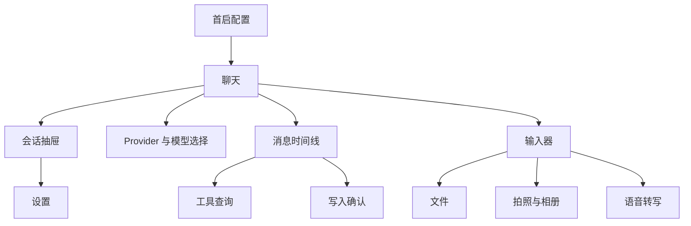

# Familiar 产品定义

## 1. 产品标识

- 产品名称：Familiar
- 产品形态：原生 iPhone AI 行动助理
- 最低系统：iOS 17
- 支持设备：iPhone
- 分发目标：公开 App Store
- 账户模式：无账户
- 计费模式：无订阅、无 Familiar 托管额度
- 模型接入：用户自备 API Key，设备直接请求 Provider
- 数据存储：会话、附件索引和工具记录保存在本机

## 2. 产品目标

Familiar 为用户提供统一的移动问答与有限 Agent 执行入口。产品首发聚焦以下任务：

1. 使用用户选择的 AI Provider 完成文本问答。
2. 读取本机日历和提醒事项，回答时间安排相关问题。
3. 在用户逐次确认后创建日历事件或提醒事项。
4. 将本机文档转换为可发送的文本上下文。
5. 将语音转换为可编辑的输入草稿。
6. 在本机保存会话历史、文档副本和工具终态记录。

## 3. 核心用户任务

### 3.1 配置模型服务

用户在首启流程中选择 Provider、填写 API Key、选择或输入模型 ID，并执行连接验证。API Key 写入设备 Keychain。Provider 配置和偏好写入本地设置。

### 3.2 连续对话

用户创建会话、发送文本或文档上下文、查看流式回答，并执行复制、分享、重试、编辑后重发等操作。会话记录实际使用的 Provider 和模型。

### 3.3 查询个人时间信息

用户可以提出日历事件和提醒事项查询。首次触发相关功能时，界面说明数据用途并请求系统权限。查询范围由工具参数限定。

### 3.4 创建日程或提醒

模型生成结构化写入请求。时间线展示目标日历或列表、标题、时间、备注、优先级等字段。用户确认后执行 EventKit 写入。取消结果返回 Agent Loop，用于生成后续回答。

### 3.5 使用本机文档

用户从系统文件选择器添加文档。App 将文件复制到私有目录，通过 AnyDoc 转换为 Markdown。PDF 页面缺少文本层时使用 Vision OCR。发送给 Provider 的内容为抽取文本和文件名上下文。

### 3.6 使用语音输入

用户启动语音识别，转写结果持续写入输入框。转写文本保持可编辑状态。App 不创建音频消息，不保留原始录音文件。

## 4. 产品原则

### 4.1 用户持有服务关系

Provider API Key、费用、额度、区域和服务条款由用户与 Provider 直接管理。Familiar 不代理模型计费，不转存 API Key，不提供共享服务密钥。

### 4.2 本地数据优先

会话、附件和工具记录使用本机存储。文档转换和 PDF OCR 在设备内完成。Markdown 渲染依赖 App Bundle 内资源和非持久化 WebKit 数据存储。

### 4.3 写操作逐次授权

每次日历或提醒事项写入均生成独立确认请求。确认内容覆盖目标容器和全部写入字段。等待确认期间的请求只存在于内存。任务取消、会话退出和确认取消均不得触发写入。

### 4.4 能力声明与执行链路一致

模型能力由 `providerID + modelID` 决定。工具能力关闭时不发送工具定义。文档能力关闭时阻止发送文档。图片发送链路尚未交付时，输入器保留图片草稿并阻止网络请求。

### 4.5 终态可追溯

助手回答在完成后持久化。工具执行保存摘要、确认结果、终态和时间。等待确认状态和流式 token 不进入持久层。

### 4.6 系统权限按功能触发

首启流程不集中请求相机、麦克风、Speech、日历和提醒事项权限。用户进入相关功能后再触发系统授权。

## 5. 首发范围

### 5.1 包含

- 文本聊天与本地会话管理。
- 12 个内置 Provider。
- 自定义 OpenAI-compatible Provider。
- OpenAI Chat、Anthropic Messages、Gemini Generate Content 三类协议适配。
- 日历事件查询与创建。
- 提醒事项查询与创建。
- PDF、Office、OpenDocument、RTF、EPUB、CSV、TXT、Markdown 等文档导入。
- AnyDoc 本地 Markdown 转换。
- PDFKit 文本层检查与 Vision OCR。
- 图片选择、拍照、预览、移除和发送拦截。
- Apple Speech 转写。
- 简体中文和英文界面。

### 5.2 当前排除

- iPad 专用界面。
- 账户、登录、云端会话同步。
- Familiar 自建业务后端。
- 订阅、购买、权益和托管额度。
- 实时语音对话。
- 图片模型请求。
- 修改或删除现有日历事件和提醒事项。
- MCP、Skills、Sandbox、多 Agent、工作区和 Artifact。
- 读取学术系统或其他 App 的私有数据。
- 通用外部操作自动化。

## 6. 信息架构

## 7. 体验目标

### 7.1 配置

- 首次使用者可在 App 内完成 Provider 配置。
- Key 验证结果具备明确成功或错误信息。
- 自定义 Provider 配置展示 Base URL、模型 ID 和模型列表路径等必要字段。

### 7.2 聊天

- 流式回答保持同一富文本视图。
- 用户停留在底部附近时自动跟随输出。
- 用户向上阅读后停止自动滚动。
- 编辑或重试旧消息前说明后续记录将被删除。

### 7.3 Agent

- 每次写操作在执行前展示完整预览。
- 取消、失败和成功均生成可信终态。
- 同一次 Agent Run 中的相同写入只成功提交一次。
- 模型无法使用工具时，界面不展示可执行暗示。

### 7.4 文件

- 文件导入失败时保留输入草稿。
- 超过上下文上限时在网络请求前阻止发送。
- 历史附件可以从会话重新预览。
- 删除消息或会话时清理对应本地附件。

## 8. 发布门槛

1. Debug 和 Release 的 iPhone 构建通过。
2. iOS 17 arm64 Simulator 构建通过。
3. 写操作在未确认状态下零执行。
4. Provider 错误、工具错误和文件错误不显示虚假成功。
5. 图片草稿被拦截时不创建消息、不上传图片、不清空草稿。
6. API Key 只进入 Keychain 和对应 Provider 请求。
7. 隐私用途说明与实际调用一致。
8. 内置模型 ID 失效时允许用户输入有效模型 ID，界面保持可恢复。
9. SwiftData 启动路径能够处理当前开发 Schema 与旧开发 store 的切换。
10. EventKit、相机、Speech 和安全作用域文件完成真机验收。

## 9. 产品成功条件

首发阶段使用可观察结果评估：

- 用户可独立完成 Provider 配置并发送首条消息。
- 会话中可稳定完成文本流式回答。
- 文档转换结果可进入模型上下文并保留原文件预览。
- 日历与提醒事项查询结果来源于 EventKit。
- 每次写入均具备确认记录和系统保存结果。
- 关闭并重新打开 App 后，可查看已完成消息和工具终态。
- 系统拒绝权限时，App 提供明确状态和恢复入口。
