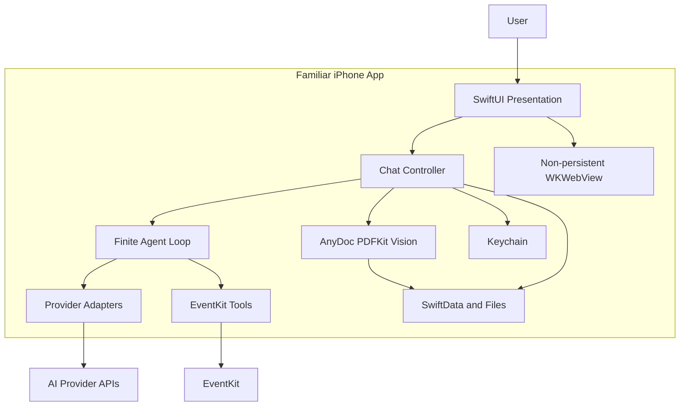
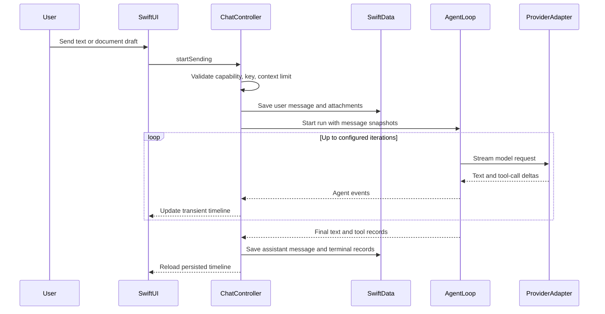

# Familiar 系统架构

## 1. 系统边界

Familiar 在 iPhone 内运行。网络请求从 App 直接发送到用户选择的 AI Provider。日历、提醒事项、相机、麦克风、Speech、文件选择和 Keychain 通过系统框架访问。项目没有 Familiar 业务后端。



## 2. 技术基线

| 领域 | 技术 |
|---|---|
| UI | SwiftUI |
| 数据模型 | SwiftData |
| 网络 | URLSession、AsyncThrowingStream、SSE |
| 富文本 | WebKit、Markdown-It、Highlight.js、KaTeX、Mermaid、DOMPurify |
| 密钥 | Security.framework Keychain |
| 日历和提醒 | EventKit |
| 文件选择 | UniformTypeIdentifiers、安全作用域 URL |
| 文档转换 | AnyDoc Rust engine、C ABI、XCFramework |
| PDF | PDFKit、Vision OCR |
| 图片 | PhotosPicker、AVFoundation、UIKit |
| 语音 | Speech、AVAudioEngine、AVAudioSession |
| 最低系统 | iOS 17 |
| Swift 语言模式 | Swift 6 |
| 设备族 | iPhone，`TARGETED_DEVICE_FAMILY = 1` |

工程设置位于 `familiar.xcodeproj/project.pbxproj`。

## 3. 代码分层

### 3.1 App

路径：`Familiar/App/`

职责：

- 创建 SwiftData `Schema`。
- 配置版本化本地 store。
- 注入 `ModelContainer`。
- 建立根场景。

入口：`Familiar/App/FamiliarApp.swift`。

### 3.2 Presentation

路径：`Familiar/Presentation/`

主要组件：

- `FamiliarRootView`：首启与主界面切换。
- `FamiliarOnboardingView`：三步 Provider 配置。
- `FamiliarChatView`：抽屉、顶栏、时间线、输入器和设置入口。
- `FamiliarChatController`：聊天状态、SwiftData 保存、网络任务和确认状态协调。
- `FamiliarChatMessageViews`：消息、模型切换、工具记录和确认卡。
- `FamiliarComposerView`：文本、文件、图片、相机、相册和语音入口。
- `FamiliarMarkdownWebView`：本地富文本渲染。
- `FamiliarCameraView`：相机 UI 与采集 worker。

### 3.3 Domain

路径：`Familiar/Domain/`

职责：

- Provider、模型和能力描述。
- 会话快照和设置值类型。
- 模型切换记录定义。
- 跨层传递的 `Sendable` 内容片段。

关键文件：

- `FamiliarProviderCatalog.swift`
- `FamiliarChatModels.swift`
- `FamiliarConversationMetadata.swift`

### 3.4 Data

路径：`Familiar/Data/`

职责：

- OpenAI-compatible Chat Completions。
- Anthropic Messages。
- Gemini Generate Content。
- 模型列表加载。
- Provider 连接验证。
- Keychain 操作。

关键文件：

- `OpenAICompatibleClient.swift`
- `FamiliarProviderAdapters.swift`
- `FamiliarModelCatalogService.swift`
- `FamiliarProviderConnectionValidator.swift`
- `FamiliarKeychainStore.swift`

### 3.5 Agent

路径：`Familiar/Agent/`

职责：

- 将消息快照转换为 Provider 请求。
- 聚合流式文本和工具调用增量。
- 执行有限轮次 Tool Loop。
- 处理重复调用、取消、结果长度和终态事件。
- 暂停写操作并等待 UI 确认。

关键文件：

- `FamiliarAgentLoop.swift`
- `FamiliarModelProvider.swift`
- `FamiliarTool.swift`
- `FamiliarToolConfirmationCoordinator.swift`
- `FamiliarNativeTools.swift`

### 3.6 EventKit

路径：`Familiar/EventKit/`

职责：

- 日历与提醒事项权限状态。
- 查询和写入参数校验。
- EventKit 对象与 `Sendable` DTO 转换。
- 写入幂等缓存。

关键文件：

- `FamiliarEventKitService.swift`
- `FamiliarEventKitTools.swift`

### 3.7 Persistence 与 Attachments

路径：

- `Familiar/Persistence/`
- `Familiar/Attachments/`

职责：

- SwiftData 实体。
- 文件导入、大小限制、路径校验、草稿复制和清理。
- AnyDoc、PDFKit 和 Vision 的内容抽取协调。

### 3.8 AnyDoc Bridge

路径：

- `Familiar/AnyDoc/FamiliarAnyDocService.swift`
- `Vendor/AnyDocBridgeRust/`
- `Vendor/AnyDocBridge.xcframework/`
- `Scripts/build-anydoc-xcframework.sh`

职责：

- Swift 到 C ABI 调用。
- C ABI 到 Rust AnyDoc 引擎调用。
- Markdown、检测格式、引擎版本和错误码返回。
- `ios-arm64` 和 `ios-arm64-simulator` 产物管理。

## 4. 聊天运行链路



### 4.1 请求前检查

`FamiliarChatController.startSending(in:)` 执行以下检查：

1. 图片草稿 gate。
2. 文档能力 gate。
3. API Key 存在性。
4. 文本和文档上下文字符上限。
5. 文件导入状态。

检查通过后保存用户消息。网络请求使用持久化消息生成的快照。

### 4.2 流式状态

以下状态保存在 `FamiliarChatController` 内存：

- `streamingText`
- `streamingMessageID`
- `agentStatus`
- `toolActivities`
- `pendingConfirmations`

流式增量不写入 SwiftData。助手消息在终态创建并保存。

### 4.3 Tool Loop

`FamiliarAgentLoop` 默认最多运行 6 轮。每轮完成以下工作：

1. 根据模型能力提供工具定义。
2. 发送完整上下文。
3. 聚合文本和工具调用。
4. 校验工具名、参数和重复调用。
5. 执行工具或等待确认。
6. 将工具结果写回下一轮上下文。
7. 在无工具调用的终态返回回答。

## 5. 数据持久化边界

| 数据 | 存储位置 | 保存时点 |
|---|---|---|
| 会话 | SwiftData | 创建、标题变化、模型切换、消息变化 |
| 用户消息 | SwiftData | 网络请求前 |
| 助手消息 | SwiftData | 回答终态 |
| 模型切换 | SwiftData | 会话内切换时 |
| 工具记录 | SwiftData | 成功、取消或失败终态 |
| 流式文本 | 内存 | 运行期间 |
| 待确认请求 | 内存 | 等待用户决策期间 |
| Provider 配置 | UserDefaults | 设置保存时 |
| API Key | Keychain | 用户保存或验证配置时 |
| 文档原文件 | App Support | 草稿导入和消息提交时 |
| 文档抽取文本 | SwiftData | 附件提交时 |
| 图片草稿 | 内存 | 输入器会话期间 |
| 原始录音 | 不创建文件 | 无保存时点 |

## 6. 并发模型

### 6.1 Main Actor

工程设置 `SWIFT_DEFAULT_ACTOR_ISOLATION = MainActor`。UI、`ModelContext` 使用和可观察状态集中在 Main Actor。

主要 Main Actor 类型：

- `FamiliarChatController`
- `FamiliarSpeechTranscriber`
- `FamiliarCameraController`

### 6.2 Actor

- `FamiliarToolRegistry`：工具注册与读取。
- `FamiliarToolConfirmationCoordinator`：确认 continuation 和幂等状态。
- `FamiliarEventKitService`：EventKit store 与写入幂等状态。

### 6.3 Sendable 边界

Provider 消息、Agent 事件、确认请求、EventKit DTO、附件快照等纯值类型声明为 `Sendable`。Swift 6 构建用于校验隔离边界。

### 6.4 相机

`FamiliarCameraController` 管理 SwiftUI 发布状态。`FamiliarCameraSessionWorker` 使用专用串行队列管理 `AVCaptureSession`、输入、输出、镜头位置和拍照。worker 通过 Main Actor 回调更新 UI。

### 6.5 文件转换

`FamiliarAttachmentStore.importDocument(from:)` 使用 detached task 处理安全作用域文件复制和内容抽取。取消处理通过 `Task.checkCancellation()` 和 `withTaskCancellationHandler` 传播。

## 7. 富文本渲染

`FamiliarMarkdownWebView` 使用非持久化 `WKWebsiteDataStore`。脚本、样式、字体和渲染器从 `Familiar/Resources/FamiliarMarkdownRenderer/` 加载。

支持：

- Markdown
- 代码高亮
- 表格
- 引用
- KaTeX
- Mermaid
- 代码复制
- 系统外链打开

CSP 禁止脚本网络连接、媒体、对象、frame 和表单。`img-src` 当前允许 `https:` 和 `data:`，远程 Markdown 图片可能产生网络请求。该行为需要在隐私审核时单独确认。

## 8. iOS 17 与 iOS 26

### iOS 26

- `safeAreaBar`
- `glassEffect`
- `GlassEffectContainer`

### iOS 17–25

- `safeAreaInset`
- `regularMaterial` / `ultraThinMaterial`
- 描边和系统填充色

### 无障碍回退

- Reduce Transparency：使用实色 elevated fill 和边框。
- Reduce Motion：关闭或缩短首启、抽屉、输入器和滚动动画。

相关实现：

- `Familiar/Support/FamiliarTheme.swift`
- `Familiar/Presentation/FamiliarChatView.swift`
- `Familiar/Presentation/FamiliarRootView.swift`
- `Familiar/Presentation/FamiliarComposerView.swift`

## 9. 启动与本地 store

`FamiliarApp` 创建以下 Schema：

- `FamiliarConversation`
- `FamiliarMessage`
- `FamiliarAttachment`
- `FamiliarModelSwitchRecord`
- `FamiliarToolRunRecord`

当前开发 Schema 使用版本化地址：

```text
Application Support/Familiar/Persistence/FamiliarAgentV1.store
```

首次成功创建当前 store 后，App 清理旧开发 `default.store`、SQLite sidecar 和旧附件目录。该策略服务于开发阶段的直接 Schema 替换。后续公开版本发生 Schema 变化时，需要引入正式迁移方案或新的受控数据升级流程。

## 10. 错误边界

| 场景 | 当前处理 |
|---|---|
| Provider 非 2xx | 提取有限长度错误正文并显示错误 |
| SSE 空响应 | 抛出 empty response |
| 上下文超限 | 请求前阻止发送 |
| 图片草稿 | 请求前阻止发送并保留草稿 |
| 文档转换失败 | 删除导入副本并保留其他草稿 |
| 工具重复调用 | 生成失败工具结果，不重复执行 |
| 写入取消 | 返回取消结果，不调用 EventKit save |
| EventKit 保存失败 | 生成失败终态 |
| Markdown 渲染失败 | 回退 SwiftUI attributed/plain text |
| 当前 store 创建失败 | 启动 fatal error；后续需要恢复界面 |

## 11. 架构约束

- Provider adapter 不接触 SwiftData 实体。
- Agent Loop 使用消息快照和内容片段。
- UI 不直接调用 EventKit save。
- 写工具的 `execute` 只产生待确认计划。
- 文档原文件不进入 Provider 请求。
- 图片 placeholder 不进入网络请求。
- WebKit 不使用持久化网站数据存储。
- SwiftData 的广泛 invalidation 不承载逐 token 更新。
