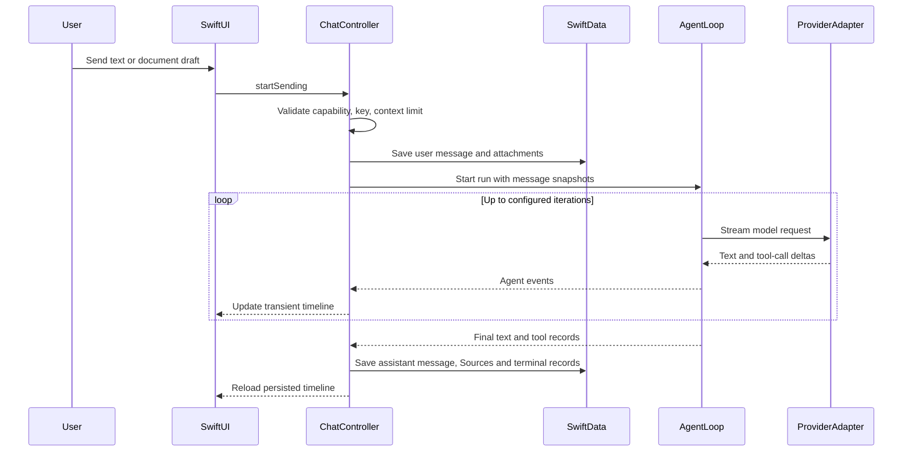

# Familiar 系统架构

## 1. 系统边界

Familiar 是一个 iPhone 原生、安全、可检查的个人 AI 工作台。Project 是目标产品中的长期工作单元，聊天是主要入口，单 Agent Runtime 是执行内核。网络请求从 App 直接发送到用户选择的 AI Provider；只读 Web 请求直接发送到 DuckDuckGo 或用户选择的公共 HTTPS 站点。项目没有 Familiar 业务后端。

它不以 Linux 为执行环境，不依赖 Apple Intelligence，不把用户需求硬编码成 workflow，也不从复杂多 Agent 开始。

## 2. 目标六层架构

下图描述目标架构，不代表所有模块已经实现。当前实现矩阵如下：

| 层 | 当前状态 |
|---|---|
| System Entry | App、Share、Deep Link、通知、Spotlight、Widget/Control、App Intents 已实现，暂时冻结扩张 |
| Agent Runtime | 有限顺序 Tool Loop 与 Runtime Event 已实现；项目上下文、并行规划、严格恢复和重放未实现 |
| Capability Registry | 启动时静态注册 8 个工具；只有权限可用性过滤，无发现、安装、版本和项目绑定 |
| Execution Policy | effect/risk/availability 与结构化确认已实现；生产路径没有可审计 AuthorizationGrant |
| Workspace | 当前只有消息附件抽取与上下文注入；Project、Resource、Artifact、lineage 和可写工作区未实现 |
| State | Conversation、Message、Attachment、Source、Run/Step 摘要已实现；Project、Memory、完整 snapshot 和 ResumeCursor 未实现 |

```text
┌─────────────────────────────────────────┐
│             System Entry Layer          │
│ Chat / Share / Notifications / Widgets  │
│ Spotlight / App Intents / Shortcuts     │
└────────────────────┬────────────────────┘
                     │
                     ▼
┌─────────────────────────────────────────┐
│               Agent Runtime             │
│                                         │
│ Agent Loop / Context Assembly           │
│ Model Router / Tool Router              │
│ Run / Step State                        │
└────────────────────┬────────────────────┘
                     │
                     ▼
┌─────────────────────────────────────────┐
│            Capability Registry          │
│                                         │
│ System Tools          Workspace Tools   │
│ Calendar              File              │
│ Reminder              PDF               │
│ Contacts              Text              │
│ Photos                Image             │
│ Maps                  Audio             │
│ Weather               Web               │
│ Location              Structured Data   │
└────────────────────┬────────────────────┘
                     │
                     ▼
┌─────────────────────────────────────────┐
│           Execution Policy Layer        │
│ Availability / Permission / Approval    │
│ Validation / Timeout / Cancellation     │
└────────────────────┬────────────────────┘
                     │
                     ▼
┌─────────────────────────────────────────┐
│              Native Layer               │
│ EventKit / Vision / MapKit / WebKit     │
│ Photos / PDFKit / Core ML / Foundation  │
└─────────────────────────────────────────┘
            + State Layer
  Session / Workspace / Memory
  Artifacts / Trace / History
```

### 2.1 System Entry Layer

系统入口按优先级划分：

| 优先级 | 入口 |
| --- | --- |
| **第一优先级** | ① Familiar App 本身 · ② Share Extension · ③ 系统通知 / Deep Link |
| **第二优先级** | ④ Widgets / Controls · ⑤ Spotlight 等轻量系统入口 |
| **兼容能力** | ⑥ App Intents · ⑦ Shortcuts |

已实现的 Deep Link 由 `FamiliarDeepLink` 解析为有限类型：新草稿、会话和 Run。System Entry Layer 只负责恢复本地界面上下文；它不直接调用 Provider、不执行 Tool，也不授予写权限。新草稿链接只预填输入器，仍由用户主动发送；会话和 Run 链接只解析本地 UUID，找不到时显示可恢复错误。

Share Extension 与主 App 通过 `group.com.isaachuo.familiar` 的 App Group 文件容器交换一次性 payload：

```text
Host App Share Sheet
        │
        ▼
Share Extension ── copy text / URL / files ──▶ Shared Inbox
                                                     │
                                                     ▼
Familiar foreground ── validate / import ──▶ New Draft
```

共享收件箱使用临时目录写入 manifest 与文件，完成后原子移动为可消费目录。主 App 校验 ID、文件名、数量、大小和实际文件长度，再经现有 AttachmentStore / AnyDoc 路径导入。扩展 target 不链接 Agent Runtime、Provider adapter、Keychain 或 EventKit。

App Intents 位于外层，不进入 Agent Core。当前只暴露 `Ask Familiar`、`Process with Familiar`、`Open Familiar`：Ask / Process 接收有长度上限的文本，通过主 App 的单一 handoff 进入新草稿并启动同一套 Agent Runtime；Open 只把 Familiar 带到前台，不改变当前草稿或会话。Intent 本身不读取 Keychain、不复制 Provider adapter 或 Capability Registry，也不能授权工具写入。主 App 有未发送草稿时拒绝覆盖；已有 Run 执行中时等待其结束后再处理。iOS 18–25 使用前台打开兼容入口，iOS 26 起使用 `supportedModes`。

本地通知同样位于 System Entry Layer。`FamiliarNotificationService` 只在用户显式开启、系统仍允许通知且 App 不处于活跃状态时，为完成或失败的 Run 安排本地通知。通知 payload 只保存 `run:<UUID>` 或 `conversation:<UUID>` 类型化路由，不保存问题、回答、附件名或工具结果；用户点击后由 `FamiliarAppDelegate` 交给现有 handoff，再走 `FamiliarDeepLink` 的本地查找路径。前台到达的通知不额外展示横幅。关闭功能会清理 Familiar 的待处理和已投递通知。当前实现不注册远程推送、不依赖 APNs，也不承担后台续跑。

Spotlight 使用 `FamiliarSpotlightIndexer` 管理一个 `.complete` 文件保护等级的 Core Spotlight 自定义索引。聊天界面根据 SwiftData 当前集合生成不可变快照，只纳入已经产生消息或 Run 的会话；每项只包含最多 80 字符的标题、更新时间和 `conversation:<UUID>` 标识。索引 actor 串行合并高频更新，先清理 Familiar 会话 domain，再写入最新完整集合，避免删除或重命名后保留旧结果。系统选中结果时，`CSSearchableItemActionType` 的标识被解析为现有 `FamiliarDeepLink.conversation`。聊天正文、附件名、工具结果、密钥和 Provider 配置不进入索引；不使用公开 Web 索引或服务器同步。

### 2.2 Agent Runtime

Agent Runtime 是骨架中最关键的一层。它尽量不碰 Apple Framework，完全不知道：

```text
EventKit / Vision / HealthKit / MapKit
```

它只知道：

```text
ToolDefinition / ToolCall / ToolResult
```

核心数据流：

```text
User
  → AgentRun
  → Request Context Assembly（当前）/ ProjectContextAssembler（目标）
  → Model
  → Tool Call?
       ├── No ──→ Final Answer
       └── Yes
           → Tool Registry
           → Policy Engine
           → Execute Tool
           → ToolResult
           → Context
           → Model
           → continue
直到：final answer / cancelled / failed / max steps
```

内部组件：

- Agent Loop：有限轮次循环。
- Request Context Assembly：当前组装系统提示、会话历史、附件抽取文本与工具结果。
- ProjectContextAssembler：目标组件，生成不可变 `ContextSnapshot`；当前未实现。
- Model Router：把 Tool Call 决策交给模型，聚合流式增量。
- Tool Router：通过 Capability Registry 分发 Tool 执行。
- Run / Step State：一次 Agent Run 的执行状态。

### 2.3 Capability Registry

Registry 是 Familiar 的目标核心资产之一。当前实现为启动时传入 8 个 `AnyFamiliarTool` 的静态字典，其中 2 个本机信息工具、2 个只读 Web 工具、4 个 EventKit 工具；EventKit availability 决定部分工具是否暴露。

目标 Registry 组织成两大能力体系：

| Native System | Native Workspace |
| --- | --- |
| Calendar | File |
| Reminders | PDF |
| Contacts | Text |
| Photos | Image |
| Maps | Audio |
| Location | Video |
| Weather | CSV / JSON |
| Health | Archive |
| Notifications | Document |
| Clipboard | Web |

- Native System 工具负责操作 iPhone 和用户的数字环境。
- 目标 Native Workspace 通过 Project、Resource 和 Artifact 提供不依赖 Linux 的通用工作空间；当前只有附件处理。
- 当前设备、地区、系统版本、用户授权不可用的 Tool 不暴露给模型。
- 目标实现拆分为 `CapabilityCatalog + CapabilityResolver + CapabilityBindingStore`，支持稳定 ID/版本/来源、隐私与网络域、安装状态和项目绑定。

### 2.4 Execution Policy Layer

位于 Registry 与 Native Layer 之间，承担：

- 能力可用性检查。
- 权限与授权决策。当前写入逐次结构化确认；目标 `AuthorizationGrant` 尚未实现。
- 写操作审批。
- 参数校验、超时与取消。
- 破坏性与财务敏感操作的强确认。

### 2.5 Native Layer

当前执行后端包含 EventKit、Foundation/Network.framework Web、Vision 与 PDFKit；附件和输入路径还使用 PhotosPicker、AVFoundation、Speech 与 WebKit 渲染。MapKit、Core ML 等是目标能力。Apple Framework 只通过适配层进入相应功能，不被 Agent Runtime 直接感知。

### 2.6 State Layer

- 当前 Session：Conversation、Message、Attachment、Source、Run/Step 摘要。
- 当前 Trace：运行事件、审批和工具终态的用户可见摘要；不包含完整模型请求、工具载荷和授权快照。
- 目标 Project Workspace：Project、Resource、Artifact、Instruction、Binding、MemoryItem 与 Schedule。
- 目标 Run Workspace：不可变 Context/Capability/Authorization snapshot、工具输入输出引用与 ResumeCursor。

## 3. 技术基线

| 领域 | 技术 |
|---|---|
| UI | SwiftUI |
| 数据模型 | SwiftData |
| 网络 | URLSession、AsyncThrowingStream、SSE |
| 富文本 | WebKit、Markdown-It、Highlight.js、KaTeX、Mermaid、DOMPurify |
| 密钥 | Security.framework Keychain |
| 日历和提醒 | EventKit |
| 文件选择 | UniformTypeIdentifiers、安全作用域 URL |
| 文档转换 | AnyDoc Rust engine、C ABI、XCFramework |
| PDF | PDFKit、Vision OCR |
| 图片 | PhotosPicker、AVFoundation、UIKit |
| 语音 | Speech、AVAudioEngine、AVAudioSession |
| 最低系统 | iOS 18 |
| Swift 语言模式 | Swift 6 |
| 设备族 | iPhone，`TARGETED_DEVICE_FAMILY = 1` |

工程设置位于 `familiar.xcodeproj/project.pbxproj`。

## 4. 代码分层

### 4.1 App

路径：`Familiar/App/`

职责：

- 创建 SwiftData `Schema`。
- 配置版本化本地 store。
- 注入 `ModelContainer`。
- 建立根场景。

入口：`Familiar/App/FamiliarApp.swift`。

### 4.2 Presentation

路径：`Familiar/Presentation/`

主要组件：

- `FamiliarRootView`：首启与主界面切换，并支持从设置重新进入首启。
- `FamiliarOnboardingView`：三步 Provider 配置，也可不发起网络请求直接进入浏览状态。
- `FamiliarChatView`：抽屉、顶栏、时间线、输入器和设置入口。
- `FamiliarChatController`：聊天状态、SwiftData 保存、网络任务和确认状态协调。
- `FamiliarChatMessageViews`：消息、模型切换、工具记录和确认卡。
- `FamiliarComposerView`：文本、文件、图片、相机、相册和语音入口。
- `FamiliarMarkdownWebView`：本地富文本渲染。
- `FamiliarCameraView`：相机 UI 与采集 worker。

### 4.3 Domain

路径：`Familiar/Domain/`

职责：

- Provider、模型和能力描述。
- 会话快照和设置值类型。
- 模型切换记录定义。
- 跨层传递的 `Sendable` 内容片段。

关键文件：

- `FamiliarProviderCatalog.swift`
- `FamiliarChatModels.swift`
- `FamiliarConversationMetadata.swift`

### 4.4 Data

路径：`Familiar/Data/`

职责：

- OpenAI-compatible Chat Completions。
- Anthropic Messages。
- Gemini Generate Content。
- 模型列表加载。
- Provider 连接验证。
- Keychain 操作。

关键文件：

- `OpenAICompatibleClient.swift`
- `FamiliarProviderAdapters.swift`
- `FamiliarModelCatalogService.swift`
- `FamiliarProviderConnectionValidator.swift`
- `FamiliarKeychainStore.swift`

### 4.5 Agent

路径：`Familiar/Agent/`

职责：

- 将消息快照转换为 Provider 请求。
- 聚合流式文本和工具调用增量。
- 执行有限轮次 Tool Loop。
- 处理重复调用、取消、结果长度和终态事件。
- 暂停写操作并等待 UI 确认。

关键文件：

- `FamiliarAgentLoop.swift`
- `FamiliarModelProvider.swift`
- `FamiliarTool.swift`
- `FamiliarToolConfirmationCoordinator.swift`
- `FamiliarNativeTools.swift`

### 4.6 Web

路径：`Familiar/Web/`

职责：

- 提供 `web_search` 与 `web_fetch` 只读工具。
- 限制公共 HTTPS、端口、DNS、重定向、响应大小和内容类型。
- 把远程正文视为不可信内容，并生成可持久化的 Sources。

尚未实现独立 `web.read`、Project URL Resource、登录、表单提交或浏览器自动化。

### 4.7 EventKit

路径：`Familiar/EventKit/`

职责：

- 日历与提醒事项权限状态。
- 查询和写入参数校验。
- EventKit 对象与 `Sendable` DTO 转换。
- 写入幂等缓存。

关键文件：

- `FamiliarEventKitService.swift`
- `FamiliarEventKitTools.swift`

### 4.8 Persistence 与 Attachments

路径：

- `Familiar/Persistence/`
- `Familiar/Attachments/`

职责：

- SwiftData 实体。
- 文件导入、大小限制、路径校验、草稿复制和清理。
- AnyDoc、PDFKit 和 Vision 的内容抽取协调。

### 4.9 AnyDoc Bridge

路径：

- `Familiar/AnyDoc/FamiliarAnyDocService.swift`
- `Vendor/AnyDocBridgeRust/`
- `Vendor/AnyDocBridge.xcframework/`
- `Scripts/build-anydoc-xcframework.sh`

职责：

- Swift 到 C ABI 调用。
- C ABI 到 Rust AnyDoc 引擎调用。
- Markdown、检测格式、引擎版本和错误码返回。
- `ios-arm64` 和 `ios-arm64-simulator` 产物管理。

## 5. 聊天运行链路



### 5.1 请求前检查

`FamiliarChatController.startSending(in:)` 执行以下检查：

1. 图片草稿 gate。
2. 文档能力 gate。
3. API Key 存在性。
4. 文本和文档上下文字符上限。
5. 文件导入状态。

检查通过后保存用户消息。网络请求使用持久化消息生成的快照。

### 5.2 流式状态

以下状态保存在 `FamiliarChatController` 内存：

- `streamingText`
- `streamingMessageID`
- `agentStatus`
- `toolActivities`
- `pendingConfirmations`

流式增量不写入 SwiftData。助手消息在终态创建并保存。

### 5.3 Tool Loop

`FamiliarAgentLoop` 默认最多运行 6 轮。每轮完成以下工作：

1. 根据模型能力提供工具定义。
2. 发送完整上下文。
3. 聚合文本和工具调用。
4. 校验工具名、参数和重复调用。
5. 执行工具或等待确认。
6. 将工具结果写回下一轮上下文。
7. 在无工具调用的终态返回回答。

## 6. Runtime Event

当前代码由 `FamiliarRuntimeEventPayload` 产生统一事件，UI 只渲染这些事件，工具不自己造 UI：

```text
runStarted
state(thinking / usingTool / awaitingApproval / responding)
textDelta
toolRequested
toolProgress
approvalRequested / approvalResolved
toolFinished
responseCompleted
runCompleted / runCancelled / runFailed
```

例如：

```text
查找明天下午的日程
  ✓ 找到 2 个安排
查询目的地天气
  ✓ 24–29°C，有阵雨
创建提醒
  等待确认
```

这套事件已支撑运行中 UI 与摘要历史。它为未来 Trace、恢复和重放提供顺序基础，但当前没有完整 snapshot 或 ResumeCursor，不能严格重放或继续中断的任务。

## 7. Run / Step 数据模型

当前不只保存 Chat Message，也保存 Run 和摘要性 Step：

```text
Conversation
    ├── Messages
    └── Runs
         └── Steps (model / tool / approval / result summaries)
```

目标严格恢复还需要保存 `ContextSnapshot`、`CapabilitySnapshot`、`AuthorizationSnapshot`、完整输入输出引用和 `ResumeCursor`。

目标复杂任务：

```text
"分析这个 PDF，找到考试日期，加到日历。"

Run #827
  Step 1  pdf.extract
  Step 2  model reasoning
  Step 3  calendar.create
  Step 4  final
```

## 8. 数据持久化边界

| 数据 | 存储位置 | 保存时点 |
|---|---|---|
| 会话 | SwiftData | 创建、标题变化、模型切换、消息变化 |
| 用户消息 | SwiftData | 网络请求前 |
| 助手消息 | SwiftData | 回答终态 |
| 模型切换 | SwiftData | 会话内切换时 |
| 工具记录 | SwiftData | 成功、取消或失败终态 |
| Run/Step | SwiftData | Run 创建、审批/模型摘要检查点与终态；不足以恢复 |
| 流式文本 | 内存 | 运行期间 |
| 待确认请求 | 内存 | 等待用户决策期间 |
| Provider 配置 | UserDefaults | 设置保存时 |
| API Key | Keychain | 用户保存或验证配置时 |
| 文档原文件 | App Support | 草稿导入和消息提交时 |
| 文档抽取文本 | SwiftData | 附件提交时 |
| 图片草稿 | 内存 | 输入器会话期间 |
| 原始录音 | 不创建文件 | 无保存时点 |

## 9. 并发模型

### 9.1 Main Actor

工程设置 `SWIFT_DEFAULT_ACTOR_ISOLATION = MainActor`。UI、`ModelContext` 使用和可观察状态集中在 Main Actor。

主要 Main Actor 类型：

- `FamiliarChatController`
- `FamiliarSpeechTranscriber`
- `FamiliarCameraController`

### 9.2 Actor

- `FamiliarToolRegistry`：工具注册与读取。
- `FamiliarToolConfirmationCoordinator`：确认 continuation 和幂等状态。
- `FamiliarEventKitService`：EventKit store 与写入幂等状态。

### 9.3 Sendable 边界

Provider 消息、Agent 事件、确认请求、EventKit DTO、附件快照等纯值类型声明为 `Sendable`。Swift 6 构建用于校验隔离边界。

### 9.4 相机

`FamiliarCameraController` 管理 SwiftUI 发布状态。`FamiliarCameraSessionWorker` 使用专用串行队列管理 `AVCaptureSession`、输入、输出、镜头位置和拍照。worker 通过 Main Actor 回调更新 UI。

### 9.5 文件转换

`FamiliarAttachmentStore.importDocument(from:)` 使用 detached task 处理安全作用域文件复制和内容抽取。取消处理通过 `Task.checkCancellation()` 和 `withTaskCancellationHandler` 传播。

## 10. 富文本渲染

`FamiliarMarkdownWebView` 使用非持久化 `WKWebsiteDataStore`。脚本、样式、字体和渲染器从 `Familiar/Resources/FamiliarMarkdownRenderer/` 加载。

支持：

- Markdown
- 代码高亮
- 表格
- 引用
- KaTeX
- Mermaid
- 代码复制
- 系统外链打开

CSP 禁止脚本网络连接、媒体、对象、frame 和表单，`img-src` 仅允许 Bundle 同源资源与 `data:`。渲染器在将 HTML 插入文档前，把 HTTPS 远程图片替换为来源链接；只有用户主动点击后才交由系统外部打开，WebView 不自动发起图片请求。

## 11. iOS 18 与 iOS 26

### iOS 26

- `safeAreaBar`
- `glassEffect`
- `GlassEffectContainer`

### iOS 18–25

- `safeAreaInset`
- `regularMaterial` / `ultraThinMaterial`
- 描边和系统填充色

### 无障碍回退

- Reduce Transparency：使用实色 elevated fill 和边框。
- Reduce Motion：关闭或缩短首启、抽屉、输入器和滚动动画。

相关实现：

- `Familiar/Support/FamiliarTheme.swift`
- `Familiar/Presentation/FamiliarChatView.swift`
- `Familiar/Presentation/FamiliarRootView.swift`
- `Familiar/Presentation/FamiliarComposerView.swift`

## 12. 启动与本地 store

`FamiliarApp` 当前创建以下 7 个实体：

- `FamiliarConversation`
- `FamiliarMessage`
- `FamiliarSourceRecord`
- `FamiliarAttachment`
- `FamiliarModelSwitchRecord`
- `FamiliarAgentRun`
- `FamiliarAgentStep`

当前开发 Schema 使用版本化地址：

```text
Application Support/Familiar/Persistence/FamiliarAgentV2.store
```

当前 7 实体已固化为 `FamiliarSchemaV1`，生产和测试容器均通过 `FamiliarSchemaMigrationPlan` 打开。首次成功创建当前 store 后，App 仍清理旧开发 `default.store`、SQLite sidecar 和旧附件目录；当前 store 打开或迁移失败时只展示错误，不自动重置。后续 Project Schema 必须从 V1 增加版本和 migration stage，不能把用户确认后的全量重建作为正常升级路径。

## 13. 错误边界

| 场景 | 当前处理 |
|---|---|
| Provider 非 2xx | 提取有限长度错误正文并显示错误 |
| Web 私网、危险重定向或超限响应 | 拒绝请求并返回明确工具失败 |
| SSE 空响应 | 抛出 empty response |
| 上下文超限 | 请求前阻止发送 |
| 图片草稿 | 请求前阻止发送并保留草稿 |
| 文档转换失败 | 删除导入副本并保留其他草稿 |
| 工具重复调用 | 生成失败工具结果，不重复执行 |
| 写入取消 | 返回取消结果，不调用 EventKit save |
| EventKit 保存失败 | 生成失败终态 |
| Markdown 渲染失败 | 回退 SwiftUI attributed/plain text |
| 当前 store 创建失败 | 显示本地数据恢复界面，展示有限诊断；用户确认后删除当前 store、sidecar 与附件，保留 Keychain API Key，并要求重启 |

## 14. 架构约束

- Provider adapter 不接触 SwiftData 实体。
- Agent Runtime 不接触 Apple Framework，只认识 ToolDefinition/ToolCall/ToolResult。
- Agent Loop 使用消息快照和内容片段。
- UI 不直接调用 EventKit save。
- 写工具的 `execute` 只产生待确认计划。
- 文档原文件不进入 Provider 请求。
- 图片 placeholder 不进入网络请求。
- WebKit 不使用持久化网站数据存储。
- SwiftData 的广泛 invalidation 不承载逐 token 更新。
- App Intents 不复制 Capability Registry。
- Share Extension、App Intent 与 Deep Link 只提供输入来源，永不授予写权限。
- 远程 Web/MCP 内容与 server annotation 均按不可信输入处理。
- 每次 Project Run 使用不可变 ContextSnapshot；该约束待实现。
- 本地通知只携带通用终态文案与本地类型化路由，不携带会话正文或授权信息。
- Spotlight 只索引受保护的本地会话标题与 UUID，不索引聊天正文或运行详情。
- 图片预处理是 Tool，不是强制 pipeline。
- 权限由代码控制，不靠 Prompt。
