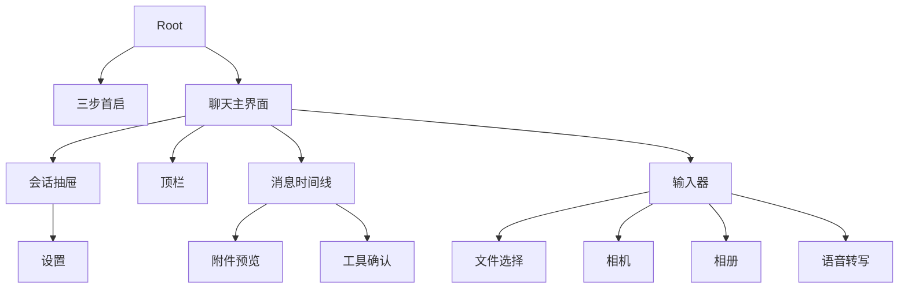

# Familiar UI 与交互设计

## 1. 设计目标

Familiar 使用 ChatGPT 移动端的信息结构和交互密度作为参考，保留独立品牌和真实能力边界。

界面目标：

- 单手操作优先。
- 主任务集中在聊天、会话管理、模型选择和输入器。
- 蓝色用于主要动作和选中状态。
- 淡紫用于首启、空态和低强度品牌背景。
- 玻璃材质限于导航、输入器和浮层。
- 消息内容层保持稳定背景和清晰排版。
- 工具写入状态以结构化卡片呈现。

## 2. 信息架构



## 2.5 系统入口

系统入口按优先级划分：

| 优先级 | 入口 |
| --- | --- |
| **第一优先级** | ① Familiar App 本身 · ② Share Extension · ③ 系统通知 / Deep Link |
| **第二优先级** | ④ Widgets / Controls · ⑤ Spotlight 等轻量系统入口 |
| **兼容能力** | ⑥ App Intents · ⑦ Shortcuts |

界面设计约束：

- Share Extension 承接外部选中的文本或文件，进入现有输入草稿或直接发起一次 Agent Run。
- 系统通知 / Deep Link 把用户带回对应任务上下文（会话 + Run/Step 轨迹）。
- Widgets / Controls 只暴露轻量动作（如快速提问、任务状态），不复制完整聊天界面。
- App Intents 只暴露 `Ask Familiar`、`Process with Familiar`、`Open Familiar`，由系统表面触发 Agent Run。
- 所有入口最终汇入同一个 Agent Runtime，不各自造一套执行逻辑。

## 2.6 Runtime Event 驱动的 Agent 执行界面

工具不自己造 UI。一次执行产生统一事件，界面只渲染这些事件：

```text
AgentRunStarted
ModelThinking
ToolRequested
ToolAwaitingApproval
ToolStarted
ToolProgress
ToolSucceeded
ToolFailed
ArtifactProduced
AgentRunCompleted
```

时间线即执行轨迹：模型思考、工具进度、审批、成功和失败都作为同一组事件渲染。运行中工具展示进度和活动说明，写操作在 `ToolAwaitingApproval` 时进入确认卡，终态渲染成功 / 取消 / 失败。这套事件同时支撑 Task Timeline、Debug、History 和 Background resume。

## 3. 首启流程

路径：`Familiar/Presentation/FamiliarOnboardingView.swift`

### 3.1 页面结构

1. Familiar 与 BYOK 说明。
2. Provider、API Key、模型和必要配置。
3. 连接验证、Keychain、本地历史和权限触发方式说明。

### 3.2 完成条件

- API Key 非空。
- 模型 ID 非空。
- Provider 配置可解析。
- 连接验证成功。
- Key 保存到 Keychain。
- 设置保存到 UserDefaults。

### 3.3 权限策略

首启页面说明权限用途。相机、麦克风、Speech、日历和提醒事项权限在用户触发对应功能时请求。

### 3.4 当前缺口

- 首启状态没有设置内重置入口。
- 页面指示器缺少 VoiceOver 当前页描述。
- 首启要求完成 Provider 验证，离线浏览入口尚未提供。

## 4. 聊天容器

路径：`Familiar/Presentation/FamiliarChatView.swift`

### 4.1 抽屉

- 宽度约为屏幕的 82%。
- 支持左边缘拖动打开。
- 支持遮罩点击、拖动和选择会话后关闭。
- 主界面在抽屉打开时横移、裁切圆角和添加阴影，不做纵向缩放。
- Reduce Motion 开启时取消动效。

抽屉内容：

- 固定的 Familiar 标题与圆形搜索按钮。
- 点击搜索按钮后在固定头部展开会话搜索。
- 会话历史在固定头部下方连续滚动；标题下方使用由实到透明的渐变，iOS 26 搜索按钮使用玻璃材质直接透出下方内容。
- 最近会话。
- 会话选择。
- 会话标题使用正文级字号和宽松行高，不使用偏小的辅助字号。
- 重命名。
- 删除。
- 固定在右下角、与搜索按钮右侧对齐的圆形本地用户头像入口。
- 头像入口打开资料与设置汇总页，其中包含 Provider、模型、API Key、回答偏好与隐私说明。

范围约束：

- 不展示账户、订阅、项目、工作区和团队入口。
- 搜索当前匹配会话标题。

### 4.2 顶栏

固定结构：

- 左：会话抽屉按钮。
- 中：Provider 与模型选择胶囊。
- 右：新对话按钮。

模型选择胶囊紧邻左侧抽屉按钮，不在顶栏中居中。

发送期间禁用模型切换和新对话，避免当前请求上下文发生变化。

模型菜单只展示已保存 API Key 的 Provider。设置页保留完整 Provider 列表，并展示当前已配置数量。

### 4.3 平台材质

- iOS 26：`safeAreaBar`、`GlassEffectContainer`、`glassEffect`。
- iOS 18–25：`safeAreaInset`、`ultraThinMaterial`、底部分隔线。

## 5. 时间线

路径：`Familiar/Presentation/FamiliarChatMessageViews.swift`

### 5.1 时间线项目

`FamiliarMessageTimeline` 合并以下项目：

- 用户消息。
- 助手消息。
- 模型切换记录。
- 已完成工具记录。
- 待确认请求。
- Agent 运行状态。
- 流式助手消息。

排序依据：

1. `sequence`
2. `createdAt`

### 5.2 用户消息

- 右对齐。
- 紧凑圆角气泡。
- 使用用户填充色。
- 支持文本选择。
- 支持附件入口。
- 上下文菜单包含复制和编辑。

编辑前显示确认对话。确认后删除目标消息之后的单一路径内容，并将原文本和附件恢复到输入器。

### 5.3 助手消息

- 左对齐。
- 无气泡正文排版。
- 使用同一 `FamiliarMarkdownWebView` 承载流式和终态内容。
- 终态显示实际 Provider 和模型来源。
- 提供复制、系统分享和重试。

重试前显示确认对话。确认后删除目标消息之后的消息、模型切换和工具记录。

### 5.4 模型切换

时间线使用轻量分隔行记录 Provider 或模型变化。记录包含旧值、新值、序号和时间。

### 5.5 工具状态

已完成工具记录展示：

- 成功、取消或失败图标。
- 用户可见摘要。
- 详情。
- 完成时间。

运行中工具展示进度和活动说明。

### 5.6 写入确认卡

卡片展示：

- 工具请求标题。
- 目标日历或提醒列表。
- 按字段排序的完整参数。
- 取消按钮。
- 确认添加按钮。

确认卡位于时间线内，保持与模型回答和工具终态相同的上下文位置。

## 6. 滚动行为

时间线使用 `ScrollViewReader`、`ScrollView` 和 `LazyVStack`。

自动跟随规则：

- 用户位于底部阈值内：流式文本、消息和工具活动变化时跟随底部。
- 用户向上阅读：停止自动跟随。
- 用户点击“滚动到最新”：恢复跟随。

键盘使用交互式收起。滚动位置当前不跨会话持久化。

## 7. 富文本

路径：`Familiar/Presentation/FamiliarMarkdownWebView.swift`

支持：

- Markdown 段落和列表。
- 代码高亮和代码复制。
- 表格。
- 引用。
- KaTeX。
- Mermaid。
- 安全外链。

WebView 关闭内部滚动，由内容高度回传 SwiftUI。文档预览模式可以启用 WebView 垂直滚动。渲染失败时使用 `AttributedString` 或纯文本回退。

## 8. 输入器

路径：`Familiar/Presentation/FamiliarComposerView.swift`

输入器严格参考 Leafy 日迹页的结构和操作密度，适配 Familiar 的聊天任务。

### 8.1 布局

输入器包含：

- 添加按钮。
- 文本编辑区。
- 语音按钮。
- 发送或停止按钮。
- 文档和图片草稿预览区。

### 8.2 模式

- `compact`：短文本和未聚焦状态。
- `expanded`：聚焦或多行文本状态。
- `fullscreen`：长文本编辑状态。

文本接近四行时自动扩展。用户可以显式展开或收起，全屏输入器最多占可用聊天区域的 80%。空态、时间线和文本编辑区均支持交互式下滑收起键盘。Reduce Motion 开启时取消模式切换动画。

### 8.3 发送状态

| 状态 | 主按钮行为 |
|---|---|
| 空草稿 | 禁用发送 |
| 有文本 | 发送 |
| 有文档 | 发送，受模型能力和上下文上限约束 |
| 有图片 | 阻止发送并保留全部草稿 |
| 文件导入中 | 禁用发送 |
| 模型生成中 | 显示停止 |
| 等待确认 | 停止操作可取消 Agent Run 和待确认请求 |

## 9. 附件菜单

添加按钮提供：

- 文件。
- 拍照。
- 相册。

### 9.1 文件

- 使用系统 `fileImporter`。
- 支持多选。
- 单个草稿最多 3 个文档。
- 导入期间显示进度状态。
- 支持移除草稿文档。
- 历史消息通过 Quick Look 预览原文件。

### 9.2 拍照

- 使用原生相机预览。
- 支持前后镜头切换。
- 支持闪光灯。
- 支持权限拒绝后的系统设置入口。
- 拍摄结果加入图片草稿。

### 9.3 相册

- 使用 `PhotosPicker`。
- 支持有序多选。
- 图片总数上限为 4。
- 支持内嵌选择和系统完整照片选择器。
- 支持移除单张图片。

### 9.4 图片能力 gate

当前版本允许选择、拍摄、预览和移除图片。发送操作统一拦截。拦截时：

- 不创建用户消息。
- 不发起 Provider 请求。
- 不清空文字草稿。
- 不清空图片草稿。
- 显示当前版本不支持图片发送的说明。

## 10. 语音转写

- 麦克风按钮在空闲状态显示 `mic`。
- 监听状态显示 `waveform` 和系统符号动效。
- 转写文本追加到启动语音前的基础草稿。
- 转写结束后输入器保持可编辑和聚焦。
- App 进入非 active 状态时停止转写。

## 11. 设置

路径：`Familiar/Presentation/FamiliarSettingsView.swift`

设置分区：

- 品牌说明。
- Provider。
- 模型。
- API Key。
- 回答偏好。
- 隐私与数据。

Provider 特定字段：

- OpenAI Organization ID。
- OpenAI Project ID。
- Qwen 区域。
- 自定义显示名。
- 自定义 Base URL。
- 自定义模型列表路径。
- 手动模型 ID。

操作：

- 保存配置。
- 验证连接。
- 刷新模型列表。
- 清除 API Key。

## 12. 视觉系统

路径：`Familiar/Support/FamiliarTheme.swift`

### 12.1 色彩职责

| 色彩 | 用途 |
|---|---|
| Familiar accent blue | 主要动作、选中状态、发送 |
| Brand purple | 渐变辅助、首启和低强度氛围 |
| User fill | 用户消息气泡 |
| Assistant fill | 助手相关背景 |
| Elevated fill | 工具卡、回退材质和浮层 |
| Separator | 分隔线和边框 |

### 12.2 玻璃范围

使用玻璃：

- 顶栏控制。
- Provider/模型胶囊。
- 输入器。
- 相机浮层控制。
- 滚动到最新按钮。

使用内容背景：

- 用户消息。
- 助手正文。
- 工具终态。
- 确认卡。
- 附件内容。

### 12.3 Reduce Transparency

系统开启 Reduce Transparency 时，玻璃组件使用实色 elevated fill 和边框。

## 13. 本地化

资源：

- `Familiar/Resources/zh-Hans.lproj/`
- `Familiar/Resources/en.lproj/`

覆盖范围：

- 首启。
- 会话和抽屉。
- 消息操作。
- Provider 和模型。
- 附件和 AnyDoc 错误。
- EventKit 权限和确认。
- 相机、麦克风和 Speech 用途说明。
- 设置与隐私。

## 14. 无障碍状态

### 已实现

- 主要图标按钮具备 Accessibility Label。
- Reduce Motion 影响首启、抽屉、输入器和滚动。
- Reduce Transparency 影响玻璃组件。
- 模型切换行合并子元素。
- 文本和确认字段支持选择。

### 待补充

- 首启页码的当前页描述。
- 抽屉会话项的选中 trait。
- 相机主快门按钮标签。
- 确认卡和工具记录的组合状态描述。
- 发送按钮禁用原因。
- VoiceOver 焦点转移。
- Dynamic Type 极端字号布局验收。
- Increase Contrast 和 Bold Text 验收。

## 15. UI 验收矩阵

| 维度 | 目标 |
|---|---|
| 系统 | iOS 18、iOS 26 |
| 外观 | Light、Dark |
| 语言 | 简体中文、英文 |
| 字体 | 默认、最大 Dynamic Type |
| 输入 | 空、短文本、长文本、键盘交互 |
| 时间线 | 短回答、长回答、连续流式、工具卡 |
| 滚动 | 底部跟随、向上阅读、恢复跟随 |
| 动效 | 默认、Reduce Motion |
| 材质 | 默认、Reduce Transparency |
| 辅助技术 | VoiceOver |
| 附件 | 文件导入、图片草稿、相机、相册、预览 |
| 系统入口 | App 冷启动、Share Extension 承接、Deep Link 定位、Widgets/Controls、Spotlight |
| Runtime 事件 | 模型思考、工具进度、审批、成功/失败终态、执行轨迹回放 |
