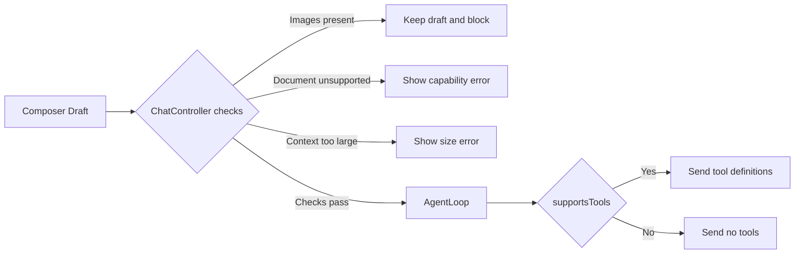
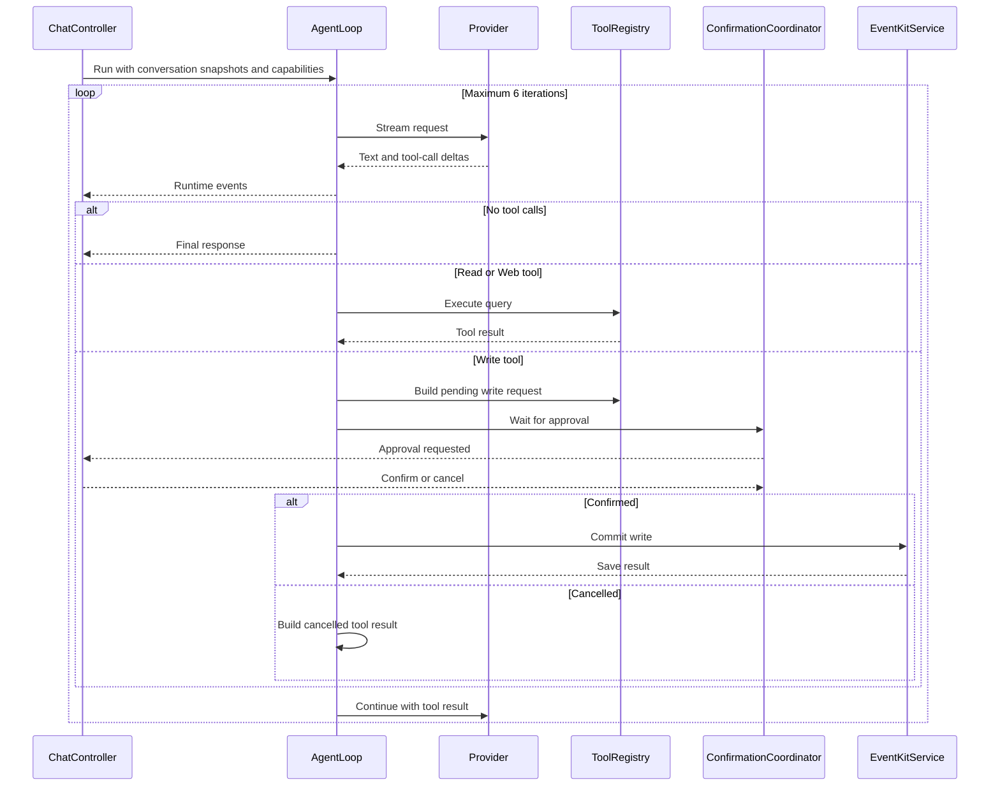
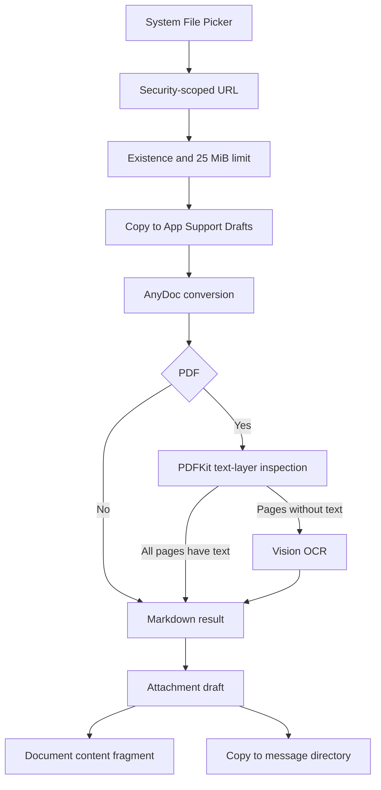

# Familiar Agent、Provider 与内容处理链路

## 1. Provider Catalog

路径：`Familiar/Domain/FamiliarProviderCatalog.swift`

### 1.1 内置 Provider

| ID | Provider | 协议族 |
|---|---|---|
| `openai` | OpenAI | OpenAI Chat |
| `anthropic` | Anthropic | Anthropic Messages |
| `gemini` | Gemini | Gemini Generate Content |
| `deepseek` | DeepSeek | OpenAI Chat 配置适配 |
| `groq` | Groq | OpenAI Chat 配置适配 |
| `xai` | xAI | OpenAI Chat 配置适配 |
| `openrouter` | OpenRouter | OpenAI Chat 配置适配 |
| `qwen` | Qwen | OpenAI Chat 配置适配 |
| `kimi` | Kimi | OpenAI Chat 配置适配 |
| `glm` | GLM | OpenAI Chat 配置适配 |
| `minimax` | MiniMax | OpenAI Chat 配置适配 |
| `siliconflow` | SiliconFlow | OpenAI Chat 配置适配 |

自定义入口 ID：`custom-openai`。

### 1.2 Provider Descriptor

`FamiliarProviderDescriptor` 描述：

- 字符串 ID。
- 显示名。
- 协议类型。
- Base URL。
- Chat path。
- Models path。
- 认证方式。
- 固定 headers。
- 精选模型。
- OpenAI SSE 差异配置。
- 自定义 Provider 标记。

认证方式：

- Bearer。
- 指定 API Key header。
- 指定 API Key query parameter。

### 1.3 Provider 特定配置

- OpenAI：Organization ID、Project ID。
- OpenRouter：`HTTP-Referer`、`X-Title`。
- Qwen：中国区和国际区 Base URL。
- 自定义 Provider：显示名、Base URL、模型 ID、可选模型列表路径。

API Key 使用 Provider ID 作为 Keychain account，服务名为 `com.isaachuo.familiar.provider-api-keys.v2`。

## 2. 模型能力

`FamiliarModelCapabilities` 字段：

- `supportsText`
- `supportsTools`
- `supportsImages`
- `supportsDocuments`
- `maximumInputCharacters`

### 2.1 Gate 位置



UI gate 位于 `FamiliarChatController.startSending(in:)`。Agent gate 位于 `FamiliarAgentLoop`。

### 2.2 未知模型

服务端返回或用户手动输入的未知模型使用 `.textOnly` 回退：

- 工具关闭。
- 图片关闭。
- 文档关闭。
- 输入上限 60,000 字符。

模型能力由应用静态目录定义。能力状态不代表 Provider 在线探测结果。

### 2.3 模型分层策略

第一阶段使用能拿到的最强模型建立 Agent benchmark，不做提前优化。之后按 eval 结果分层：

- 简单提取 → 小模型。
- 复杂 Planning → 强模型。
- 本地分类 → Core ML（仅在出现明确任务时）。

## 3. 统一 Provider 接口

路径：`Familiar/Agent/FamiliarModelProvider.swift`

输入：`FamiliarModelRequest`

当前统一事件：

- `textDelta`
- `toolCallDelta`
- `completed`

终止原因统一映射为：

- stop
- tool calls
- length
- unknown

内容片段支持：

- 文本。
- 文档文本和文件名。
- 图片 placeholder。

图片 placeholder 由 UI 和 adapter 双层拦截。

## 4. OpenAI Chat 适配

路径：`Familiar/Data/OpenAICompatibleClient.swift`

请求行为：

- `POST`
- `stream: true`
- `Accept: text/event-stream`
- assistant tool calls 编码。
- tool result 的 `tool_call_id` 编码。
- JSON Schema function parameters 编码。

SSE 行为：

- 读取配置的 `data:` 前缀。
- `[DONE]` 结束。
- `delta.content` 转为文本增量。
- `delta.tool_calls` 转为工具增量。
- `finish_reason` 转为统一终止原因。

各兼容 Provider 通过 descriptor 配置 endpoint、headers、stream options 和事件差异。代码不假设所有 OpenAI-compatible 服务具有相同能力。

## 5. Anthropic Messages 适配

路径：`Familiar/Data/FamiliarProviderAdapters.swift`

请求行为：

- system 消息单独编码。
- 连续同角色消息合并为 content blocks。
- 工具定义编码为 Anthropic tools。
- tool result 编码为 tool result block。
- `max_tokens = 4096`。

事件处理：

- `content_block_start`
- `content_block_delta`
- `message_delta`
- `message_stop`

`tool_use` 提供 ID 和名称。`partial_json` 作为参数增量。

## 6. Gemini Generate Content 适配

路径：`Familiar/Data/FamiliarProviderAdapters.swift`

请求行为：

- `streamGenerateContent?alt=sse`
- system 映射为 `systemInstruction`
- 消息映射为 `contents`
- 工具映射为 `functionDeclarations`
- assistant 角色映射为 `model`
- 工具结果映射为 `functionResponse`

Gemini function call 缺少服务端调用 ID 时，App 生成当前运行范围内的本地 ID。

## 7. 网络错误和取消

三类 adapter 使用：

- `URLSession.shared.bytes(for:)`
- `bytes.lines`
- 120 秒 timeout
- `Task.checkCancellation()`
- `AsyncThrowingStream.onTermination`

非 2xx 响应处理：

- 错误正文读取上限 64,000 字节。
- 用户可见错误摘要上限 500 字符。

格式异常的单行 SSE 当前采用跳过策略。连续异常导致无有效事件时返回空响应错误。

## 8. Agent Runtime

路径：`Familiar/Agent/`

### 8.1 职责边界

Agent Runtime 尽量不接触 Apple Framework，完全不知道 EventKit、Vision、HealthKit、MapKit。它只知道：

```text
ToolDefinition / ToolCall / ToolResult
```



同一轮的多个 Tool Call 当前按模型返回顺序串行执行。并行执行、依赖图和独立规划层尚未实现。

### 8.2 运行限制

- 默认最多 6 轮。
- 工具结果上限 48,000 字符。
- `web_search` 使用无需额外 Key 的 DuckDuckGo HTML/Lite，属于 best-effort 的只读外部服务；挑战页、限流或结构变化必须作为明确失败返回。
- `web_fetch` 只访问公共 HTTPS 地址，以 DNS 固定的 Network.framework TLS 连接执行，每次重定向重新校验地址，不运行脚本、不加载子资源、不保存网页正文。
- 上下文上限由模型能力决定。
- 工具参数执行前进行 JSON 解码和字段校验。
- 同一 run 内以工具名和参数组合识别重复调用。
- 重复调用生成失败工具结果。
- length 和 unknown 终止原因产生不完整回答错误。

### 8.3 Runtime Event

Agent Loop 只产生统一事件，UI 只渲染这些事件，工具不自己造 UI：

当前 `FamiliarRuntimeEventPayload` 包含 `runStarted`、`state`、`textDelta`、`toolRequested`、`toolProgress`、approval、`toolFinished`、`responseCompleted` 和三类 Run 终态。Artifact 仍是目标对象，不是当前 Runtime Event。

### 8.4 系统策略

无工具能力时，系统策略要求模型避免声称已读取设备数据或执行系统操作。写入取消后，后续回答需要反映取消结果。

### 8.5 Run / Step 模型

当前不只保存 Chat Message，也保存 Run 和摘要性 Step；这些记录不能用于严格恢复或重放：

```text
AgentSession
    ├── Messages
    └── Runs
         └── Steps
              ├── ModelStep
              ├── ToolStep
              ├── ApprovalStep
              └── ResultStep
```

### 8.6 只读 Web

路径：`Familiar/Web/`

- `web_search` 使用 DuckDuckGo HTML/Lite，属于无需额外 Key 的 best-effort 搜索。
- `web_fetch` 获取公共 HTTPS 页面并抽取可读文本，不运行 JavaScript、不加载子资源、不保留 Cookie。
- URL policy 拒绝认证信息、非 443 端口、私网/保留地址和危险 host；每次 HTTPS 重定向都重新校验。
- DNS 解析要求地址全部公开，连接使用固定解析结果，并限制超时、重定向次数、响应字节和内容类型。
- 页面正文是不可信远程内容，不能授予工具权限；来源标题、URL、站点和访问时间随助手消息保存。

尚未实现独立 `web.read(selector/readerMode)`、Project URL Resource、浏览器登录、表单提交、Cookie 会话或自动点击。

## 9. Tool 设计

### 9.1 强类型 Tool

当前协议为 `FamiliarTool`，使用类型化 `Input`，执行结果统一映射为 `FamiliarToolOutcome`；Registry 存储 `AnyFamiliarTool`。

当前 `FamiliarToolManifest`：

```swift
struct FamiliarToolManifest {
    let name: String
    let title: String
    let description: String
    let parameters: FamiliarJSONSchema
    let effect: FamiliarToolEffect
    let risk: FamiliarToolRisk
    let requirements: [FamiliarCapabilityRequirement]
}
```

Manifest v2 目标增加稳定 ID、版本、来源、输入/输出与载荷上限、网络/数据/隐私域、幂等、取消、恢复、并行、系统权限和项目作用域。

### 9.2 Resources / Tools / Instructions

借鉴 MCP 的思想，但内部直接用 Swift：

- **当前 Resources**（application-controlled）：会话历史、消息附件抽取文本。
- **当前 Tools**（model-controlled）：8 个静态注册的本机信息、Web 和 EventKit 工具。
- **目标 Resources**：Project 文件、URL、Artifact、Project/Conversation Memory。
- **目标 Instructions**（user-controlled）：Base Agent Policy、ProjectInstruction、Skills。

外部服务（GitHub、Notion 等）未来通过远程 `MCPClient` 接入，把 MCP Tools 转成 Familiar Manifest，并继续经过项目绑定和 Execution Policy。

> **MCP 是 Adapter，不是 Kernel。**

### 9.3 本机信息

路径：`Familiar/Agent/FamiliarNativeTools.swift`

- `current_date_time`
- `app_information`

### 9.4 EventKit

路径：`Familiar/EventKit/FamiliarEventKitTools.swift`

| 工具 | 类型 | 主要参数 |
|---|---|---|
| `calendar_events` | 查询 | 开始、结束、limit |
| `create_calendar_event` | 写入计划 | 标题、开始、结束、全天、地点、备注、URL、日历 |
| `reminders` | 查询 | 开始、结束、文字、limit |
| `create_reminder` | 写入计划 | 标题、截止时间、列表、优先级、备注 |

## 10. Execution Policy 与意图感知授权

权限由代码控制，不靠 Prompt。当前生产风险模型：

| 操作 | 默认行为 |
|---|---|
| Read + 低风险 | 自动执行 |
| 可逆写入 | 结构化确认，成功后当前进程内一次性 Undo |
| 推断出的写入 | 结构化确认 |
| Web 敏感读取 | 当前自动执行受限公网请求；不授予后续工具权限 |
| EventKit 可申请读取 | 结构化确认后请求系统权限 |
| 破坏性操作 | 确认 |
| 财务 / 外部重大影响 | 强确认 |

生产 Agent Loop 没有传入 `FamiliarOneShotAuthorization`，因此自然语言中的“明确意图”不会直接授权写入。未来使用 `AuthorizationGrant` 记录 user action、source、capability、规范化 arguments hash、project scope、expiry、single-use 和 confirmation evidence。Share Extension、App Intent 与 Deep Link 只记录输入来源，永远不自行产生写授权。

## 11. EventKit 权限与查询

路径：`Familiar/EventKit/FamiliarEventKitService.swift`

权限状态：

- not determined
- restricted
- denied
- write only
- full access

查询要求 full access。首次相关查询通过时间线确认卡说明数据用途，然后请求系统权限。

查询限制：

- `limit` 范围 1–200。
- 日历查询要求开始时间早于结束时间。
- 提醒事项支持截止时间范围和标题/备注文字匹配。
- EventKit 对象在回调内转换为 `Sendable` DTO。

## 12. 写入确认和幂等

### 12.1 确认协调器

路径：`Familiar/Agent/FamiliarToolConfirmationCoordinator.swift`

确认幂等键：

```text
runID + toolCallID
```

状态：

- pending
- confirmed
- cancelled
- already resolved
- unknown request

Task 取消会移除 continuation，并将该请求解析为取消。

### 12.2 EventKit commit

`FamiliarEventKitService` actor 使用 `committedKeys` 保存当前进程内已完成写入。相同 idempotency key 返回已有结果。

该缓存不跨 App 重启。SwiftData 工具终态提供历史记录，不能用于系统层写入回滚。

## 13. 文档处理

### 13.1 支持格式

- DOC、DOCX、DOCM
- PPT、PPS、POT、PPTX、PPTM、PPSX、PPSM
- XLS、XLSX、XLSM、XLSB
- ODT、ODS、ODP
- RTF、EPUB、CSV
- PDF
- TXT、MD、Markdown

### 13.2 导入链路



### 13.3 AnyDoc Bridge

路径：

- `Familiar/AnyDoc/FamiliarAnyDocService.swift`
- `Vendor/AnyDocBridgeRust/`
- `Vendor/AnyDocBridge.xcframework/`

返回信息：

- Markdown bytes。
- 检测格式。
- 引擎版本。
- 错误码和错误消息。

平台 slices：

- `aarch64-apple-ios`
- `aarch64-apple-ios-sim`

### 13.4 PDF

1. AnyDoc 处理文档结构。
2. PDFKit 检查每页文本层。
3. 无文本层页面渲染缩略图。
4. Vision 使用准确识别和语言修正。
5. OCR 文本追加到 Markdown。
6. AnyDoc 返回 PDF unsupported 时执行完整 PDF fallback。

### 13.5 Provider 输入

Provider 接收：

- 文件名。
- 抽取后的 Markdown 文本。

Provider 不接收原文件二进制。

## 14. 图片链路

### 14.1 已实现

- 相机拍摄。
- PhotosPicker 选择。
- 图片草稿预览。
- 单张移除。
- 发送前拦截。

### 14.2 预处理是 Tool，不是强制 pipeline

图片可能包含照片、UI 截图、活动海报、二维码、表格、人物、风景。不要默认每张图片都 OCR：

```text
Image
  → Agent 判断任务
     ├── 需要文字 → Vision OCR
     ├── 需要视觉理解 → Multimodal LLM
     └── 需要二维码 → Vision Barcode
```

Native preprocessing 是 Tool，不是强制 pipeline，避免因为提前 OCR 丢掉图片语义。

### 14.3 Core ML 边界

只有出现 Embedding、专用分类、目标检测、本地特殊模型这样的明确任务时才使用 Core ML。不要为了 "Native" 而强行把每个 AI 问题 Core ML 化。

### 14.4 当前限制

- 不编码图片内容片段。
- 不上传图片。
- 不执行图片 OCR 后自动发送。
- `supportsImages` 描述字段不开放图片发送路径。

## 15. 语音链路

路径：`Familiar/Speech/FamiliarSpeechTranscriber.swift`

流程：

1. 请求 Speech 权限。
2. 请求麦克风权限。
3. 配置 audio session。
4. 安装 input tap。
5. 启动 `SFSpeechRecognitionTask`。
6. 将 partial result 写入输入框。
7. final result、错误、用户停止或场景失活时结束。
8. 移除 tap、取消 task、释放 audio session。

设备支持本地识别时设置 `requiresOnDeviceRecognition = true`。系统不支持本地识别时，Speech framework 可能使用 Apple 服务。隐私文案需要保留该条件描述。

## 16. Memory（目标，未实现）

目标 Memory 使用三种作用域：

- global：跨项目个人偏好。
- project：项目事实与约定。
- conversation：单个对话的局部信息。

第一版采用结构化条目，记录 provenance、scope、confidence、createdBy、lastUsedAt 和可见性，不做向量数据库。自动写入默认关闭；候选条目由用户确认或明确规则写入。

目标工具：

- `memory.search`
- `memory.write`
- `memory.delete`

`memory.write` 保守执行：优先保存 "用户习惯提前 15 分钟提醒" 这类明确事实，而不是把全部聊天自动向量化。等真实数据量出现后再决定是否需要 embeddings。

## 17. Skills（目标，未实现）

Familiar Skill 第一版不包含 Python、Shell、Executable Script。支持 Files/Share 导入、内容预览、明确安装、项目绑定、禁用和删除。Skill 只能收窄 Tool Scope，不能扩大用户授权。一个 Skill 包含：

```text
Skill
├── id
├── description
├── instructions
├── allowedTools
└── examples
```

例如：

```text
Travel Assistant
  Allowed Tools: maps.* weather.* calendar.* file.*
  Instructions: 规划出行时……
```

本质是 Instruction Package + Tool Scope。

## 18. Background 与可恢复 Run（目标，未实现）

Agent Run 的目标是可中断和可恢复，不是常驻 daemon。当前 Run/Step 只保存摘要和终态，没有 Context/Capability/Authorization snapshot 或 ResumeCursor：

```text
用户发起
  → Foreground
  → 用户退出 App
  → 必要时继续完成
```

- iOS 26+：可条件使用 `BGContinuedProcessingTask` 承接用户在前台启动的长任务，仍需保存恢复游标并处理 expiration。
- iOS 18–25：`BGProcessingTask` 由系统择机执行，不能保证精确时间；适合的网络传输可使用 background `URLSession`。
- 无后端时不承诺可靠 cron。“已计划”必须标明精确、尽力或需用户继续的保证等级。

## 19. 验证要求

### 真实 Key

- 每个内置 Provider 的认证。
- endpoint 和 headers。
- 文本流式输出。
- SSE 终止事件。
- 模型列表端点。
- 标记支持工具的模型完成一次 tool call。

### 真机

- EventKit 授权允许、拒绝和受限状态。
- 查询范围和结果限制。
- 写入预览、确认、取消和系统保存失败。
- 安全作用域文件。
- AnyDoc 真实文档。
- 扫描 PDF OCR。
- 图片拦截保留草稿。
- Speech 权限和中文转写。

### Benchmark

MVP Benchmark 任务（见 01-product-definition）已由 `FamiliarBenchmarkTests` 参数化运行 8 个确定性场景。`Scripts/run-agent-benchmarks.sh` 是本地入口；每个场景记录模型轮数、工具/审批序列、终态、耗时和 usage 可用性。真实 Provider 验收见 `11-real-provider-smoke-checklist.md`。
