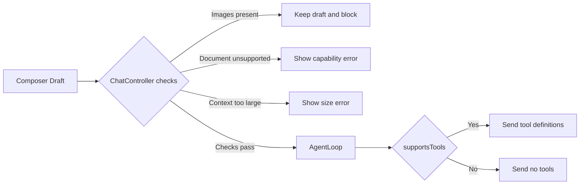
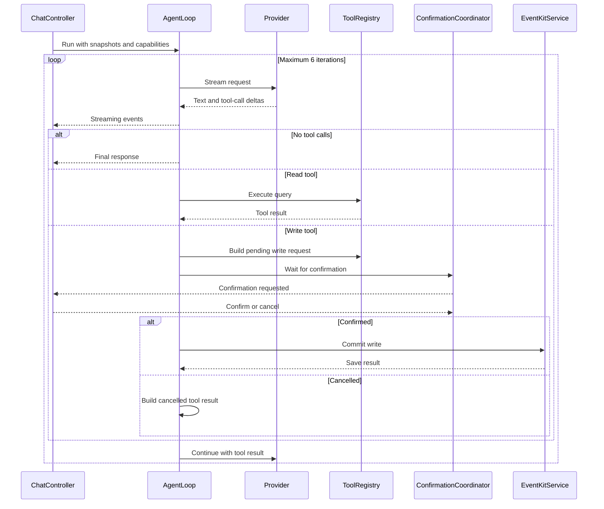
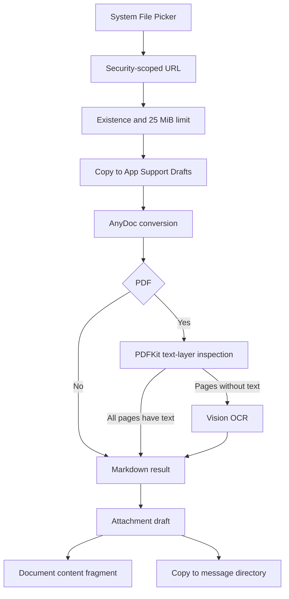

# Familiar Agent、Provider 与内容处理链路

## 1. Provider Catalog

路径：`Familiar/Domain/FamiliarProviderCatalog.swift`

### 1.1 内置 Provider

| ID | Provider | 协议族 |
|---|---|---|
| `openai` | OpenAI | OpenAI Chat |
| `anthropic` | Anthropic | Anthropic Messages |
| `gemini` | Gemini | Gemini Generate Content |
| `deepseek` | DeepSeek | OpenAI Chat 配置适配 |
| `groq` | Groq | OpenAI Chat 配置适配 |
| `xai` | xAI | OpenAI Chat 配置适配 |
| `openrouter` | OpenRouter | OpenAI Chat 配置适配 |
| `qwen` | Qwen | OpenAI Chat 配置适配 |
| `kimi` | Kimi | OpenAI Chat 配置适配 |
| `glm` | GLM | OpenAI Chat 配置适配 |
| `minimax` | MiniMax | OpenAI Chat 配置适配 |
| `siliconflow` | SiliconFlow | OpenAI Chat 配置适配 |

自定义入口 ID：`custom-openai`。

### 1.2 Provider Descriptor

`FamiliarProviderDescriptor` 描述：

- 字符串 ID。
- 显示名。
- 协议类型。
- Base URL。
- Chat path。
- Models path。
- 认证方式。
- 固定 headers。
- 精选模型。
- OpenAI SSE 差异配置。
- 自定义 Provider 标记。

认证方式：

- Bearer。
- 指定 API Key header。
- 指定 API Key query parameter。

### 1.3 Provider 特定配置

- OpenAI：Organization ID、Project ID。
- OpenRouter：`HTTP-Referer`、`X-Title`。
- Qwen：中国区和国际区 Base URL。
- 自定义 Provider：显示名、Base URL、模型 ID、可选模型列表路径。

API Key 使用 Provider ID 作为 Keychain account，服务名为 `com.isaachuo.familiar.provider-api-keys.v2`。

## 2. 模型能力

`FamiliarModelCapabilities` 字段：

- `supportsText`
- `supportsTools`
- `supportsImages`
- `supportsDocuments`
- `maximumInputCharacters`

### 2.1 Gate 位置



UI gate 位于 `FamiliarChatController.startSending(in:)`。Agent gate 位于 `FamiliarAgentLoop`。

### 2.2 未知模型

服务端返回或用户手动输入的未知模型使用 `.textOnly` 回退：

- 工具关闭。
- 图片关闭。
- 文档关闭。
- 输入上限 60,000 字符。

模型能力由应用静态目录定义。能力状态不代表 Provider 在线探测结果。

## 3. 统一 Provider 接口

路径：`Familiar/Agent/FamiliarModelProvider.swift`

输入：`FamiliarModelRequest`

流事件：

- `textDelta`
- `toolCallDelta`
- `completed`

终止原因统一映射为：

- stop
- tool calls
- length
- unknown

内容片段支持：

- 文本。
- 文档文本和文件名。
- 图片 placeholder。

图片 placeholder 由 UI 和 adapter 双层拦截。

## 4. OpenAI Chat 适配

路径：`Familiar/Data/OpenAICompatibleClient.swift`

请求行为：

- `POST`
- `stream: true`
- `Accept: text/event-stream`
- assistant tool calls 编码。
- tool result 的 `tool_call_id` 编码。
- JSON Schema function parameters 编码。

SSE 行为：

- 读取配置的 `data:` 前缀。
- `[DONE]` 结束。
- `delta.content` 转为文本增量。
- `delta.tool_calls` 转为工具增量。
- `finish_reason` 转为统一终止原因。

各兼容 Provider 通过 descriptor 配置 endpoint、headers、stream options 和事件差异。代码不假设所有 OpenAI-compatible 服务具有相同能力。

## 5. Anthropic Messages 适配

路径：`Familiar/Data/FamiliarProviderAdapters.swift`

请求行为：

- system 消息单独编码。
- 连续同角色消息合并为 content blocks。
- 工具定义编码为 Anthropic tools。
- tool result 编码为 tool result block。
- `max_tokens = 4096`。

事件处理：

- `content_block_start`
- `content_block_delta`
- `message_delta`
- `message_stop`

`tool_use` 提供 ID 和名称。`partial_json` 作为参数增量。

## 6. Gemini Generate Content 适配

路径：`Familiar/Data/FamiliarProviderAdapters.swift`

请求行为：

- `streamGenerateContent?alt=sse`
- system 映射为 `systemInstruction`
- 消息映射为 `contents`
- 工具映射为 `functionDeclarations`
- assistant 角色映射为 `model`
- 工具结果映射为 `functionResponse`

Gemini function call 缺少服务端调用 ID 时，App 生成当前运行范围内的本地 ID。

## 7. 网络错误和取消

三类 adapter 使用：

- `URLSession.shared.bytes(for:)`
- `bytes.lines`
- 120 秒 timeout
- `Task.checkCancellation()`
- `AsyncThrowingStream.onTermination`

非 2xx 响应处理：

- 错误正文读取上限 64,000 字节。
- 用户可见错误摘要上限 500 字符。

格式异常的单行 SSE 当前采用跳过策略。连续异常导致无有效事件时返回空响应错误。

## 8. Agent Loop

路径：`Familiar/Agent/FamiliarAgentLoop.swift`

### 8.1 运行步骤



### 8.2 运行限制

- 默认最多 6 轮。
- 工具结果上限 48,000 字符。
- 上下文上限由模型能力决定。
- 工具参数执行前进行 JSON 解码和字段校验。
- 同一 run 内以工具名和参数组合识别重复调用。
- 重复调用生成失败工具结果。
- length 和 unknown 终止原因产生不完整回答错误。

### 8.3 系统策略

无工具能力时，系统策略要求模型避免声称已读取设备数据或执行系统操作。写入取消后，后续回答需要反映取消结果。

## 9. 工具注册表

### 9.1 本机信息

路径：`Familiar/Agent/FamiliarNativeTools.swift`

- `current_date_time`
- `app_information`

### 9.2 EventKit

路径：`Familiar/EventKit/FamiliarEventKitTools.swift`

| 工具 | 类型 | 主要参数 |
|---|---|---|
| `calendar_events` | 查询 | 开始、结束、limit |
| `create_calendar_event` | 写入计划 | 标题、开始、结束、全天、地点、备注、URL、日历 |
| `reminders` | 查询 | 开始、结束、文字、limit |
| `create_reminder` | 写入计划 | 标题、截止时间、列表、优先级、备注 |

## 10. EventKit 权限与查询

路径：`Familiar/EventKit/FamiliarEventKitService.swift`

权限状态：

- not determined
- restricted
- denied
- write only
- full access

查询要求 full access。首次相关查询通过时间线确认卡说明数据用途，然后请求系统权限。

查询限制：

- `limit` 范围 1–200。
- 日历查询要求开始时间早于结束时间。
- 提醒事项支持截止时间范围和标题/备注文字匹配。
- EventKit 对象在回调内转换为 `Sendable` DTO。

## 11. 写入确认和幂等

### 11.1 确认协调器

路径：`Familiar/Agent/FamiliarToolConfirmationCoordinator.swift`

确认幂等键：

```text
runID + toolCallID
```

状态：

- pending
- confirmed
- cancelled
- already resolved
- unknown request

Task 取消会移除 continuation，并将该请求解析为取消。

### 11.2 EventKit commit

`FamiliarEventKitService` actor 使用 `committedKeys` 保存当前进程内已完成写入。相同 idempotency key 返回已有结果。

该缓存不跨 App 重启。SwiftData 工具终态提供历史记录，不能用于系统层写入回滚。

## 12. 文档处理

### 12.1 支持格式

- DOC、DOCX、DOCM
- PPT、PPS、POT、PPTX、PPTM、PPSX、PPSM
- XLS、XLSX、XLSM、XLSB
- ODT、ODS、ODP
- RTF、EPUB、CSV
- PDF
- TXT、MD、Markdown

### 12.2 导入链路



### 12.3 AnyDoc Bridge

路径：

- `Familiar/AnyDoc/FamiliarAnyDocService.swift`
- `Vendor/AnyDocBridgeRust/`
- `Vendor/AnyDocBridge.xcframework/`

返回信息：

- Markdown bytes。
- 检测格式。
- 引擎版本。
- 错误码和错误消息。

平台 slices：

- `aarch64-apple-ios`
- `aarch64-apple-ios-sim`

构建流程不包含 Intel Simulator slice。

### 12.4 PDF

1. AnyDoc 处理文档结构。
2. PDFKit 检查每页文本层。
3. 无文本层页面渲染缩略图。
4. Vision 使用准确识别和语言修正。
5. OCR 文本追加到 Markdown。
6. AnyDoc 返回 PDF unsupported 时执行完整 PDF fallback。

### 12.5 Provider 输入

Provider 接收：

- 文件名。
- 抽取后的 Markdown 文本。

Provider 不接收原文件二进制。

## 13. 图片链路

已实现：

- 相机拍摄。
- PhotosPicker 选择。
- 图片草稿预览。
- 单张移除。
- 发送前拦截。

当前限制：

- 不编码图片内容片段。
- 不上传图片。
- 不执行图片 OCR 后自动发送。
- `supportsImages` 描述字段不开放图片发送路径。

## 14. 语音链路

路径：`Familiar/Speech/FamiliarSpeechTranscriber.swift`

流程：

1. 请求 Speech 权限。
2. 请求麦克风权限。
3. 配置 audio session。
4. 安装 input tap。
5. 启动 `SFSpeechRecognitionTask`。
6. 将 partial result 写入输入框。
7. final result、错误、用户停止或场景失活时结束。
8. 移除 tap、取消 task、释放 audio session。

设备支持本地识别时设置 `requiresOnDeviceRecognition = true`。系统不支持本地识别时，Speech framework 可能使用 Apple 服务。隐私文案需要保留该条件描述。

## 15. 验证要求

### 真实 Key

- 每个内置 Provider 的认证。
- endpoint 和 headers。
- 文本流式输出。
- SSE 终止事件。
- 模型列表端点。
- 标记支持工具的模型完成一次 tool call。

### 真机

- EventKit 授权允许、拒绝和受限状态。
- 查询范围和结果限制。
- 写入预览、确认、取消和系统保存失败。
- 安全作用域文件。
- AnyDoc 真实文档。
- 扫描 PDF OCR。
- 图片拦截保留草稿。
- Speech 权限和中文转写。
