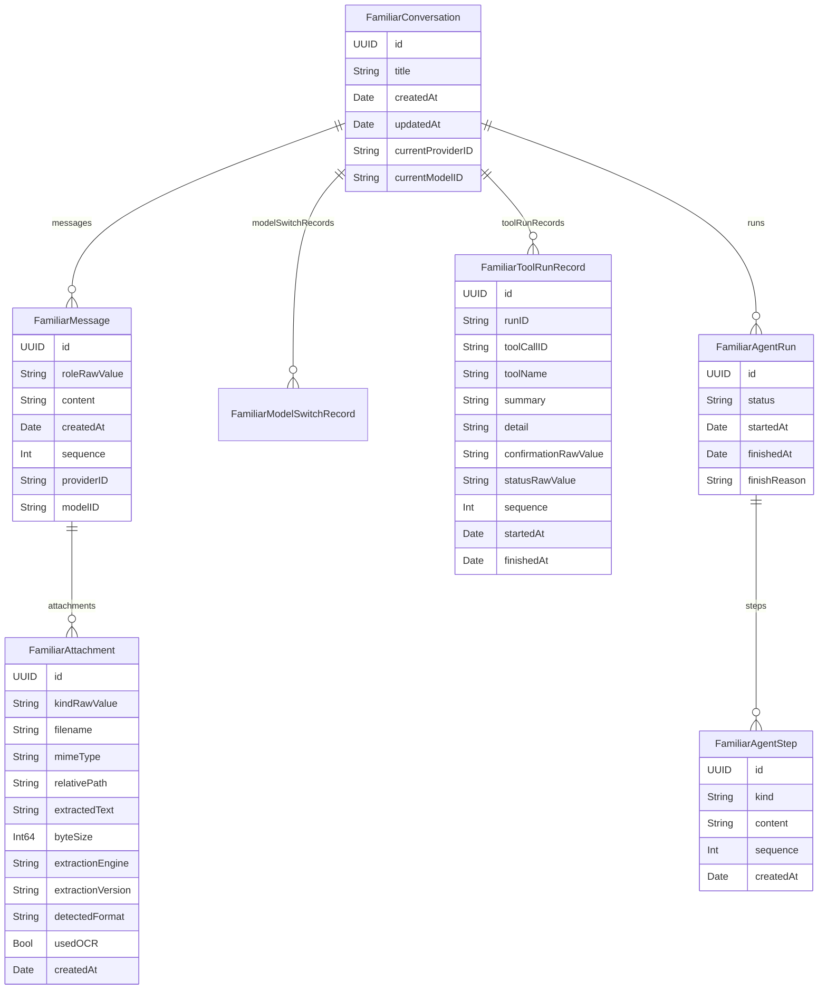

# Familiar 本地数据与隐私

## 1. 数据处理原则

- API Key 保存到设备 Keychain。
- 模型请求从 iPhone 直接发送到用户选择的 Provider。
- 会话和工具记录保存在 SwiftData 本地 store。
- Agent Run 与 Step 终态保存在 SwiftData。
- 文档原文件复制到 App 私有目录。
- 文档转换和 PDF OCR 在设备内执行。
- 流式 token 和待确认请求只存在于内存。
- 图片草稿不进入 Provider 请求。
- App 不创建原始录音文件。
- App 不读取学术系统或其他 App 的私有数据。
- App 不使用 Familiar 账户、业务后端或云端数据库。
- Deep Link 只接受有长度上限的草稿文本或本地会话 / Run UUID；它不自动发送内容、不承载 API Key，也不授予工具写权限。
- Share Extension 只把用户明确共享的文本、URL 和文件复制到 App Group 收件箱；扩展不读取 Keychain、会话、Provider 配置或 EventKit 数据。
- Ask / Process App Intents 只把用户明确提供且经过长度限制的文本交给主 App；文本随后沿用普通消息的 BYOK 请求路径。Open Familiar 不创建草稿、不发送网络请求，所有 Intent 均不能授予工具写权限。

## 2. 数据清单

| 数据 | 来源 | 本地位置 | 网络目的地 | 生命周期 |
|---|---|---|---|---|
| Provider API Key | 用户输入 | Keychain | 对应 Provider | 用户清除或卸载相关 Keychain 项目 |
| Provider 配置 | 用户输入 | UserDefaults | 用于构建请求 | 用户修改或重置设置 |
| 会话 | 用户行为 | SwiftData | 作为模型上下文 | 用户删除会话 |
| 用户消息 | 用户输入 | SwiftData | 对应 Provider | 用户删除或编辑路径 |
| 助手消息 | Provider 返回 | SwiftData | 后续请求上下文 | 用户删除或重试路径 |
| 模型切换记录 | 用户操作 | SwiftData | 不单独发送 | 会话删除或路径重写 |
| 工具终态 | Agent 与系统结果 | SwiftData | 可能进入后续模型上下文 | 会话删除或路径重写 |
| Run/Step 记录 | Agent Runtime | SwiftData | 不单独发送 | 会话删除或路径重写 |
| Long-term Memory | 明确事实写入 | SwiftData | 作为 Resources 进入上下文 | 用户删除或 memory.delete |
| 待确认请求 | Agent | 内存 | 不发送到 Familiar 服务 | 决策、取消或进程结束 |
| 流式 token | Provider | 内存 | 不作二次上传 | 回答终态或任务结束 |
| 文档原文件 | 文件选择器 | App Support | 不上传 | 附件、消息或会话删除 |
| 文档抽取文本 | AnyDoc/OCR | SwiftData | 对应 Provider | 附件、消息或会话删除 |
| 图片草稿 | 相机或相册 | 内存 | 当前版本不上传 | 移除、切换会话或进程结束 |
| 语音转写 | Apple Speech | 输入草稿 | 发送后进入 Provider | 用户编辑或清空草稿 |
| 原始录音 | 麦克风输入 | 不落盘 | Speech framework 按系统能力处理 | audio buffer 生命周期 |
| 日历/提醒数据 | EventKit | 查询结果进入内存和工具记录摘要 | 可能作为工具结果进入 Provider | 运行结束和历史记录生命周期 |
| Deep Link 输入 | 其他 App 或系统入口 | 草稿文本进入内存；会话 / Run UUID 仅用于本地查询 | 不因打开链接自动发送 | 链接处理或草稿生命周期 |
| Share Extension 输入 | 用户从其他 App 明确共享 | App Group `ShareInbox`，导入后复制到 App 私有草稿附件目录 | 不因共享或导入自动发送 | 成功或终态失败处理后删除共享副本；草稿副本沿用附件生命周期 |
| App Intent 文本 | 用户在 Siri / Shortcuts / Spotlight 明确提供 | 仅作为进程内 handoff 和新草稿短暂存在，发送后进入本地消息记录 | Ask / Process 通过当前选择的 BYOK Provider 发送；Open 不发送 | 未发送草稿被拒绝覆盖；成功提交后沿用会话生命周期 |

## 3. SwiftData Schema

路径：`Familiar/Persistence/FamiliarModels.swift`、`Familiar/Domain/FamiliarConversationMetadata.swift`



关系删除规则使用 cascade。文件系统附件由控制器执行显式清理。

## 4. store 版本策略

当前开发 Schema 的 store 地址：

```text
Application Support/Familiar/Persistence/FamiliarAgentV2.store
```

历史开发版本使用 SwiftData 默认地址：

```text
Application Support/default.store
```

旧 store 缺少 `FamiliarConversation.currentModelID` 等必填字段时，SwiftData 轻量迁移会返回 `NSCocoaErrorDomain 134110`。当前引导流程执行：

1. 创建 `FamiliarAgentV2.store` 的目录和配置。
2. 成功打开当前 `ModelContainer`。
3. 当前 store 首次创建时检查旧 `default.store`。
4. 清理旧 store、`-shm`、`-wal` 和旧附件目录。

清理动作发生在新容器成功创建后。该策略适用于项目当前无正式用户的开发阶段。

公开版本后发生 Schema 变化时，需要满足以下条件之一：

- 提供 `VersionedSchema` 和迁移计划。
- 提供用户可见的数据恢复与重建流程。
- 在版本发布前明确声明数据兼容范围。

当前版本在容器创建失败时不再终止启动：恢复界面展示有限诊断信息，并在用户再次确认后删除当前 V2 store、SQLite sidecar 与附件目录。该操作保留 Keychain 中的 Provider API Key，完成后要求用户重启 App。

## 5. 持久化时点

### 5.1 用户消息

用户消息和已提交附件在网络请求前保存。请求失败后，用户输入仍保留在会话中。

### 5.2 助手消息

流式期间更新 `streamingText`。Provider 和 Agent Loop 进入终态后创建助手消息并保存。

### 5.3 工具记录

工具成功、取消或失败后保存：

- 工具名。
- 用户可见摘要。
- 详情。
- 确认结果。
- 终态。
- 开始和结束时间。

等待确认状态不保存。

### 5.4 模型切换

会话内切换 Provider 或模型时保存切换记录，并更新会话当前选择。

### 5.5 Run 与 Step

一次 Agent Run 中的 ModelStep、ToolStep、ApprovalStep、ResultStep 在终态保存。等待确认状态和流式增量不保存。

## 5.6 Memory 三层

- Working Context：当前 Run，内存。
- Session History：当前 Conversation，SwiftData。
- Long-term Memory：跨 Session 的明确用户事实，SwiftData。

Long-term Memory 只写入用户明确告知或反复出现的稳定事实，保守执行，不做全量聊天向量化。

## 6. 文件系统

附件根目录：

```text
Application Support/Familiar/Attachments/
```

子目录：

```text
Drafts/
Messages/<message UUID>/
```

### 6.1 路径安全

`FamiliarAttachmentStore` 执行：

- 文件名清洗。
- 拒绝绝对路径。
- 拒绝空路径段。
- 拒绝 `..`。
- 规范化 URL 必须位于附件根目录内。
- 源文件和复制文件大小校验。
- 单文件上限 25 MiB。

### 6.2 安全作用域

文件导入期间调用：

- `startAccessingSecurityScopedResource()`
- `stopAccessingSecurityScopedResource()`

安全作用域只覆盖复制过程。后续预览使用 App 私有副本。

### 6.3 清理

已实现清理场景：

- 导入失败。
- 转换失败。
- 导入取消。
- 多附件提交中途失败。
- 删除会话。
- 编辑或重试删除后续消息。
- 丢弃草稿。
- 页面出现时清理未被当前草稿引用的 Drafts。

当前缺口：

- 尚无按全部 SwiftData 引用扫描 `Messages` 目录的全局孤儿文件清理。
- 尚未显式设置文件保护等级。

## 7. Keychain

路径：`Familiar/Data/FamiliarKeychainStore.swift`

属性：

```text
kSecClassGenericPassword
kSecAttrService = com.isaachuo.familiar.provider-api-keys.v2
kSecAttrAccount = providerID
kSecAttrAccessible = kSecAttrAccessibleWhenUnlockedThisDeviceOnly
```

影响：

- 设备解锁后可访问。
- 不通过 Keychain 同步迁移到其他设备。
- 每个 Provider 使用独立 account。
- 空 Key 输入触发删除。

API Key 不进入 SwiftData、UserDefaults、日志文案和工具记录。

## 8. Provider 网络数据

发送内容可能包括：

- 系统提示词。
- 当前会话文本消息。
- 文档抽取文本。
- 工具定义。
- 工具查询结果。
- 用户确认后的工具执行结果。

网络目的地由 Provider descriptor 和用户配置决定。

用户配置自定义 Base URL 时，数据会发送到该 URL 所属服务。设置界面和隐私文档需要提示该影响。

## 9. WebKit 数据

`FamiliarMarkdownWebView` 使用 `.nonPersistent()` website data store。脚本和样式来自 App Bundle。

CSP 主要限制：

- `connect-src 'none'`
- `media-src 'none'`
- `object-src 'none'`
- `frame-src 'none'`
- `form-action 'none'`

`img-src` 仅允许 Bundle 同源资源与 `data:`，不允许 HTTP 或 HTTPS 图片。渲染器先在 inert template 中清理 Markdown HTML，把 HTTPS 图片替换为带有替代文本和主机名的来源链接，再插入 WebView 文档。因此渲染过程不会向图片主机暴露 IP、User-Agent 或访问时间。只有用户主动点击来源链接后，系统才会在外部打开该地址，此后的网络请求受目标网站隐私政策约束。

## 10. EventKit 数据

### 10.1 读取

查询参数限定时间范围、文字条件和结果上限。工具结果可能进入 Provider 上下文，用于生成回答。

### 10.2 写入

创建操作包含两个阶段：

1. 生成待确认计划。
2. 用户确认后调用 EventKit save。

工具确认卡展示目标容器和字段。取消结果进入 Agent Loop。取消路径不调用 save。

### 10.3 权限

使用 EventKit full access API（iOS 17 引入）：

- `requestFullAccessToEvents()`
- `requestFullAccessToReminders()`

用途说明：

- `NSCalendarsFullAccessUsageDescription`
- `NSRemindersFullAccessUsageDescription`

## 11. 相机、照片和语音

### 相机

- 用户进入相机界面时请求权限。
- 照片进入内存草稿。
- 当前发送 gate 阻止图片网络请求。

### 照片

- 使用 `PhotosPicker`。
- 不请求完整照片库权限。
- 用户选定的图片进入内存草稿。

### 语音

- 请求麦克风和 Speech 权限。
- 可用时优先设备端识别。
- 转写结果进入文本输入框。
- 不保留音频文件。
- 系统不支持设备端识别时，Speech framework 的处理路径由 Apple 系统能力决定。

## 12. 权限表

权限由代码控制，不靠 Prompt。系统权限按功能触发；写操作按意图感知授权执行：

| 操作 | 默认行为 |
|---|---|
| Read + 低风险 | 自动执行 |
| 明确的可逆写入 | 执行 + Undo |
| 推断出的写入 | 确认 |
| 敏感读取 | Permission / policy |
| 破坏性操作 | 确认 |
| 财务 / 外部重大影响 | 强确认 |

| 权限 | 触发功能 | 数据用途 |
|---|---|---|
| Camera | 拍照 | 创建图片草稿 |
| Microphone | 语音输入 | 提供实时音频 buffer 给 Speech |
| Speech Recognition | 语音输入 | 生成可编辑文本 |
| Calendars Full Access | 日历工具 | 查询和确认后创建事件 |
| Reminders Full Access | 提醒工具 | 查询和确认后创建提醒 |
| PhotosPicker | 相册 | 读取用户选定图片 |
| Security-scoped file URL | 文件 | 复制用户选定文档 |

## 13. 威胁与控制

| 风险 | 控制 |
|---|---|
| API Key 泄露到普通存储 | Keychain，ThisDeviceOnly |
| 自定义服务地址收集内容 | 用户显式配置，设置中展示 Base URL |
| 模型执行未授权写入 | 时间线确认、协调 actor、EventKit commit 分层 |
| 重复工具调用 | run 内重复检测、确认幂等、进程内 commit 幂等 |
| 路径穿越 | 相对路径校验和根目录约束 |
| 大文件耗尽上下文 | 25 MiB 文件限制和模型字符上限 |
| 图片意外上传 | UI gate 和 adapter gate |
| Web 内容执行网络脚本 | Bundle 资源、CSP、non-persistent store |
| 流式 token 触发广泛持久化 | 内存状态和终态保存分离 |
| 旧 Schema 启动崩溃 | 版本化开发 store |

## 14. 删除语义

### 删除消息路径

编辑和重试会删除目标之后的：

- 消息。
- 模型切换记录。
- 工具记录。
- 对应附件文件。

### 删除会话

删除会话时：

- 清理消息附件文件。
- 删除会话实体。
- cascade 删除关联实体。

### 卸载 App

App 容器中的 SwiftData、UserDefaults 和附件文件由系统删除。`kSecAttrAccessibleWhenUnlockedThisDeviceOnly` Keychain 项目的卸载行为由系统管理；产品需要提供设置内清除 Key 的操作。

## 14.5 后台与可恢复运行

Agent Run 设计为可恢复，不是常驻 daemon。用户退出 App 后，必要时通过 `BGContinuedProcessingTask` 承接用户启动的长任务继续完成。Run/Step 终态已持久化，重新打开 App 后可恢复执行轨迹。后台运行不改变数据目的地：模型请求仍然直接发往用户选择的 Provider。

## 15. 隐私验收

- 抓包确认 Provider 请求目的地。
- 检查请求体不含图片 bytes 和原文件 bytes。
- 检查日志不含 API Key。
- 检查流式 token 未写入 SwiftData。
- 检查等待确认状态未写入 SwiftData。
- 拒绝 EventKit 权限时零读取和零写入。
- 取消写入确认时零写入。
- 删除会话后附件目录无对应文件。
- 停止语音后无录音文件。
- 验证 Markdown CSP 不允许 HTTP/HTTPS 图片，且远程图片只呈现为用户主动打开的来源链接。
