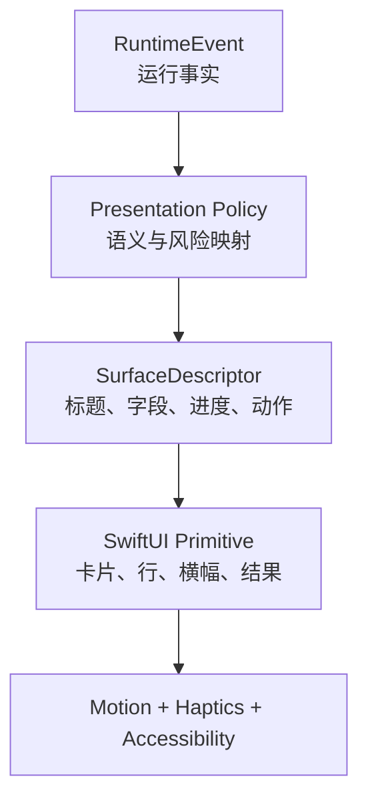
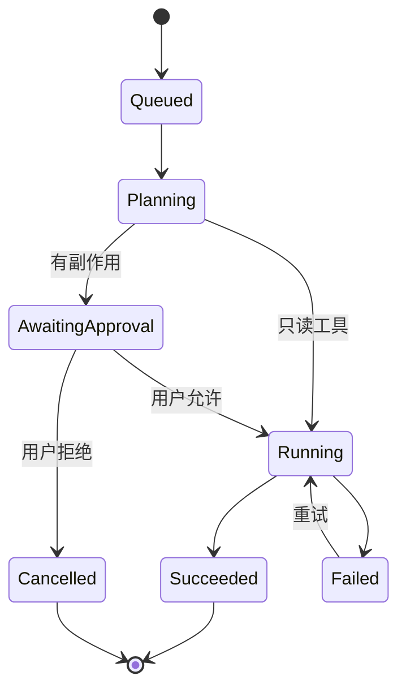

# Familiar 原生 AI 前端、交互与动画壁垒报告

> 调研日期：2026-08-13  
> 审阅对象：`IsaacHuo/Familiar`，提交 `f4ab80992a42221ca5717605c0ada753149de3a9`  
> 范围：SwiftUI 前端、AI 运行状态呈现、工具交互、动效、触觉、无障碍与项目工作台体验

> 顺序说明：本文是专题研究材料。实际实施顺序以 [`../10-next-phase-execution-plan.md`](../10-next-phase-execution-plan.md) 为准；视觉与 motion 系统不先于 benchmark、CI、迁移和 Project 数据路径。

## 一句话结论

Familiar 最值得建立的前端壁垒，是一套“AI 运行时事件可以稳定转换成 Apple 平台原生交互”的系统：同一张工具卡从等待、授权、执行到成功或失败连续演化；动画表达因果关系；触觉只标记关键里程碑；VoiceOver、Reduce Motion、Dynamic Type 与系统材质从第一天进入组件契约。

单纯追求更丝滑的动画，复制成本很低。运行状态、权限语义、原生组件、动效节奏、系统入口和长期一致性组合起来，才会形成难以追赶的产品能力。

---

## 1. 当前判断：地基已经存在，体系尚未形成

从代码看，Familiar 当前已经具备相当多的原生基础：

- 根界面有原生抽屉手势、主表面位移、圆角和阴影联动，并使用弹簧动画。
- Composer 已有 compact、expanded、fullscreen 等形态，并通过自定义 `Layout` 和 `.smooth` 过渡。
- 语音运行状态使用 SF Symbols 动效；加载状态使用 `TimelineView(.animation)`，同时处理 Reduce Motion。
- iOS 26 使用 `glassEffect`、`GlassEffectContainer`、`safeAreaBar`；iOS 18–25 有降级路径，并考虑 Reduce Transparency。
- 工具调用已经有运行中状态、确认卡、持久化结果行、执行轨迹 disclosure 和 sources disclosure。
- `ToolRunSnapshot`、`AgentRunSnapshot`、`AgentStepSnapshot` 已经让 UI 能看见运行过程。
- 工具确认会移动辅助功能焦点；多处已有 accessibility label。

证据可见于 [FamiliarTheme.swift](https://github.com/IsaacHuo/Familiar/blob/main/Familiar/Support/FamiliarTheme.swift)、[FamiliarRootView.swift](https://github.com/IsaacHuo/Familiar/blob/main/Familiar/Presentation/FamiliarRootView.swift)、[FamiliarComposerView.swift](https://github.com/IsaacHuo/Familiar/blob/main/Familiar/Presentation/FamiliarComposerView.swift)、[FamiliarChatMessageViews.swift](https://github.com/IsaacHuo/Familiar/blob/main/Familiar/Presentation/FamiliarChatMessageViews.swift) 和 [FamiliarChatModels.swift](https://github.com/IsaacHuo/Familiar/blob/main/Familiar/Domain/FamiliarChatModels.swift)。

因此，目前的问题主要有三层：

1. **状态模型分散**：每个 View 各自判断 loading、running、confirmation、result，长期会产生相近却不一致的交互。
2. **视觉组件缺乏语义协议**：工具卡能显示内容，但还没有一个统一描述“这是什么、风险多大、进度如何、用户能做什么”的中间层。
3. **动效缺乏产品级语法**：已有优秀的局部动画，还没有形成可复用的 motion tokens、状态迁移规则和触觉策略。

## 2. 对标 OpenMinis 时，应该学什么

[OpenMinis](https://github.com/OpenMinis/OpenMinis) 的强项是能力密度：Linux 沙箱、浏览器自动化、Skills、Memory、Workspaces 与 Apple 系统工具形成一个可执行环境。它把 Workspace 暴露为 `minis://workspace/`，并把重型或平台相关工作交给 native offload。其 README 也明确写明 iOS 端包含 Swift/SwiftUI App、Share、Widget 和 File Provider 扩展。

Familiar 选择更纯粹的 iOS 原生路线，可以形成不同的优势：

| 维度 | OpenMinis 路线 | Familiar 建议路线 |
|---|---|---|
| 执行能力 | Linux shell 作为通用计算机 | 能力注册表 + Apple Framework 工具 + 远程 MCP |
| 用户理解 | shell、文件、Skills 较接近开发者心智 | 项目、卡片、授权、结果、撤销更接近日常用户心智 |
| UI | 能力广度优先 | 状态连续性、权限可见性、原生反馈优先 |
| 风险 | 沙箱仍有高权限工具与提示注入风险 | 每个副作用穿过统一 policy/approval 层 |
| 可复制性 | 开源运行环境与工具数量 | 运行语义和 Apple 交互细节的长期积累 |

这里最关键的选择是：Familiar 无需在 UI 里模拟终端，也不需要把每个 AI 步骤做成日志。用户需要随时回答五个问题：

1. 它现在在做什么？
2. 为什么需要我确认？
3. 它用了哪些信息？
4. 它对系统产生了什么改变？
5. 失败后我能否重试、修改或撤销？

## 3. 建议建立 “Familiar AI Surface Protocol”

建议新增一个独立 Presentation 层协议，把运行时与 SwiftUI 解耦。运行时只发出语义事件，Presentation Policy 负责把事件转换成稳定的展示描述，View 只负责渲染。



### 3.1 统一运行状态

建议用一个跨工具的状态机替代多个布尔值：

```swift
enum AgentActivityState: Sendable, Equatable {
    case queued
    case planning
    case awaitingApproval(ApprovalDescriptor)
    case running(progress: ProgressDescriptor?)
    case succeeded(ResultDescriptor)
    case failed(FailureDescriptor)
    case cancelled
}
```

状态迁移规则应由运行时保证，UI 只观察：



### 3.2 展示描述符

```swift
struct FamiliarSurfaceDescriptor: Sendable, Identifiable {
    let id: UUID                 // 整个生命周期保持不变
    let kind: SurfaceKind        // activity / approval / artifact / source
    let title: LocalizedStringResource
    let subtitle: String?
    let symbol: String
    let fields: [Field]
    let progress: ProgressDescriptor?
    let actions: [SurfaceAction]
    let emphasis: Emphasis
    let sensitivity: Sensitivity
    let accessibilitySummary: String
}
```

工具提供结构化数据，Presentation Policy 决定文案、图标、风险强调和可用动作。这样 EventKit、Web Search、文件导入和未来 MCP 工具都能共享同一种交互语言，同时保留工具特有字段。

### 3.3 原生组件集合

第一批组件建议控制在七个：

| 组件 | 用途 | 关键行为 |
|---|---|---|
| `AgentStatusRow` | 规划、读取、等待等轻状态 | 同一位置更新，避免刷屏 |
| `ToolActivityCard` | 工具执行生命周期 | 原位 morph，身份不变 |
| `ApprovalCard` | 有副作用操作 | 展示对象、范围、后果、允许/拒绝 |
| `ArtifactCard` | 文件、图片、Markdown、导出物 | Quick Look、分享、加入项目 |
| `SourceCard` | 网页与引用 | 域名、标题、访问时间、打开来源 |
| `InlineResult` | 简短结构化结果 | 支持复制、继续操作 |
| `RecoveryBanner` | 网络、权限、模型、工具错误 | 一步重试或打开设置 |

## 4. 动画系统：表达因果，而非装饰

Apple 的 [Motion HIG](https://developer.apple.com/design/human-interface-guidelines/motion) 强调动画可以传达状态、反馈和操作结果，也要求在 Reduce Motion 下减少自动或重复动画。Familiar 应把动画分成三层：

### 4.1 空间动画

用于抽屉、项目、会话、Artifact 预览等“位置发生变化”的交互。

- 抽屉继续使用手势进度驱动，释放后才使用 spring。
- 项目卡进入项目主页可使用 `matchedGeometryEffect` 或 Navigation transition，但只在真实共享元素上使用。
- 卡片展开到详情应保持来源位置和视觉身份，避免全屏突然替换。

### 4.2 状态动画

用于 queued → running → succeeded 等离散状态。

- 同一工具调用只保留一张卡；图标、标题、进度和操作在卡内更新。
- 成功时使用一次短暂 symbol transition 或 checkmark draw，随后停止。
- 失败时改变语义色、显示简明原因和重试；避免抖动、闪烁和“警报式”长动画。
- `contentTransition(.numericText())` 适用于进度或计数，文本主体仍保持稳定。

### 4.3 连续进度动画

用于录音、下载、无法估算时长的工具运行。

- 一个屏幕最多保留一个显著的连续动画焦点。
- 已有 orbit loader 可以继续，但仅用于真正无法估算的短等待。
- 超过约 8–10 秒，应显示正在执行的动作、已完成步骤或可取消入口；动画本身无法建立信任。

### 4.4 Motion tokens

建议集中定义，禁止 View 自行发明 duration/spring：

```swift
enum FamiliarMotion {
    static let micro = Animation.easeOut(duration: 0.16)
    static let state = Animation.smooth(duration: 0.28)
    static let spatial = Animation.spring(duration: 0.42, bounce: 0.12)
    static let drawer = Animation.interactiveSpring(
        response: 0.38, dampingFraction: 0.86, blendDuration: 0.08
    )
}
```

在 Reduce Motion 下，空间位移改用短 opacity/content transition；状态信息仍然完整出现。

Apple 的 [`PhaseAnimator`](https://developer.apple.com/documentation/swiftui/phaseanimator) 适合少数明确的阶段序列，例如“请求确认 → 已确认 → 开始执行”。它不适合驱动所有卡片，以免调试困难。iOS 18 基线允许 Familiar 使用 `matchedGeometryEffect`、`symbolEffect`、自定义 `Layout` 和 SwiftUI animation；iOS 26 再条件启用 Glass morphing。

## 5. 触觉：把关键边界变成身体可感知的反馈

SwiftUI 的 [`sensoryFeedback`](https://developer.apple.com/documentation/swiftui/sensoryfeedback) 可以由状态变化触发。建议只在这些时刻使用：

| 事件 | 反馈建议 |
|---|---|
| 抽屉或 Composer 吸附到稳定档位 | `selection`，轻且可预测 |
| 出现副作用确认 | 一次轻 warning/impact |
| 用户确认操作 | `impact`，随后立即进入 running |
| 工具成功 | `success`，每个用户任务最多一次显著反馈 |
| 工具失败 | `error`，同时必须有视觉与文字说明 |

避免逐 token、逐搜索结果、逐 agent step 震动。触觉应标记用户能理解的边界。

## 6. Liquid Glass 的正确位置

Apple 的 [Liquid Glass 指南](https://developer.apple.com/documentation/swiftui/applying-liquid-glass-to-custom-views) 和 [`GlassEffectContainer`](https://developer.apple.com/documentation/swiftui/glasseffectcontainer) 更适合导航、控制和临时浮层。Familiar 当前把 Glass 放在 Composer、工具栏和交互控制附近，方向合理。

建议约束：

- Glass：导航栏、Composer、浮动操作、项目切换、确认操作区。
- 实体系统填充：聊天内容、工具结果、长文本、来源、Artifact。
- 同一区域的 Glass 组件放进一个 `GlassEffectContainer`，让形态变化有统一采样和 morph。
- Reduce Transparency 下使用不透明 system background；不能只降低 alpha。
- iOS 18–25 的形态、层级与信息密度保持一致，Glass 只是材质增强。

## 7. “项目工作台”中的前端落点

项目页不能只做文件夹列表。它应成为 AI 的上下文与产物主页：

| 区域 | 内容 | 原生实现 |
|---|---|---|
| 项目头部 | 名称、目标、最近活动、运行状态 | Navigation title + status accessory |
| 继续工作 | 最近会话与建议动作 | 原生 list/card，最多 3 项 |
| 资源 | 导入文件、网页、照片、笔记 | `fileImporter`、PhotosPicker、Share Extension |
| 产物 | 报告、Markdown、图片、日历/提醒动作 | Artifact 卡 + Quick Look / ShareLink |
| 能力 | 启用的 Skills、MCP、系统权限 | Disclosure + Settings deep link |
| 活动 | Run、Tool、Approval、Source 时间线 | 统一 Surface Protocol |

从 ChatGPT 截图可借鉴的是信息架构：侧栏中“项目”作为一级入口，项目页有明确空状态和创建动作。Familiar 的差异应体现在进入项目之后：资源、能力、运行、确认和产物真正形成闭环。

## 8. 质量与性能红线

本次只能进行代码与文档审阅，没有在 Simulator/真机中完成视觉、VoiceOver 和性能验证。因此，以下内容必须成为实现后的验收门槛：

- Dynamic Type：至少验证默认、XXXL 和 Accessibility XXXL；确认卡的允许/拒绝操作不可被挤出屏幕。
- VoiceOver：状态变化用恰当 announcement，运行中动画不重复朗读；卡片聚合成有意义的 accessibility element。
- Reduce Motion / Reduce Transparency：每个 Preview fixture 都有对应环境测试。
- 60/120Hz：长会话滚动时，持续动画离屏立即停止；避免每个 token 触发整棵消息树重算。
- 大 View 拆分：`FamiliarChatView` 与 `FamiliarChatMessageViews` 应按稳定身份、观察范围和重绘边界拆分，避免共享大型可变状态。
- Snapshot：每类 Surface 至少覆盖 queued、approval、running、success、failure、long text、large type、dark mode。

Apple 的 [Accessibility HIG](https://developer.apple.com/design/human-interface-guidelines/accessibility)、[Materials HIG](https://developer.apple.com/design/human-interface-guidelines/materials) 和 [SF Symbols HIG](https://developer.apple.com/design/human-interface-guidelines/sf-symbols) 应成为组件验收依据。

## 9. 分阶段路线图

### P0：先建立系统（2–3 周）

1. 定义 `AgentActivityState`、`FamiliarSurfaceDescriptor` 与稳定 card identity。
2. 把 Web Search、Web Fetch、EventKit 确认迁移到同一 ToolActivity/Approval 生命周期。
3. 集中 motion tokens、sensory feedback policy、Reduce Motion fallback。
4. 建立 Preview fixtures 与最小 snapshot/accessibility 测试。

### P1：形成工作台闭环（3–5 周）

1. 项目主页接入 Resource、Artifact、Source、Run。
2. Artifact Quick Look、分享、加入项目、删除/撤销。
3. 来源卡和引用跳转；失败恢复卡。
4. 项目卡到项目主页的共享元素过渡；真机 VoiceOver 与 Dynamic Type 验收。

### P2：形成品牌化原生语言（持续）

1. 每个新工具必须提供 descriptor fixture、权限文案、结果/错误映射。
2. iOS 26+ 条件增强 Glass morph；旧系统保持同构体验。
3. 记录交互指标：确认放弃率、工具失败恢复率、用户中止点、长任务返回率。

## 10. 首个“证明壁垒”的验收场景

选择一个跨能力、可见且可撤销的任务：

> “搜索三篇可靠资料，读完后总结，并在明天下午创建一个复习提醒。”

完整体验应当是：搜索状态原位更新 → 来源可展开 → 总结形成 Artifact → 创建提醒前出现语义明确的确认卡 → 用户确认后卡片进入执行 → 成功后显示提醒详情与撤销。

如果这一条链路在动画、触觉、权限、来源、失败恢复、VoiceOver 和项目归档上都统一，Familiar 就拥有了可感知的原生 AI 前端系统。继续堆更多卡片样式的收益会远低于打磨这一条完整链路。

## 参考资料

- [Familiar repository](https://github.com/IsaacHuo/Familiar)
- [Familiar UI/UX design document](https://github.com/IsaacHuo/Familiar/blob/main/Docs/03-ui-ux-design.md)
- [Apple: Applying Liquid Glass to custom views](https://developer.apple.com/documentation/swiftui/applying-liquid-glass-to-custom-views)
- [Apple: Motion](https://developer.apple.com/design/human-interface-guidelines/motion)
- [Apple: Accessibility](https://developer.apple.com/design/human-interface-guidelines/accessibility)
- [Apple: sensoryFeedback](https://developer.apple.com/documentation/swiftui/sensoryfeedback)
- [Apple: PhaseAnimator](https://developer.apple.com/documentation/swiftui/phaseanimator)
- [OpenMinis repository](https://github.com/OpenMinis/OpenMinis)
