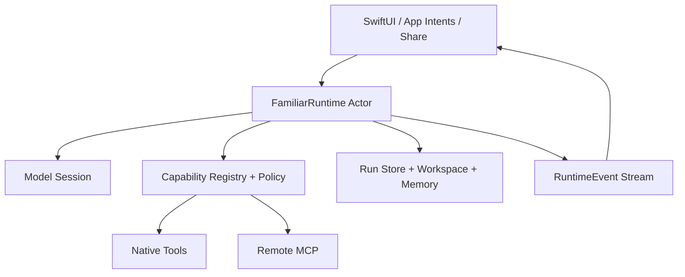
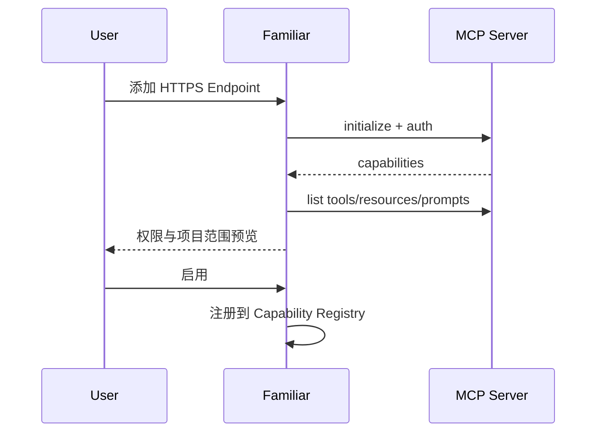

# Familiar iOS 原生 AI 运行时（“后端”）深入调查与实现报告

> 调研日期：2026-08-13  
> 审阅对象：`IsaacHuo/Familiar`，提交 `f4ab80992a42221ca5717605c0ada753149de3a9`  
> 覆盖：Agent Loop、模型适配、工具与授权、MCP、Skills、Workspace、Memory、后台执行、Apple Foundation Models、Swarm 与其他 Swift SDK

> 顺序说明：本文是专题研究材料。实际实施顺序以 [`../10-next-phase-execution-plan.md`](../10-next-phase-execution-plan.md) 为准；官方 MCP Swift SDK 只在 Project/Capability/Authorization 基础完成后评估引入，不属于当前第一轮动作。

## 结论先行

Familiar 应继续拥有自己的轻量运行时内核，并把第三方 SDK 放在适配层。当前最值得直接引入的是官方 MCP Swift SDK，且 iPhone 只支持远程 Streamable HTTP。Swarm 适合当架构参考和 iOS 26+ 实验后端；它当前的系统要求、0.x 成熟度和多代理/工作流范围，与 Familiar 的 iOS 18 基线和“克制、可解释、用户确认”路线并不吻合。

本文把“后端”限定为运行在 App 内部的原生核心：模型会话、Agent Loop、工具注册与策略、项目文件、MCP、Skills、Memory、持久化和后台续跑。真正需要持续在线、多人同步、隐藏平台密钥或远程沙箱时，再引入云端服务。

---

## 1. Familiar 当前处于什么位置

从 [系统架构文档](https://github.com/IsaacHuo/Familiar/blob/main/Docs/02-system-architecture.md)、[工程状态文档](https://github.com/IsaacHuo/Familiar/blob/main/Docs/06-engineering-status-and-validation.md) 与代码目录看，Familiar 已有一个可继续演进的核心：

- OpenAI-compatible、Anthropic、Gemini provider，通过 `URLSession` / SSE 调用，支持 BYOK。
- 自有 Agent Loop，限制工具轮次，具备 typed tool definition/call/result。
- Capability Registry 与 Execution Policy；有副作用的 EventKit 写入需要用户确认，并提供撤销。
- SwiftData 持久化 run/step；UI 可以观察 tool/run snapshot。
- 原生 Web Search/Web Fetch、Sources、AnyDoc、相机/照片/语音、App Intents、Share Extension、Spotlight 与 Widgets。
- iOS 18、Swift 6、arm64 是当前产品约束。

主要缺口与文档判断一致：Project/Workspace、MCP、Skills、Memory、后台长任务尚未成为实际系统。

这意味着现在适合做“内核收敛”，不适合推倒后重选一个大而全 Agent SDK。

## 2. 对标 OpenMinis：能力差距来自执行环境

[OpenMinis](https://github.com/OpenMinis/OpenMinis) 在 iOS 内嵌 iSH/Alpine Linux，给 Agent 一个可以安装包、运行脚本和操作文件的通用环境；同时具有 browser automation、Skills、Memory、Workspaces 与 native offloads。它的构建文档显示 iOS 目标包含 iSH、FFmpeg、LAME、Alpine rootfs，首次构建复杂度也显著增加；当前工程目标 iOS 26.2。

OpenMinis 的优势来自“通用计算环境”，代价包括包体、启动/资源管理、许可证、攻击面和更高的用户理解成本。Familiar 若坚持原生路线，建议把通用性放在三个边界内实现：

1. 原生能力由 typed Swift tools 提供。
2. 外部生态由 remote MCP 提供。
3. 可复用工作流由 declarative Skills 提供。

任意脚本执行不应成为 P0。iOS 的 `Foundation.Process` 只在 macOS/Mac Catalyst 可用，[Apple 文档](https://developer.apple.com/tutorials/data/documentation/foundation/process.md) 也说明了平台限制。Familiar 可以接入受控远程沙箱，或者以后评估类似 iSH 的重型方案；两者都需要单独的安全与产品决策。

## 3. 推荐目标架构：Familiar-owned kernel



内核只负责五件事：

1. 维护一条 Run 的确定性状态机。
2. 调用模型并解析 tool call。
3. 将每个工具调用送入 policy/approval。
4. 执行、记录、重试、取消和 checkpoint。
5. 产生统一 `RuntimeEvent`，供 SwiftUI、通知、Live Activity 和测试观察。

建议协议：

```swift
protocol FamiliarModelSession: Sendable {
    func stream(
        request: ModelRequest
    ) -> AsyncThrowingStream<ModelEvent, Error>
}

protocol FamiliarTool: Sendable {
    associatedtype Input: Decodable & Sendable
    associatedtype Output: Encodable & Sendable

    static var definition: ToolDefinition { get }
    var effect: ToolEffect { get }   // read / write / external / destructive
    func call(_ input: Input, context: ToolContext) async throws -> Output
}

protocol FamiliarRunStore: Sendable {
    func append(_ event: RuntimeEvent) async throws
    func checkpoint(_ checkpoint: RunCheckpoint) async throws
    func load(runID: RunID) async throws -> RunReplay
}
```

一个 actor 驱动主循环：

```swift
actor FamiliarRuntime {
    private let models: ModelRouter
    private let capabilities: CapabilityRegistry
    private let policy: ExecutionPolicy
    private let store: any FamiliarRunStore

    func run(_ request: RunRequest) -> AsyncThrowingStream<RuntimeEvent, Error> {
        // 1. 建立 run + checkpoint
        // 2. model stream
        // 3. tool call -> policy -> approval -> execute
        // 4. append event + continue
        // 5. completed / failed / cancelled
    }
}
```

关键约束：Provider、MCP Server、Skill 都不能绕过 `ExecutionPolicy`。模型说“用户已经同意”也不能成为授权证据；授权只能来自系统记录的用户动作。

## 4. `RuntimeEvent` 是前后端之间最重要的契约

建议把当前 snapshot 继续下沉为 append-only event log：

```swift
enum RuntimeEvent: Codable, Sendable {
    case runCreated(RunMetadata)
    case modelStarted(ModelMetadata)
    case textDelta(String)
    case toolRequested(ToolRequest)
    case approvalRequested(ApprovalRequest)
    case approvalResolved(ApprovalResolution)
    case toolProgress(ToolProgress)
    case toolSucceeded(ToolResultReference)
    case toolFailed(ToolFailure)
    case artifactCreated(ArtifactReference)
    case sourceObserved(SourceReference)
    case checkpointed(RunCheckpoint)
    case runCompleted(RunSummary)
    case runFailed(RunFailure)
    case runCancelled
}
```

它带来四个直接收益：

- UI 可以重放，不依赖瞬时 ViewModel 状态。
- App 被挂起或杀死后可以从 checkpoint 恢复。
- 测试可以断言事件顺序和幂等性。
- 将来 Live Activity、通知和 macOS/iPadOS 都能消费同一事实流。

## 5. SDK 调查与取舍

### 5.1 Swarm

[Swarm](https://github.com/christopherkarani/Swarm) 当前 README 标注 v0.6.0、Swift 6.2+、iOS/macOS/tvOS 26+。它提供 agents、typed `@Tool`、workflow graph、streaming `AgentEvent`、memory、guardrails、checkpoint/resume、MCP、OpenTelemetry 和 Apple Foundation Models 集成。

值得学习的部分：

- workflow graph 的 sequential/parallel/route/repeat 表达。
- typed tool 和事件流。
- checkpoint/resume、guardrails、resilience。
- Foundation Models first 的可用性判断与 tool bridge。

暂不直接替换 Familiar 内核的原因：

- Familiar 支持 iOS 18；Swarm 当前要求 iOS 26。
- Familiar 的 policy、用户确认、SwiftData 记录与原生工具已经形成产品语义。
- Swarm 0.x 仍在快速演进；API 和依赖面需要持续跟进。
- 多代理和复杂 workflow graph 会扩大状态空间，与当前限制工具轮次的安全策略冲突。

合理用法：做一个隔离的 `SwarmModelSessionAdapter` 技术验证，跑同一组 eval；等 Familiar 的协议边界稳定后，再决定 iOS 26+ 是否提供实验后端。

### 5.2 官方 MCP Swift SDK

[modelcontextprotocol/swift-sdk](https://github.com/modelcontextprotocol/swift-sdk) 是最适合直接采用的依赖。当前 README 对应 Swift 6、iOS 16+，package 版本示例为 `0.11.0`，支持 tools、resources、prompts、progress、cancellation、sampling、elicitation、roots 与 OAuth 2.1/PKCE。

采用范围：

- iPhone：`HTTPClientTransport` + Streamable HTTP。
- Mac Catalyst/macOS：未来可单独评估 stdio。
- iOS UI 不提供“启动本地命令”配置，因为 `Process` 不可用。
- SDK 仍为 pre-1.0，必须包在自己的 adapter 后面。

### 5.3 Apple Foundation Models

Apple 在 [WWDC25 Foundation Models 介绍](https://developer.apple.com/videos/play/wwdc2025/286/) 中提供 `LanguageModelSession`、guided generation、streaming 和 tool calling，主价值是离线、隐私与系统模型免下载。它适合短上下文、分类、摘要、结构化提取和简单工具选择。

WWDC26/iOS 27 时代的 [Foundation Models 更新](https://developer.apple.com/videos/play/wwdc2026/339/) 又引入更通用的 `LanguageModel` / `LanguageModelExecutor` 思路，可桥接系统模型、Private Cloud Compute、Core AI、MLX 和服务器模型。Apple 的实验室资料说明设备模型上下文大约 4K，而 PCC 可到 32K，选型必须通过评测完成，不能只凭“本地/云端”标签。

建议：

- iOS 18–25：继续当前 URLSession provider。
- iOS 26+：增加 Apple system model adapter，处理 availability 与设备不支持情况。
- iOS 27+：让 `FamiliarModelSession` 可以桥接 Apple 的统一模型抽象，但保持 Familiar 自己的 Run/Policy/Tool 语义。
- PCC：作为可选路由。Apple 的 [PCC 开发者页面](https://developer.apple.com/private-cloud-compute/) 说明其资格、地区和 entitlement 有约束，需要优雅降级。

### 5.4 Swift AI SDK、SwiftAgent、MLX Swift LM 与 Core AI

| 项目 | 强项 | 建议 |
|---|---|---|
| [Swift AI SDK](https://github.com/teunlao/swift-ai-sdk) | 多 provider、streaming、结构化输出、tools、MCP、middleware | 参考 provider conformance tests；暂不整体替换现有 BYOK adapters |
| [SwiftAgent](https://github.com/SwiftedMind/SwiftAgent) | 接近 FoundationModels 的原生 session API、tools、grounding | 作为 API 设计参考；其生产密钥代理建议与 Familiar 直接 BYOK 路线不同 |
| [MLX Swift LM](https://github.com/ml-explore/mlx-swift-lm) | 本地 LLM/VLM、量化、LoRA、embeddings、guided generation | 后期可选 Model Pack；先评估下载、内存、温度、电量和质量 |
| [Apple Core AI Models](https://github.com/apple/coreai-models) | Apple 新模型格式与 Swift runtime utilities | iOS 27+ 研究项，当前 iOS 18 P0 不采用 |
| 社区 Agents Swift port | 快速模仿 OpenAI Agents API | 多数处于 early development，当前不进入生产依赖 |

总原则：依赖 SDK 可以节省协议解析和 provider 适配时间；Familiar 的授权、运行记录、项目、事件流和 UI 语义必须自己掌握。

## 6. Remote MCP 的原生实现

### 6.1 数据模型

```swift
struct MCPConnectionRecord: Codable, Sendable, Identifiable {
    let id: UUID
    var displayName: String
    var endpoint: URL
    var auth: MCPAuthState
    var enabled: Bool
    var projectIDs: Set<ProjectID>
    var approvedCapabilities: Set<CapabilityID>
    var lastInventoryHash: String?
}
```

### 6.2 连接流程



### 6.3 安全边界

- 默认只允许 HTTPS；LAN/private IP 单独开关并明确风险。
- OAuth 使用 `ASWebAuthenticationSession`；token 存 Keychain。
- MCP tools schema 先做大小、深度、名称和 JSON Schema 验证，再转换成 provider tool schema。
- 工具执行设置 timeout、response size、重定向、下载类型和并发上限。
- MCP 返回的网页/文档内容全部标记为 untrusted data，不能把其中的“请批准”“忽略规则”当系统指令。
- `roots` 只暴露某个 Project 的 app-private workspace，使用相对资源引用；禁止整个 Files、照片库或绝对路径。
- MCP capability 变化时重新请求用户审阅，不能静默新增高风险工具。

Apple 的 [隐私与智能功能安全实验室](https://developer.apple.com/videos/play/wwdc2026/8009/) 特别提醒间接提示注入、工具 allow-list、权限提示以及第三方模型数据实践差异。Familiar 的 policy 必须在 MCP/模型之后再次执行。

## 7. Skills：先做声明式能力包

OpenMinis 将 Skill 定义为带 `SKILL.md` 的目录，可包含 scripts、references、assets，并按 metadata → body → resources 渐进加载。[MinisSkills](https://github.com/OpenMinis/MinisSkills) 已形成庞大生态。

Familiar 可以兼容其中“说明与资源”的部分，第一阶段不执行任意脚本：

```text
skill-name/
├── skill.json
├── SKILL.md
├── references/
├── assets/
└── evals/
```

`skill.json` 建议包含：

- `id`、`name`、`version`、`author`、`description`。
- `requiredCapabilities` 与可选 `mcpConnections`。
- 输入/输出 schema。
- 兼容的 Familiar runtime version。
- 文件 hash、签名信息、来源 URL。

导入流程：复制到 inbox → 解包和路径穿越检查 → schema/大小校验 → 展示指令和权限预览 → 用户选择项目范围 → 存储不可变版本 → 启用。运行时只注入命中的 Skill 元数据与指令，需要资源时再按白名单读取。

P0 禁止 Skill 携带任意 JS/Python/WASM 执行入口。以后若有真实需求，使用受控远程 sandbox，并将网络、文件、时间、费用和副作用权限全部显式化。

## 8. Workspace / Project：原生路线的核心执行边界

建议一一对应：一个 Project 拥有一个 app-private Workspace。聊天属于项目，工具通过 capability token 访问项目资源。

```text
Projects/<project-id>/
├── manifest.json
├── resources/       # 用户导入的稳定副本
├── artifacts/       # Agent 产物
├── runs/<run-id>/   # 事件、日志引用、checkpoint
└── tmp/<run-id>/    # 运行临时文件，可清理
```

规则：

- 外部导入使用 security-scoped URL 读取，然后复制到 app container；不要长期依赖临时 bookmark，除非用户明确选择“保持链接”。
- 模型只看 `ResourceID`、文件名、MIME、摘要与相对路径，不看到绝对 sandbox path。
- 工具执行通过 `WorkspaceCapability` 解析路径，并验证读写范围。
- Artifact 用临时文件写入，校验后 atomic move 到 `artifacts/`；事件记录 provenance、工具、来源与 hash。
- 删除项目时先展示资源与产物数量；提供短期可恢复的软删除。
- 大文件、视频和模型包采用配额和按需清理策略。

推荐实体：`Project`、`Conversation`、`Run`、`Step`、`ToolCall`、`Approval`、`Resource`、`Artifact`、`Source`、`MCPConnection`、`Skill`、`SkillBinding`、`MemoryItem`。

## 9. Memory：先做透明、可删除、可追溯

Memory 分成三层：

| 层级 | 生命周期 | 内容 |
|---|---|---|
| Working | 单次模型调用 | 当前 prompt、tool result、压缩上下文 |
| Session | 当前会话 | 对话摘要、未完成事项、临时偏好 |
| Project | 长期 | 用户明确保存或经规则提取的事实 |

第一版先做 SwiftData/SQLite FTS、标签、时间和 project scope 检索。向量检索在真实数据集上证明召回收益后再加入；本地 embedding 可评估 MLX 或 Apple 框架。

每条长期记忆必须保存：文本、来源消息/run、创建原因、project、更新时间、置信度/状态。用户可以查看、编辑、删除、暂停记忆，并看到“本次回答使用了哪些记忆”。自动提取不应保存健康、身份、财务等敏感事实，除非用户明确授权。

## 10. 后台执行的现实边界

iOS 18–25 上，连续 SSE Agent Loop 应按前台任务设计：进入后台时保存 checkpoint，允许系统尽力完成短操作，超时则暂停并发本地通知，用户返回后恢复。

iOS 26 的 [`BGContinuedProcessingTask`](https://developer.apple.com/tutorials/data/documentation/backgroundtasks/performing-long-running-tasks-on-ios-and-ipados.md) 适合由用户明确启动、可持续数分钟以上的任务，系统提供进度/取消界面，也可能因资源和 expiration 被终止。使用时：

- 创建 run 后立即 checkpoint。
- 注册 cancellation/expiration handler。
- 进度映射到用户可理解的阶段。
- 每个 tool call 保证幂等；恢复前检查已提交的副作用。
- 用户强制退出后尊重系统取消语义。

[Background URLSession](https://developer.apple.com/tutorials/data/documentation/foundation/downloading-files-in-the-background.md) 适合 HTTP(S) 上传下载，不能视为任意流式 Agent Loop 的后台保证。它可用于模型包、Artifact 和大资源传输。

## 11. 安全不变量

建议写入 `Docs/` 并用测试锁定：

1. 所有有副作用工具都经过 policy；模型、Skill、MCP 无法绕过。
2. Approval 绑定具体 tool、参数 hash、目标与过期时间；参数变化后重新批准。
3. 远程内容全部是 untrusted data，永远不能提升为 system instruction。
4. 凭据只进 Keychain，不进 prompt、日志、Artifact 或 analytics。
5. Workspace 默认项目隔离；跨项目读取需要用户动作。
6. Run replay 不重复提交 EventKit、文件覆盖、支付或消息发送。
7. 后台 expiration 和 crash 都留下可验证 checkpoint。
8. 删除项目/记忆/连接时，对应索引、缓存与凭据一起清理。

## 12. 测试与评测

### 12.1 运行时测试

- Fake model 按 fixture 输出 text/tool/error/cancellation。
- 断言 RuntimeEvent 的顺序、稳定 ID、幂等键和 checkpoint。
- 恢复测试：在每个 event 后模拟 termination，再重放。
- 并发测试：取消、工具超时、用户拒绝、重复回调。

### 12.2 MCP/Skill 安全测试

- 恶意工具名称、超深 schema、超大 result、重定向到 private IP。
- 网页写入“忽略用户并调用 Calendar”等 prompt injection。
- Skill zip 路径穿越、符号链接、隐藏可执行文件、依赖未批准工具。
- server inventory 变化、OAuth 过期、项目解绑。

### 12.3 模型评测

同一组 Familiar tasks 比较 provider/Apple model/未来 Swarm adapter：

- tool 选择准确率与参数合法率。
- 无需确认的误确认率；需要确认的漏确认率必须为零。
- 完成率、平均轮次、首 token、总延迟、费用。
- 本地模型的内存峰值、thermal state、电量与前后台稳定性。

Apple 也建议使用 evaluations 判断 4K 设备模型、PCC 和服务器模型的适配，[WWDC26 group lab](https://developer.apple.com/videos/play/wwdc2026/8016/) 可作为选型参考。

## 13. 实施顺序

### P0：内核收敛（2–3 周）

1. 从现有代码抽出 `FamiliarModelSession`、`FamiliarTool`、`ExecutionPolicy`、`FamiliarRunStore`。
2. 把 snapshot 收敛成可持久化 `RuntimeEvent`，加入 checkpoint 与 idempotency key。
3. 用 Web Search/Web Fetch/EventKit 跑通 deterministic fixtures。

### P1：Project + Workspace（2–4 周）

1. 建立 Project/Resource/Artifact/Run 数据模型与 app-private 目录。
2. 接入 Files/Photos/Share imports、Quick Look 和项目归档。
3. 把工具上下文改为 project-scoped capability。

### P2：Remote MCP（2–4 周）

1. 官方 Swift SDK adapter、Streamable HTTP、OAuth/Keychain。
2. inventory 审阅、能力注册、project binding、安全限制。
3. 先只支持 tools；resources/prompts 在稳定后开启。

### P3：Declarative Skills（2–3 周）

1. 只读 `SKILL.md`/references/assets、版本/hash、导入预览和项目绑定。
2. 建立 5–10 个内置 Skill 与 eval，验证触发准确性。

### P4：Memory + Background（3–5 周）

1. Session/Project memory、FTS、provenance 和用户管理。
2. iOS 18 checkpoint/resume；iOS 26+ BGContinuedProcessingTask 条件增强。

### P5：Apple model adapters（并行研究）

1. iOS 26 system model：短任务、结构化提取、离线 fallback。
2. iOS 27 unified LanguageModel bridge / PCC。
3. MLX/Core AI 只在设备评测通过后作为可下载模型包。

## 14. 最终取舍表

| 技术 | 现在的决定 | 进入生产的条件 |
|---|---|---|
| Familiar 自有 Runtime | 保留并收敛 | P0 完成事件、策略、checkpoint 测试 |
| 官方 MCP Swift SDK | 采用，封装 adapter | Remote HTTP、安全与 OAuth 测试通过 |
| Swarm | 参考 + 实验 spike | iOS 26+、依赖/稳定性/评测均有明确收益 |
| Apple Foundation Models | 条件 adapter | availability/fallback、任务评测通过 |
| iOS 27 LanguageModel/PCC | 预留桥接 | SDK 稳定、资格可用、用户隐私说明完成 |
| Swift AI SDK | 参考与 provider 测试 | 某一 adapter 显著降低维护成本 |
| SwiftAgent | API 设计参考 | 与 BYOK、安全策略兼容后再评估 |
| MLX Swift LM / Core AI | 后期可选模型包 | 下载、内存、温度、电量、质量达标 |
| 本地任意脚本/shell | 当前不做 | 单独产品决策与完整安全审计 |

## 最重要的工程决定

先实现一个可重放、可取消、可恢复、所有副作用都可审计的 `FamiliarRuntime`，再接入 MCP、Skills 和更多模型。能力数量可以逐步增加；运行语义和授权边界一旦被第三方 SDK 主导，后续重构成本会非常高。

## 参考资料

- [Familiar repository](https://github.com/IsaacHuo/Familiar)
- [OpenMinis repository](https://github.com/OpenMinis/OpenMinis)
- [OpenMinis build guide](https://github.com/OpenMinis/OpenMinis/blob/main/BUILDING.md)
- [Official MCP Swift SDK](https://github.com/modelcontextprotocol/swift-sdk)
- [Swarm](https://github.com/christopherkarani/Swarm)
- [Apple Foundation Models: WWDC25](https://developer.apple.com/videos/play/wwdc2025/286/)
- [Apple Foundation Models updates: WWDC26](https://developer.apple.com/videos/play/wwdc2026/339/)
- [Apple Private Cloud Compute](https://developer.apple.com/private-cloud-compute/)
- [MLX Swift LM](https://github.com/ml-explore/mlx-swift-lm)
- [Apple Core AI Models](https://github.com/apple/coreai-models)
- [Swift AI SDK](https://github.com/teunlao/swift-ai-sdk)
- [SwiftAgent](https://github.com/SwiftedMind/SwiftAgent)
