# Familiar「项目」与 Workspace 产品流程

版本：v0.1  
日期：2026-08-13  
目标：参考 ChatGPT iOS App 的“项目”体验，为 Familiar 建立个人 AI 工作台的信息架构、产品流程和底层对象关系。

## 1. 先统一两个概念

### 用户看到的概念：项目 Project

项目是用户创建和管理的长期 AI 工作空间。例如：

- 电机学期末复习
- 毕业设计
- 日本旅行规划
- Familiar App 开发

用户只需要理解“项目”，不需要理解 Runtime、Context、Workspace 等工程术语。

### 系统内部概念：Workspace

Workspace 是项目背后的运行空间，负责保存和组织：

- 项目文件与网页资料
- Agent 生成的工件
- 项目指令
- 项目记忆
- 可使用的 Tools、Skills 和 MCP 连接
- Run/Step 执行记录
- 临时工作文件与上下文快照

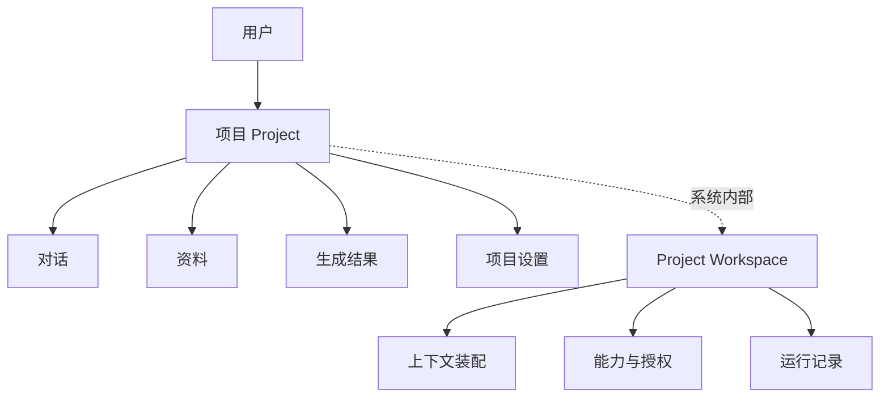

结论：

> **Project 是产品概念，Workspace 是实现 Project 的内部基础设施。**

Familiar 的侧栏和页面使用“项目”；代码与架构文档可继续使用 `ProjectWorkspace`、`RunWorkspace` 等内部名称。

## 2. 目标产品结构

ChatGPT 截图可以作为侧栏布局和项目空状态的直接参考，但入口必须跟随 Familiar 的真实能力逐步开放。

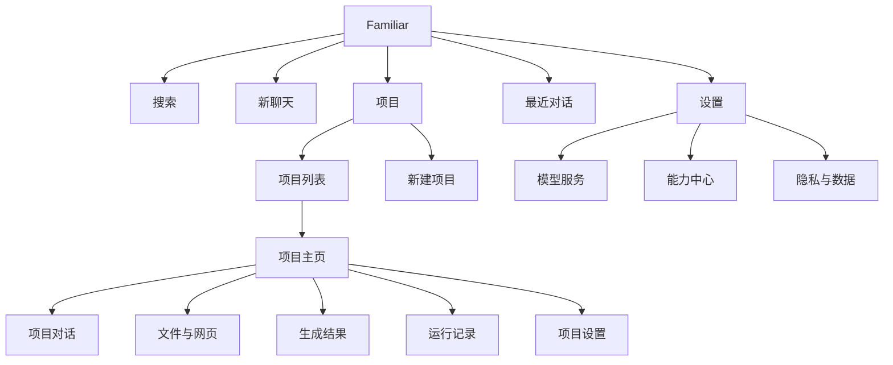

### 第一版侧栏

| 顺序 | 入口 | 说明 |
|---|---|---|
| 1 | 搜索 | 搜索项目和普通对话 |
| 2 | 项目 | 进入项目列表 |
| 3 | 最近 | 最近普通对话与项目对话 |
| 4 | 新聊天 | 创建不属于项目的临时对话 |
| 5 | 设置 | Provider、能力、隐私和 App 设置 |

### 后续能力成熟后再增加

| 入口 | 开放条件 |
|---|---|
| 资料库 | 已能跨项目管理文件、URL 和生成结果 |
| 能力中心 | Skills 和 MCP 已真实接入 Runtime |
| 已计划 | 已有可靠的 Schedule 数据模型与明确执行保证 |
| 图片 | 图片理解或生成链路真实可用 |

不要在第一版展示不可用入口。ChatGPT 截图提供视觉参考，不代表所有入口都要一次复制。

## 3. 新建项目流程

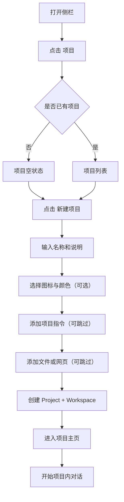

### 创建表单建议

第一版只保留三个字段：

1. 项目名称，必填。
2. 项目说明，可选。
3. 项目指令，可选，例如“回答时优先使用我上传的教材”。

文件、Skills、MCP 和模型选择可以在创建后配置，避免首次创建流程过长。

## 4. 项目主页流程

项目主页承担“长期工作入口”，不能只是一个对话列表。

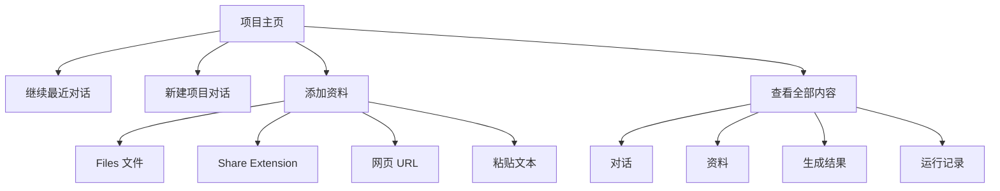

### 项目主页首屏建议

| 区域 | 内容 |
|---|---|
| 顶栏 | 项目名称、更多菜单 |
| 主动作 | “开始对话”或“继续对话” |
| 项目资料 | 最近添加的文件和网页 |
| 最近对话 | 最近 3–5 条项目对话 |
| 最近结果 | 摘要、Markdown、表格等 Agent 工件 |
| 底部输入器 | 直接在当前项目上下文中提问 |

## 5. 项目内发送消息的运行流程

普通聊天只装配会话历史；项目聊天需要装配项目范围内的资料、指令、记忆和能力。

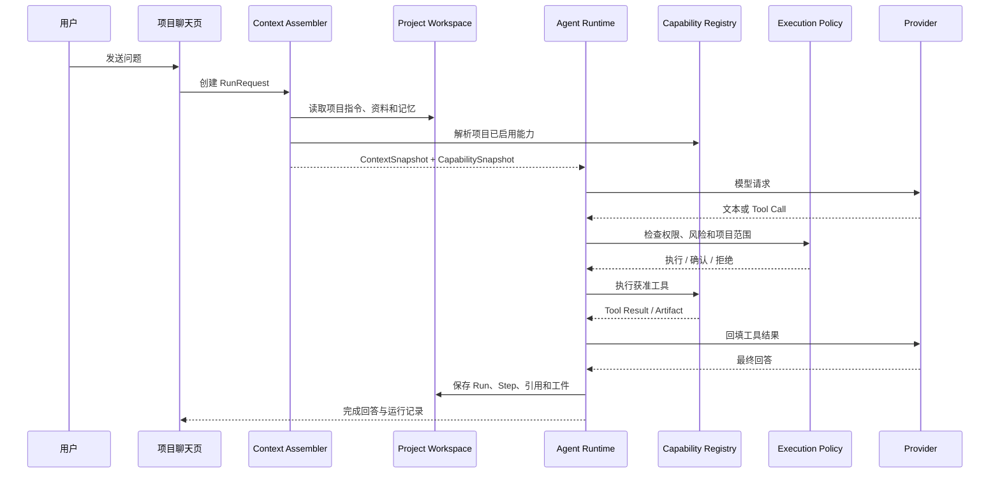

### ContextSnapshot 必须记录

- 当前 Project ID 和 Conversation ID。
- 本次读取的 Resource 及版本。
- 注入的项目指令和 Memory。
- 暴露给模型的 Tools / Skills / MCP Tools。
- Run 开始前已存在的 AuthorizationGrant 引用。
- 使用的 Provider 和 Model。
- 输入预算。

审批结果和 grant 消费记录属于 `AuthorizationSnapshot`；实际耗时、Runtime Event 和终态属于 Run/Step 或 `RunSummary`，不写回不可变 ContextSnapshot。

这样才能支持恢复、审计、删除和后续重放。

## 6. 文件进入项目的流程

### 从项目内部导入

### 从 Share Extension 导入

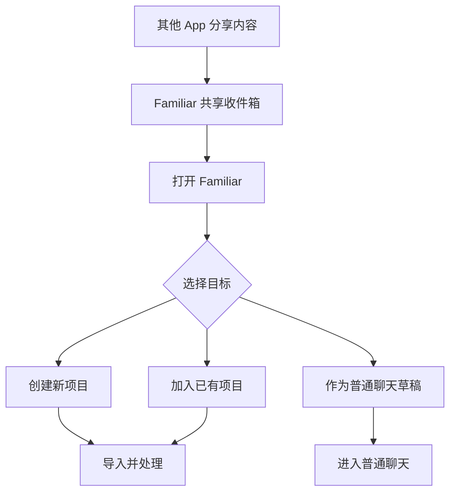

现有 Share Extension 不应直接默认进入普通草稿。项目功能上线后，需要先让用户选择目标项目。

## 7. Skills、MCP 与项目的关系

Skills 和 MCP 默认是全局安装、按项目启用。

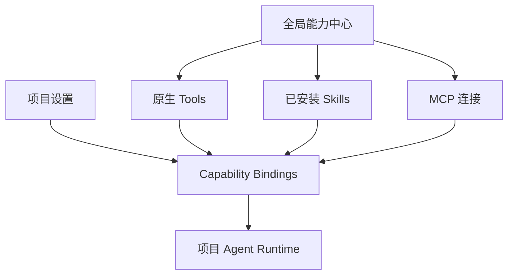

规则：

- 安装 Skill 或添加 MCP Server，不等于所有项目自动获得权限。
- 项目需要显式启用能力。
- Skill 只能限制 Tool Scope，不能绕过系统授权。
- MCP Tool 必须重新经过 Familiar Execution Policy。
- 项目删除后只删除 Binding，不自动删除全局 Skill 或 MCP 连接。

## 8. Memory 的作用域

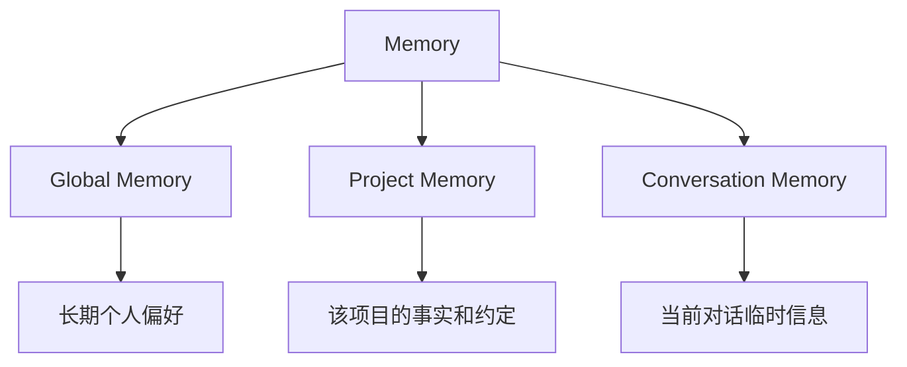

示例：

| 信息 | 作用域 |
|---|---|
| 用户希望回答使用简体中文 | Global |
| 电机学项目使用教材第三版 | Project |
| 当前讨论的是教材第六章 | Conversation |

项目第一版不实现自动 Memory。不要在当前 Project Schema 中为未实现 Memory 添加占位实体；实现 Memory 时再以 global / project / conversation 的正式作用域模型引入，并提供迁移。

## 9. Run 与 Workspace 的关系

一个 Project 有长期 `ProjectWorkspace`；每次执行创建一个隔离的 `RunWorkspace`。

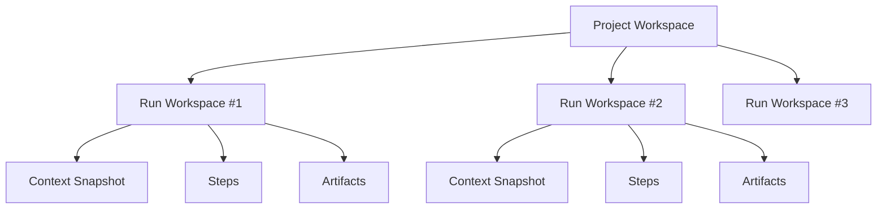

- `ProjectWorkspace` 保存长期资料、项目设置和正式工件。
- `RunWorkspace` 保存一次运行的上下文快照、临时文件和步骤。
- Run 成功后，用户选择保留的结果进入项目正式 Artifacts。
- Run 失败或取消后，可安全清理临时文件，同时保留审计记录。

## 10. 推荐数据模型

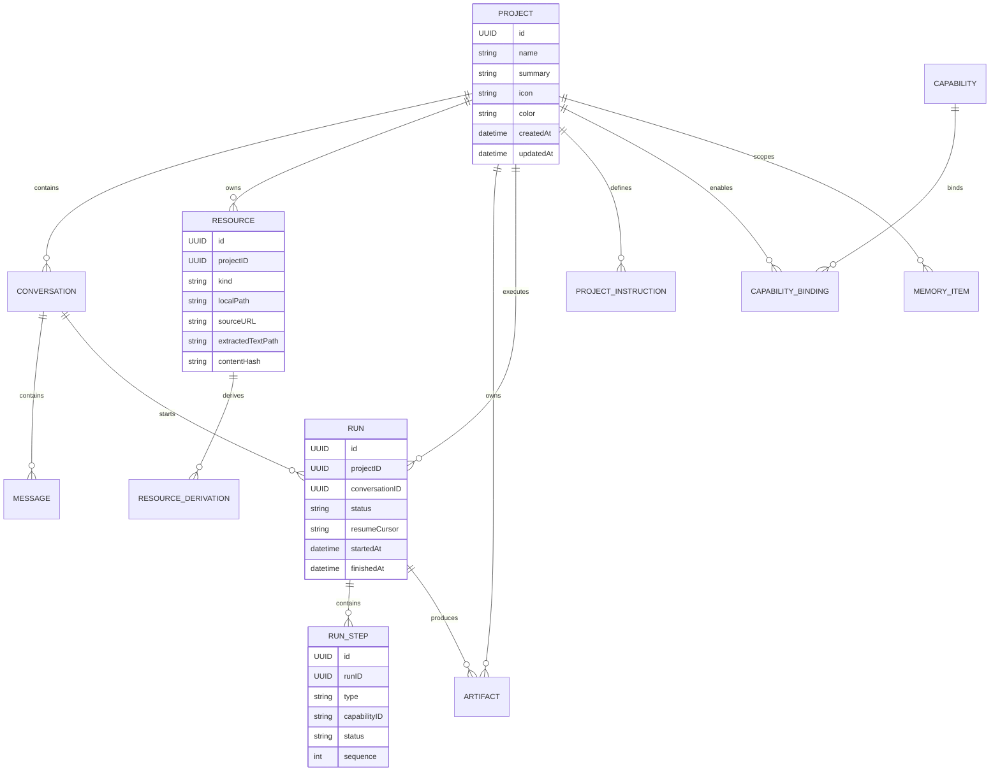

## 11. 页面流转总图

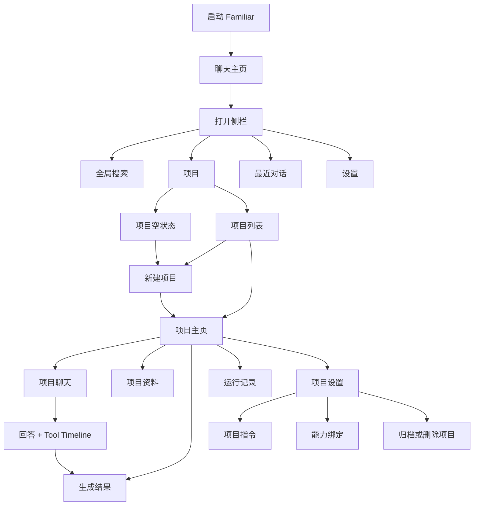

## 12. MVP 范围

### 必须完成

- 项目列表、空状态、新建、重命名、归档、删除。
- Project Schema 合入前完成 VersionedSchema 与迁移测试。
- Conversation 可选关联 Project。
- 项目内新建和继续对话。
- 项目文件导入与资料列表。
- 项目指令进入模型上下文。
- ProjectContextAssembler 与 ContextSnapshot。
- Run 和 Step 关联 Project。
- Share Extension 选择目标项目。
- 项目删除时的资源、附件和运行记录清理。

### 第一版暂缓

- 跨项目自动检索。
- 自动长期记忆。
- 项目模板市场。
- 多人协作和云同步。
- 项目级自动计划任务。
- 本机 Shell 或 MCP Server。
- 多 Agent。

## 13. 开发顺序

```mermaid
flowchart LR
    P0["0. Benchmark / CI / Migration"] --> P1["1. Project Schema"]
    P1 --> P2["2. 项目列表与创建"]
    P2 --> P3["3. 项目内对话 + 指令"]
    P3 --> P4["4. Project Resources"]
    P4 --> P5["5. ContextSnapshot + 引用"]
    P5 --> P6["6. Artifact + Run 关联"]
    P6 --> P7["7. Share / URL 导入"]
    P7 --> P8["8. Manifest / Authorization / Resume"]
    P8 --> P9["9. Skills / Remote MCP Binding"]
```

每一步都要跑通完整用户任务后再进入下一步。

## 14. 第一条端到端验收任务

建议只用这一条链路判断“项目”是否真正成立：

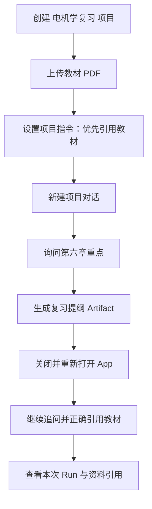

通过标准：

- 重启后项目、资料、对话和工件都存在。
- 模型能区分项目资料与普通聊天附件。
- 回答能显示使用了哪些项目资料。
- 项目指令只影响该项目。
- 删除项目后相关本地文件可控清理。
- Run 记录能解释本次使用的上下文和能力。

## 15. 最终产品定义

> **Familiar 是一个以项目为长期上下文、以聊天为交互入口、以 iPhone 原生能力和可扩展连接为执行面的个人 AI 工作台。**

对应关系：

| 产品概念 | 技术实现 |
|---|---|
| 项目 | Project + ProjectWorkspace |
| 项目资料 | Resource Store |
| 项目指令 | ProjectInstruction |
| 项目记忆 | Scoped Memory |
| 插件/连接 | Capability Binding |
| 一次任务 | Agent Run |
| 执行过程 | Run Steps + Runtime Events |
| 生成结果 | Artifact |

这套结构允许 Familiar 在保持 iOS 原生路线的同时，逐步接入 Web、Skills 和远程 MCP，并避免把每种能力做成孤立页面。
