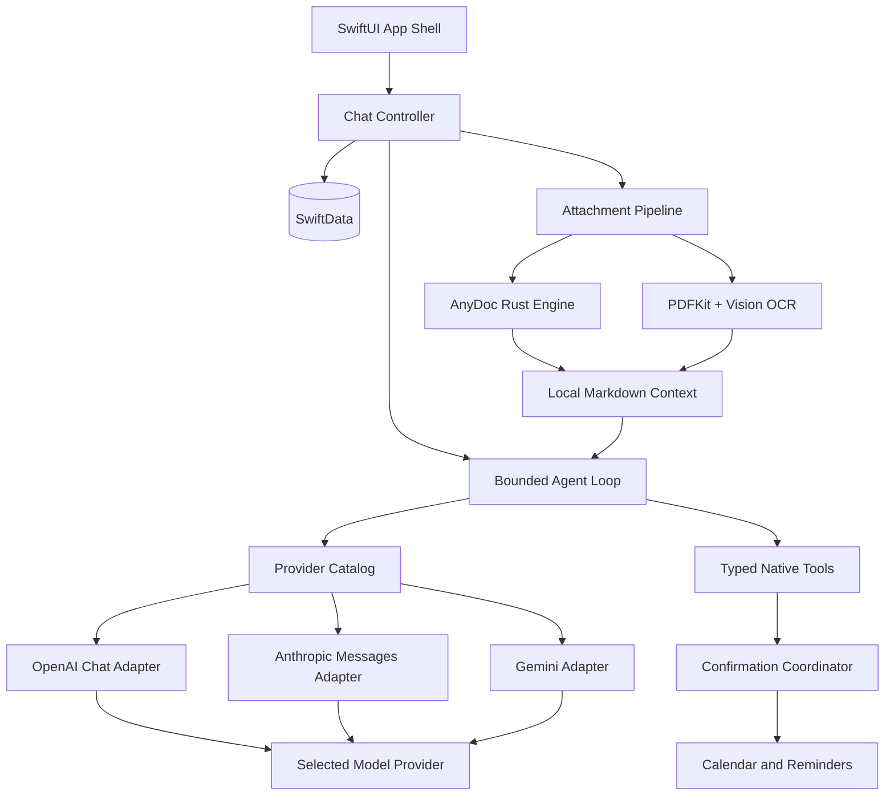

<p align="center">
  
</p>

<h1 align="center">Familiar</h1>

<p align="center">
  A native, local-first BYOK AI agent for iPhone.
</p>

<p align="center">
  <strong>English</strong> · <a href="README.zh-CN.md">简体中文</a>
</p>

<p align="center">
  <a href="https://github.com/IsaacHuo/familiar/actions/workflows/pages.yml"></a>
  
  
  
  
</p>

<p align="center">
  <a href="https://isaachuo.github.io/familiar/">Website</a> ·
  <a href="https://isaachuo.github.io/familiar/privacy/">Privacy</a> ·
  <a href="https://isaachuo.github.io/familiar/support/">Support</a>
</p>

---

## Overview

Familiar is a native AI assistant for iPhone. It does not require a Familiar account, rely on a Familiar-hosted chat backend, or provide subscriptions or managed quotas. Users bring their own model API Key, and the App connects directly from the device to the selected Provider; conversations, attachments and tool records remain on the device.

The project focuses on a trustworthy, auditable Agent loop: natural-language chat, local document understanding, calendar and reminder queries, and creation operations performed only after the user's individual confirmation.

> Familiar is under active development. AI output may be inaccurate and should not be the sole basis for medical, legal, financial or other high-risk decisions.

## Highlights

- **Native iPhone experience** — SwiftUI, SwiftData, URLSession, WebKit, Keychain, EventKit, Speech, Vision and PDFKit.
- **Local-first and BYOK** — API Keys are stored separately per Provider in the iOS Keychain; requests do not pass through Familiar servers.
- **Multi-provider catalog** — OpenAI, Anthropic, Gemini, DeepSeek, Groq, xAI, OpenRouter, Qwen, Kimi, GLM, MiniMax, SiliconFlow, and custom OpenAI-compatible endpoints.
- **Protocol-aware streaming** — OpenAI Chat, Anthropic Messages and Gemini `generateContent` protocols are implemented separately; compatible services are not assumed to be fully equivalent.
- **Confirmed native actions** — Structured previews are shown before writing to Calendar or Reminders; no operation is executed without individual confirmation.
- **Local document conversion** — AnyDoc converts Office, OpenDocument, RTF, EPUB, CSV and PDF files to Markdown on the device; scanned PDFs use Vision OCR to supplement pages without text.
- **Rich answer rendering** — Local Markdown, syntax highlighting, tables, block quotes, Mermaid, KaTeX, code copying and safe external links.
- **Voice transcription** — Apple Speech and `AVAudioEngine` generate editable text drafts; original recordings are not stored.
- **Deliberate image boundary** — Camera and photo-library images can be previewed as local drafts, but the current version uniformly blocks them before sending; it creates no message and uploads no image.
- **Bilingual UI** — Complete Simplified Chinese and English resources, with support for Light and Dark Mode, Dynamic Type, VoiceOver, Reduce Motion and Reduce Transparency.

## Architecture



### Request path

```text
User input
  → local conversation snapshot
  → provider/model capability gate
  → protocol-specific request adapter
  → user-selected third-party Provider
  → streamed response
  → local rich-text renderer
  → explicit persistence checkpoint
```

Familiar does not proxy model traffic. How a third-party Provider records, retains or trains on request content depends on that service's terms and the user's configuration.

## Provider support

| Protocol | Providers |
| --- | --- |
| OpenAI Chat | OpenAI, DeepSeek, Groq, xAI, OpenRouter, Qwen, Kimi, GLM, MiniMax, SiliconFlow, custom OpenAI-compatible |
| Anthropic Messages | Anthropic |
| Gemini generateContent | Gemini |

Each Provider has its own Keychain item, endpoint configuration, headers and model-catalog policy. Model capabilities are marked by `providerID + modelID`; unknown custom models are text-only by default and do not receive tool definitions or image content.

Conversations save the current Provider and model. Each assistant response records the `providerID` and `modelID` actually used, and switching models adds a lightweight marker to the timeline.

## Agent tools

Familiar currently provides four product-grade, strongly typed tools:

| Tool | Behavior |
| --- | --- |
| Query calendar events | Reads events in the time range required by the user's question |
| Create calendar event | Shows a complete preview and writes to EventKit after confirmation |
| Query reminders | Queries reminders by time or text criteria |
| Create reminder | Shows the list, due date, priority and notes, then writes after confirmation |

Write operations are paused by the confirmation coordinator while awaiting a UI decision. If a task is canceled, generation is stopped, the conversation is switched, or the App terminates, pending write operations are not executed. The same write operation can be successfully submitted only once within a single Agent Run.

## Document pipeline

All documents are first copied to the App's private directory and then converted locally. Familiar does not retain a long-term dependency on external security-scoped URLs.

| Input | Local processing |
| --- | --- |
| DOC, DOCX, DOCM | AnyDoc → GitHub-Flavored Markdown |
| PPT, PPS, POT, PPTX, PPTM, PPSX, PPSM | AnyDoc → GitHub-Flavored Markdown |
| XLS, XLSX, XLSM, XLSB | AnyDoc → GitHub-Flavored Markdown |
| ODT, ODS, ODP | AnyDoc → GitHub-Flavored Markdown |
| RTF, EPUB, CSV | AnyDoc → GitHub-Flavored Markdown |
| Text PDF | AnyDoc / pdf-inspector → Markdown |
| Scanned or mixed PDF | AnyDoc first; PDFKit + Vision OCR for pages without a text layer |
| TXT, MD, Markdown | Encoding validation and lossless text pass-through |

The embedded bridge pins [`anydoc 0.1.8`](https://github.com/firecrawl/anydoc) and exposes a narrow byte-oriented C ABI to Swift. It is compiled as a static XCFramework for arm64 iPhone devices and Apple Silicon iPhone simulators. Intel Simulator slices are intentionally excluded.

Only the converted Markdown and filename enter the model request. Original document bytes, local paths and security-scoped URLs are never sent to Firecrawl or the selected model Provider.

Attachments retain their original local file for QuickLook preview. Deleting a message path or conversation also removes its local files. Editing and retrying preserve attachment copies and conversion metadata.

## Rendering

Assistant output is rendered by a bundled, non-persistent `WKWebView` using local resources only. Streaming and final content share the same rendering surface, avoiding a raw-text-to-WebView transition.

Supported output includes:

- CommonMark-style Markdown
- Syntax-highlighted code blocks and code copy
- Tables, block quotes and lists
- Mermaid diagrams
- KaTeX expressions
- Safe external links

Streaming updates are throttled. Automatic scrolling continues only while the user remains close to the bottom of the conversation.

## Privacy and security model

- No Familiar account or login.
- No Familiar-owned chat backend or cloud database.
- No subscription, entitlement or managed quota system.
- API Keys are stored per Provider in iOS Keychain.
- Conversation history, attachments and tool records are stored locally.
- Streaming tokens and pending confirmations are not broadly persisted.
- Documents are converted locally with AnyDoc; only converted text is sent with a user-initiated request.
- Images are blocked from network requests in the current release.
- Calendar and reminder access is requested only when the corresponding tool is invoked.
- Calendar and reminder writes require explicit per-action confirmation.
- Website code contains no advertising, analytics or tracking scripts.

See the full [Privacy Policy](https://isaachuo.github.io/familiar/privacy/) for the distinction between local storage and content sent directly to a selected third-party Provider.

## Technology stack

| Area | Technology |
| --- | --- |
| UI | SwiftUI |
| Local persistence | SwiftData |
| Networking | URLSession, SSE streaming |
| Secrets | iOS Keychain |
| Rich content | WebKit with bundled Markdown, Mermaid and KaTeX resources |
| Native tools | EventKit |
| Documents | AnyDoc Rust core, PDFKit, Vision |
| Voice input | Speech, AVFoundation |
| Photos | PhotosPicker |
| Website | Vue 3, Vite, GitHub Pages |

## Repository structure

```text
Familiar/
├── Agent/          Bounded tool loop and confirmation events
├── AnyDoc/         Swift interface to the embedded AnyDoc engine
├── App/            App entry point and model container
├── Attachments/    Private storage, conversion and OCR pipeline
├── Data/           Provider adapters, Keychain and model catalog services
├── Domain/         Provider, message and capability models
├── EventKit/       Calendar and reminder services/tools
├── Persistence/    SwiftData schema
├── Presentation/   SwiftUI screens, composer and message rendering
├── Resources/      Localizations, assets and bundled renderer resources
├── Speech/         Native voice transcription
└── Support/        Theme and platform compatibility helpers

Vendor/
├── AnyDocBridge.xcframework/
└── AnyDocBridgeRust/

website/            Vue/Vite website, privacy policy and support pages
Scripts/            Reproducible AnyDoc XCFramework build script
```

## Requirements

- Apple Silicon Mac
- Xcode 26 or later
- iOS 17 or later
- iPhone target
- A valid API Key for at least one supported model Provider

Rust is not required for normal App builds because the arm64 AnyDoc XCFramework is committed to the repository. Rebuilding the bridge requires Rust 1.88 or later with the iOS arm64 targets installed.

## Build the iOS app

```bash
git clone https://github.com/IsaacHuo/familiar.git
cd familiar
open familiar.xcodeproj
```

Select the `Familiar` scheme and an iPhone destination. API Keys are configured at runtime in the App and must never be committed to the repository.

Command-line build example:

```bash
xcodebuild \
  -project familiar.xcodeproj \
  -scheme Familiar \
  -configuration Debug \
  -destination 'generic/platform=iOS Simulator' \
  CODE_SIGNING_ALLOWED=NO \
  build
```

### Rebuild AnyDoc

```bash
./Scripts/build-anydoc-xcframework.sh
```

The script builds only:

- `aarch64-apple-ios`
- `aarch64-apple-ios-sim`

## Build the website

```bash
npm --prefix website ci
npm --prefix website run build
```

The production output is generated in `website/dist/`. GitHub Actions deploys that directory to GitHub Pages whenever `website/**` or the Pages workflow changes on `main`.

## Validation

The current implementation has been validated with:

- iOS 17.5 arm64 Simulator build
- iOS 26.5 arm64 Simulator build
- Generic iOS arm64 device build
- Clean Simulator install and launch
- Rust bridge tests for Markdown, CSV, DOCX, PDF, unsupported data and C ABI ownership
- Vue/Vite production build
- Property list and localization validation

Real Provider credentials, EventKit writes, camera, microphone and Speech permissions must be verified on a physical iPhone before release.

## Intentional scope boundaries

Familiar does not currently include:

- iPad support
- Account or workspace systems
- Familiar-hosted model proxying
- Subscription or entitlement flows
- Real-time voice conversation
- Image upload or image understanding
- Calendar/reminder modification or deletion
- MCP, Skills, Sandbox or multi-agent orchestration
- Web research or autonomous browser actions

## Third-party software

Familiar embeds AnyDoc under the MIT License. The required notice is included in:

- `Vendor/AnyDocBridgeRust/LICENSE.anydoc`
- `Familiar/Resources/ThirdPartyNotices.txt`

Other bundled renderer resources retain their respective upstream notices and licenses.

## Support

- Product support: <https://isaachuo.github.io/familiar/support/>
- Privacy questions: <https://isaachuo.github.io/familiar/privacy/>
- Bug reports: <https://github.com/IsaacHuo/familiar/issues>

When reporting a problem, do not include API Keys, private conversations, calendar data, reminders, documents or other sensitive information.
