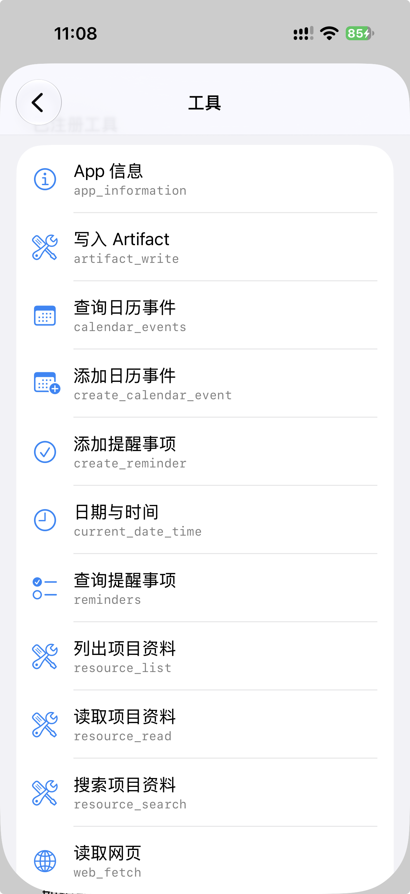
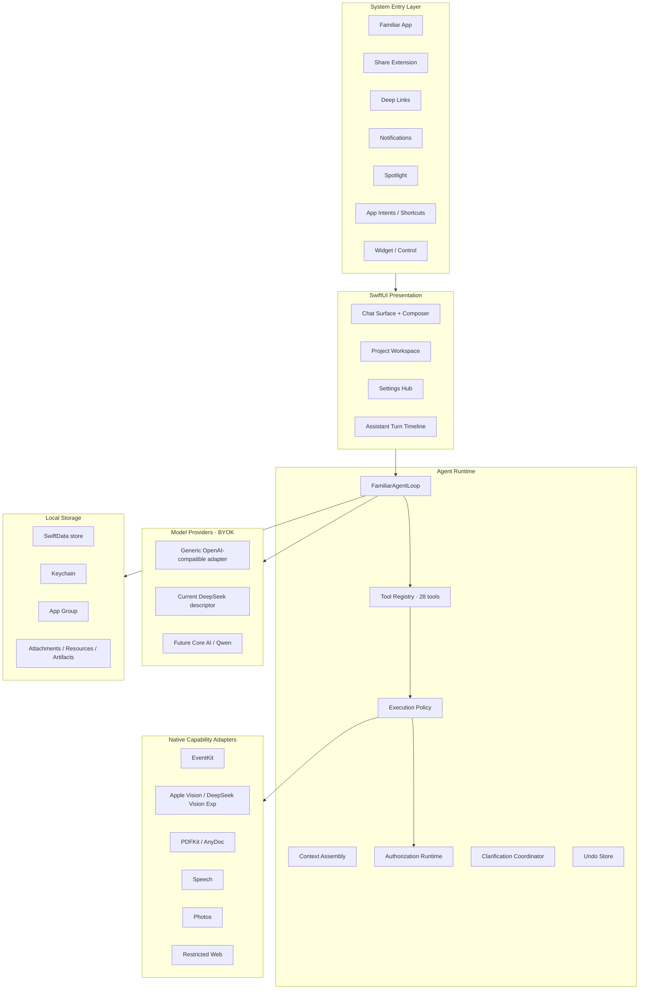
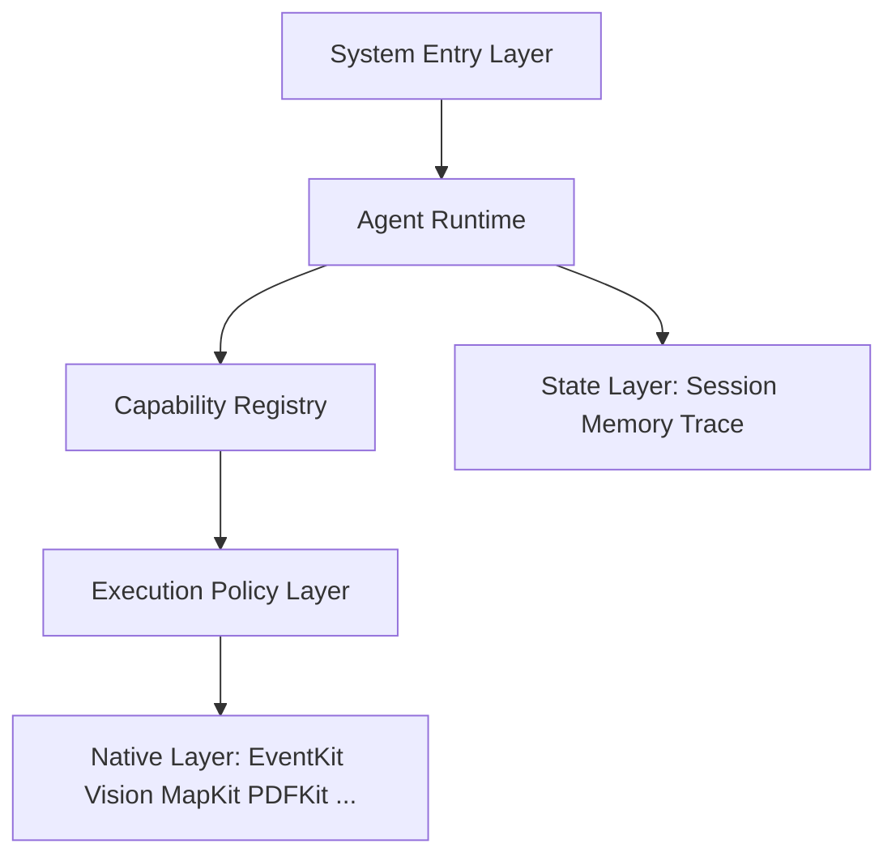

<p align="center">
  
</p>

<h1 align="center">Familiar</h1>

<p align="center">
  A native, safe and inspectable personal AI workspace for iPhone.
</p>

<p align="center">
  <strong>English</strong> · <a href="README.zh-CN.md">简体中文</a>
</p>

<p align="center">
  <a href="https://github.com/IsaacHuo/Familiar/actions/workflows/pages.yml"></a>
  
  
  
  
</p>

<p align="center">
  <a href="https://isaachuo.github.io/familiar/">Website</a> ·
  <a href="https://isaachuo.github.io/familiar/privacy/">Privacy</a> ·
  <a href="https://isaachuo.github.io/familiar/support/">Support</a>
</p>

---

## Screenshots

<table>
  <tr>
    <td align="center"></td>
    <td align="center"></td>
  </tr>
  <tr>
    <td align="center"></td>
    <td align="center"></td>
  </tr>
  <tr>
    <td align="center"></td>
    <td align="center"></td>
  </tr>
</table>

*Screenshots are from an earlier development build; the current interface may differ.*

## Overview

> **Familiar is a native, safe and inspectable personal AI workspace.** Projects are the long-lived work unit, chat is the primary entry, and a typed set of local-information, restricted Web, Project and EventKit tools forms the current execution surface. The single-Agent Runtime is the execution kernel.

Familiar turns the iPhone's native capabilities into a composable runtime without adopting a Linux execution environment, Apple Intelligence dependency or multi-agent orchestration. Projects, versioned document resources, Markdown/text artifacts, persistent workspace pins and explicit one-Run Skills are implemented; broader writable workspace capabilities and byte-level resumable execution remain future layers.

The app is BYOK-only: users bring their own model API Key, model requests go directly from the device to the selected Provider, and conversations, attachments and tool records stay on the device. When web tools are used, search queries go directly to DuckDuckGo and page requests go directly to the selected public HTTPS site.

> Familiar is under active development. AI output may be inaccurate and should not be the sole basis for medical, legal, financial or other high-risk decisions.

## Highlights

- **iPhone-native Agent Runtime** — a single primary Agent that plans with tools and executes through native iOS frameworks; no Linux environment, no Apple Intelligence dependency.
- **Tools as the core abstraction** — 28 typed tools cover native device capabilities, Workspace, restricted Web, Project resources, artifacts, EventKit, and structured presentation; each tool is small, inspectable and policy-controlled.
- **Native First** — reuse EventKit, Vision, PDFKit, Photos and Foundation for native capabilities and local preprocessing instead of rebuilding system services.
- **Unified Chat workspace** — ordinary and Project chats share one surface. The top bar switches workspace and model; the left drawer provides search, persistent pins, expandable Project history and recent ordinary chats.
- **Project workspace** — projects share an instruction and versioned local resources across chats; resources use protected storage and immutable Run references. Markdown/text artifacts support controlled write and edit operations, and Project names are globally unique after normalization.
- **Explicit Skills** — instruction-only Skills are created from a template in Settings and selected from the Composer for one Run in either ordinary or Project chat. There is no import row or Project binding; a Skill can narrow tool scope but cannot authorize an action.
- **Code-enforced authorization** — available reads run automatically; reversible writes require structured approval unless an exact active once/session/always rule matches. EventKit Undo survives restarts, while Artifact Undo remains session-local.
- **Runtime-event-driven UI** — the timeline renders Agent events (model thinking, tool progress, approval, success and failure) instead of each tool owning its own UI.
- **Local-first and BYOK** — API Keys are stored per Provider in the iOS Keychain; requests never pass through Familiar servers.
- **Generic Provider interface, currently DeepSeek only** — the OpenAI-compatible adapter, ModelRouter, and Agent Runtime remain generic; only the DeepSeek descriptor is enabled today.
- **Local document conversion** — AnyDoc converts Office, OpenDocument, RTF, EPUB, CSV and PDF files to Markdown on the device; scanned PDFs use Vision OCR.
- **System entry** — Share selected text, web links or documents into an App Group inbox; typed Deep Links restore local context; optional local notifications return to completed or failed Runs; protected on-device Spotlight results reopen local conversations; Siri and Shortcuts expose `Ask Familiar`, `Process with Familiar` and `Open Familiar`.
- **Rich answer rendering** — local Markdown, syntax highlighting, tables, block quotes, Mermaid, KaTeX, code copying and safe external links.
- **Voice transcription** — Apple Speech and `AVAudioEngine` generate editable text drafts; original recordings are not stored.
- **Bilingual and accessible UI foundations** — Simplified Chinese and English resources, Light and Dark Mode, Dynamic Type, VoiceOver, Reduce Motion and Reduce Transparency support are implemented; physical-device acceptance remains ongoing.

## Current architecture

The current implementation is a single-Agent Runtime layered over native iOS capabilities. The diagram reflects what exists in code today, not the target layers below:



The Agent Runtime is the kernel: it consumes typed tool manifests, Provider tool calls, tool outcomes, policy decisions and runtime events, and it never touches native frameworks directly — EventKit, Vision, AnyDoc, Speech, Photos and the restricted Web client all stay behind tool adapters and execution policy. Persistence uses one SwiftData store (`FamiliarDevelopment.store`), the iOS Keychain for API Keys, the App Group for the Share inbox, and protected on-device directories for attachments, Project resources and Artifacts.

## Target architecture

Familiar is evolving toward six layers. The diagram includes planned capabilities and is not a current implementation inventory:

```text
┌─────────────────────────────────────────┐
│             System Entry Layer          │
│ Chat / Share / Notifications / Widgets  │
│ Spotlight / App Intents / Shortcuts     │
└────────────────────┬────────────────────┘
                     │
                     ▼
┌─────────────────────────────────────────┐
│               Agent Runtime             │
│                                         │
│ Agent Loop / Context Assembly           │
│ Model Router / Tool Router              │
│ Run / Step State                        │
└────────────────────┬────────────────────┘
                     │
                     ▼
┌─────────────────────────────────────────┐
│            Capability Registry          │
│                                         │
│ System Tools          Workspace Tools   │
│ Calendar              File              │
│ Reminder              PDF               │
│ Contacts              Text              │
│ Photos                Image             │
│ Maps                  Audio             │
│ Weather               Web               │
│ Location              Structured Data   │
└────────────────────┬────────────────────┘
                     │
                     ▼
┌─────────────────────────────────────────┐
│           Execution Policy Layer        │
│ Availability / Permission / Approval    │
│ Validation / Timeout / Cancellation     │
└────────────────────┬────────────────────┘
                     │
                     ▼
┌─────────────────────────────────────────┐
│              Native Layer               │
│ EventKit / Vision / MapKit / WebKit     │
│ Photos / PDFKit / Core ML / Foundation  │
└─────────────────────────────────────────┘
            + State Layer
  Session / Workspace / Memory
  Artifacts / Trace / History
```

Current implementation: ordinary and Project chats share one Chat surface and bounded Agent loop. The startup Registry contains 17 tools: two local-information, two restricted Web, three Project Resource, two Project Artifact, four EventKit and four structured-presentation tools. The runtime also supports scoped authorization rules, durable EventKit Undo, immutable Context/Capability/Skill snapshots, invocation and resume-cursor records, visual evidence, persistent project/conversation pins and explicit one-Run Skills. Memory Runtime behavior, MCP Runtime, reliable background continuation and byte-level Run resumption are not implemented.

Local persistence uses one current 31-entity SwiftData schema in `FamiliarDevelopment.store`. During development, incompatible schema changes intentionally rotate to a fresh store instead of migrating test data; a public release requires an explicit compatibility and migration policy.



The Agent Runtime is the key layer: it consumes typed `FamiliarToolManifest` values, Provider tool calls, `FamiliarToolOutcome` values, policy decisions and runtime events. It never touches EventKit or other native frameworks directly; those stay behind tool adapters and execution policy.

### System entry

System entry points are prioritized:

| Priority | Entry |
| --- | --- |
| **First** | ① Familiar App · ② Share Extension · ③ System notifications / Deep Links |
| **Second** | ④ Widgets / Controls · ⑤ Spotlight and other lightweight system entries |
| **Compatibility** | ⑥ App Intents · ⑦ Shortcuts |

The current System Entry layer includes the Familiar App, a Share Extension, typed Deep Links, opt-in local Run notifications, a protected on-device Spotlight conversation index, a launcher Widget and Control, three App Intents and bilingual App Shortcuts. The Widget opens a new editable draft and the Control opens Familiar without replacing the current context. Shared content is staged locally and Deep Links only restore or prefill context. Run notifications use generic text and carry only a local Run or conversation identifier; they do not use remote push or provide background execution. Spotlight indexes only bounded conversation titles, modification dates and local identifiers, never transcripts or attachment metadata. `Ask Familiar` and `Process with Familiar` explicitly start the existing in-app send path; `Open Familiar` changes no draft or conversation. None of these entries can authorize a tool action.

These entry points are implemented in code but still require physical-device acceptance.

App Intents stay outside the Agent core. Their text input is bounded, they never read Keychain or call a Provider directly, and they refuse to overwrite an unsent draft. The full Capability Registry is not duplicated into App Intents.

## Agent runtime

Familiar uses a single-Agent-first design with a composable tool loop:

```text
User
  → AgentRun
  → FamiliarProjectContextAssembler
  → Model
  → Tool Call?
       ├── No ──→ Final Answer
       └── Yes
           → Tool Registry
           → Policy Engine
           → Execute Tool
           → ToolResult
           → Context
           → Model
           → continue
until: final answer / cancelled / failed / max steps
```

The agent loop is bounded: a maximum number of iterations, tool-result length limits and context limits enforced by model capability. Duplicate tool calls within a run are rejected; a write can be submitted successfully only once per run.

## Tools

Tools are strongly typed in Swift; the Registry stores `AnyFamiliarTool` values. The current protocol uses a typed `Input` and returns a `FamiliarToolOutcome`:

```swift
protocol FamiliarTool {
    associatedtype Input: Decodable & Sendable

    var manifest: FamiliarToolManifest { get }
    func execute(_ input: Input, context: FamiliarToolContext) async throws -> FamiliarToolOutcome
}
```

The current `FamiliarToolManifest` carries:

```text
FamiliarToolManifest
  id / version / source
  name
  title
  description
  parameters
  effect / risk
  requirements  EventKit, Calendar permission, ...
  payload / data / network / privacy metadata
  idempotency / cancellation / recovery / parallelism
  requiredScopes
```

Internally Familiar separates, following the spirit of MCP but in native Swift:

The startup Registry currently contains exactly these 17 tools:

| Group | Tool names |
| --- | --- |
| Local information | `current_date_time`, `app_information` |
| Restricted Web | `web_search`, `web_fetch` |
| Project Resource | `resource_list`, `resource_read`, `resource_search` |
| Project Artifact | `artifact_write`, `artifact_edit` |
| EventKit | `calendar_events`, `create_calendar_event`, `reminders`, `create_reminder` |
| Structured presentation | `task_plan`, `present_recommendation`, `present_insight`, `ask_user` |

- **Current resources** — conversation history, extracted attachments, versioned Project resources and Project artifacts (application-controlled)
- **Current tools** — the 17 Registry entries listed above (model-controlled)
- **Current instructions** — base policy, Project instructions and at most one explicitly selected one-Run Skill (user-controlled)
- **Target resources** — scoped Memory and broader controlled workspace data

MCP is an adapter, not the kernel. A future remote HTTPS client will convert MCP Tools into Familiar manifests and continue to apply Familiar policy; MCP is not currently implemented.

## Capability Registry

The target Registry is a core asset organized into two capability families:

| Native System | Native Workspace |
| --- | --- |
| Calendar | File |
| Reminders | PDF |
| Contacts | Text |
| Photos | Image |
| Maps | Audio |
| Location | Video |
| Weather | CSV / JSON |
| Health | Archive |
| Notifications | Document |
| Clipboard | Web |

The current Registry is a startup-supplied dictionary of 17 tools with EventKit availability filtering and active Project scoping for Resource and Artifact tools. Generic runtime discovery and remote installation are not implemented; MCP remains a future adapter.

## Permission model

Current code authorization behavior:

| Operation | Default behavior |
| --- | --- |
| Available read | Automatic |
| Requestable system access | Structured approval, then the iOS permission flow |
| Reversible write | Structured approval unless an exact once/session/always authorization matches |
| Destructive or high risk | Always request approval |
| Undo | Durable across restarts for EventKit creates; session-local for Artifact writes and edits |

Permissions are controlled by code, not by prompt: the model cannot bypass iOS permissions, action confirmations or sensitive-data policy with a sentence.

Remembered authorization is enforced in Swift and matches Project, capability ID/version, target, normalized argument hash, session and expiry. Users can revoke remembered rules in Settings. Share Extension, App Intent and Deep Link provenance never grants write authority.

## Provider support

The only currently enabled Provider descriptor is DeepSeek, using a generic OpenAI-compatible Chat Completions adapter. `FamiliarModelProvider`, ModelRouter, tool calls, SSE, and Agent Runtime contain no DeepSeek-specific branch; no second Provider is enabled yet.

The catalog contains `deepseek-v4-flash`, `deepseek-v4-pro`, and the experimental image entry `deepseek-v4-flash-vision-exp`. Core AI/Qwen remains the post-iOS 27 local direction. FastVLM currently has no settings entry or automatic route.

## Document pipeline

All documents are first copied to the App's private directory and then converted locally.

| Input | Local processing |
| --- | --- |
| DOC, DOCX, DOCM | AnyDoc → GitHub-Flavored Markdown |
| PPT, PPS, POT, PPTX, PPTM, PPSX, PPSM | AnyDoc → GitHub-Flavored Markdown |
| XLS, XLSX, XLSM, XLSB | AnyDoc → GitHub-Flavored Markdown |
| ODT, ODS, ODP | AnyDoc → GitHub-Flavored Markdown |
| RTF, EPUB, CSV | AnyDoc → GitHub-Flavored Markdown |
| Text PDF | AnyDoc / pdf-inspector → Markdown |
| Scanned or mixed PDF | AnyDoc first; PDFKit + Vision OCR for pages without a text layer |
| TXT, MD, Markdown | Encoding validation and lossless text pass-through |

Only the converted Markdown and filename enter the model request. Original document bytes, local paths and security-scoped URLs are never sent to Firecrawl or the selected model Provider.

`deepseek-v4-flash-vision-exp` receives the images selected for the current request. Text models use Apple Vision OCR/barcode/classification preflight, and the resulting untrusted visual evidence is persisted with provenance. FastVLM is not called in the current product path.

## Rendering

Streaming output uses native fallback text. Final assistant output is rendered by a bundled, non-persistent `WKWebView` using local resources only.

Supported output includes CommonMark-style Markdown, syntax-highlighted code blocks with copy, tables, block quotes, lists, Mermaid diagrams, KaTeX expressions and safe external links.

## Privacy and security model

- No Familiar account or login.
- No Familiar-owned chat backend or cloud database.
- No subscription, entitlement or managed quota system.
- API Keys are stored per Provider in iOS Keychain.
- Conversation history, attachments and tool records are stored locally.
- Streaming tokens and pending confirmations are not broadly persisted.
- Documents are converted locally; only converted text is sent with a user-initiated request.
- Calendar and reminder access is requested only when the corresponding tool is invoked.
- Writes use action proposals; unmatched actions require structured approval, while exact remembered authorization can skip repeat approval.
- Website code contains no advertising, analytics or tracking scripts.

## Technology stack

| Area | Technology |
| --- | --- |
| UI | SwiftUI |
| Local persistence | SwiftData |
| Networking | URLSession/SSE for model traffic; Network.framework HTTP/1.1 for restricted Web fetch |
| Secrets | iOS Keychain |
| Rich content | WebKit with bundled Markdown, Mermaid and KaTeX resources |
| Registered tools | Local information, restricted Web, Project Resource/Artifact and EventKit adapters |
| Documents | AnyDoc Rust core, PDFKit, Vision |
| Voice input | Speech, AVFoundation |
| Photos | PhotosPicker |
| Website | Vue 3, Vite, GitHub Pages |

## Repository structure

```text
Familiar/
├── Agent/          Agent runtime, tool loop and confirmation events
├── AnyDoc/         Swift interface to the embedded AnyDoc engine
├── App/            App entry point and model container
├── Artifacts/      Project artifact store and artifact tool
├── Attachments/    Private storage, conversion and OCR pipeline
├── Data/           Provider adapters, Keychain and model catalog services
├── Domain/         Provider, message and capability models
├── EventKit/       Calendar and reminder services/tools
├── LocalVision/    Dormant FastVLM research implementation
├── Memory/         Scoped Memory data/service foundation (Runtime not active)
├── Persistence/    Current SwiftData schema and local services
├── Presentation/   SwiftUI screens, composer and message rendering
├── Resources/      Project resource services, localizations and bundled assets
├── Skills/         Instruction-only Skill parsing, storage and Run snapshots
├── Speech/         Native voice transcription
├── Support/        Theme and platform compatibility helpers
├── SystemEntry/    Deep links, intents, notifications and Spotlight
├── Vision/         Apple Vision preprocessing and evidence
└── Web/            Read-only web search/fetch with restricted HTTP client

FamiliarWidgets/    Home/Lock Screen launcher Widget and Control Center control

Shared/             App-group inbox and control intent (app + extensions)
Vendor/
├── AnyDocBridge.xcframework/
├── AnyDocBridgeRust/
└── ml-fastvlm/

docs/               Design and planning (what we intend to build)
state/              Current implementation truth (code-verified)
logs/               Reusable debugging and investigation knowledge
website/            Vue/Vite website, privacy policy and support pages
Scripts/            Reproducible AnyDoc XCFramework build script
```

Documentation is organized by intent and split across three directories (see [`docs/README.md`](docs/README.md) for the model): `docs/` holds design and planning, `state/` holds the code-verified current implementation (`state/CURRENT.md` first, then `state/ARCHITECTURE.md`), and `logs/` holds reusable investigation knowledge.

## Requirements

- Apple Silicon Mac
- Xcode 26 or later
- iOS 18 or later
- iPhone target
- A valid API Key for at least one supported model Provider

Rust is not required for normal App builds because the arm64 AnyDoc XCFramework is committed to the repository.

## Build the iOS app

```bash
git clone https://github.com/IsaacHuo/Familiar.git
cd familiar
open familiar.xcodeproj
```

Select the `Familiar` scheme and an iPhone destination. API Keys are configured at runtime in the App and must never be committed to the repository.

Command-line build example:

```bash
xcodebuild \
  -project familiar.xcodeproj \
  -scheme Familiar \
  -configuration Debug \
  -destination 'generic/platform=iOS Simulator' \
  ARCHS=arm64 \
  ONLY_ACTIVE_ARCH=YES \
  CODE_SIGNING_ALLOWED=NO \
  build
```

### Rebuild AnyDoc

```bash
./Scripts/build-anydoc-xcframework.sh
```

The script builds only `aarch64-apple-ios` and `aarch64-apple-ios-sim`.

## Build the website

```bash
npm --prefix website ci
npm --prefix website run build
```

## Intentional scope boundaries

Familiar does not currently include:

- iPad support
- Account systems
- Arbitrary writable workspace beyond controlled Project artifacts
- Byte-level resumable execution or reliable background continuation; cursor/invocation records and startup failure-finalization for interrupted Runs are implemented
- Familiar-hosted model proxying
- Subscription or entitlement flows
- Linux / iSH execution environment
- Shell or arbitrary code execution
- Multi-agent, subagents or agent graphs
- Complex RAG or vector databases
- MCP Server on iPhone (a client may arrive later)
- Core ML LLM or Apple Intelligence dependency
- Real-time voice conversation
- Calendar/reminder modification or deletion
- Autonomous browser actions, JavaScript execution or recursive crawling

## Third-party software

Familiar embeds AnyDoc and SwiftSoup under the MIT License. Their notices are included in:

- `Vendor/AnyDocBridgeRust/LICENSE.anydoc`
- `Familiar/Resources/ThirdPartyNotices.txt`

FastVLM and its model have separate terms and acknowledgements:

- `Vendor/ml-fastvlm/LICENSE`
- `Vendor/ml-fastvlm/ACKNOWLEDGEMENTS`
- `Vendor/ml-fastvlm/LICENSE_MODEL`

Pinned MLX, Swift Transformers, ZIPFoundation and bundled renderer dependencies retain their respective upstream licenses and notices.

## Support

- Product support: <https://isaachuo.github.io/familiar/support/>
- Privacy questions: <https://isaachuo.github.io/familiar/privacy/>
- Bug reports: <https://github.com/IsaacHuo/Familiar/issues>

When reporting a problem, do not include API Keys, private conversations, calendar data, reminders, documents or other sensitive information.
