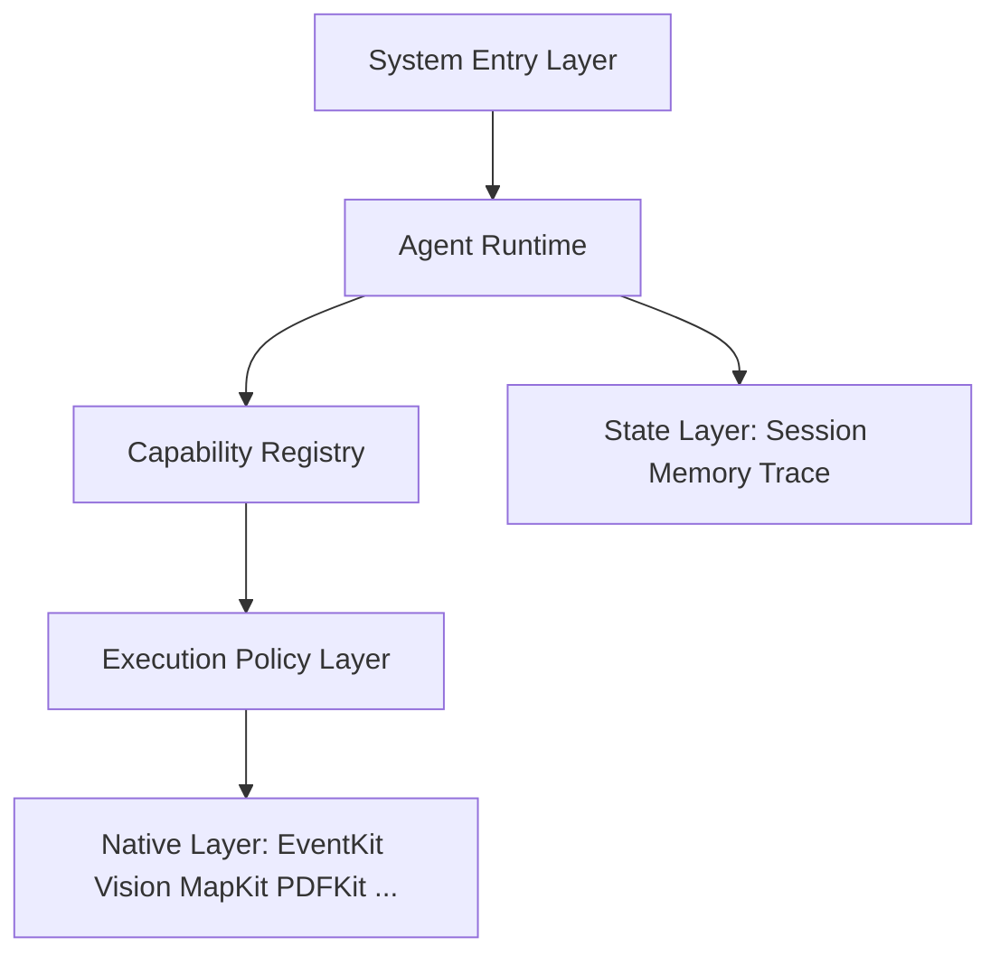

<p align="center">
  
</p>

<h1 align="center">Familiar</h1>

<p align="center">
  A native, local-first BYOK AI agent runtime for iPhone.
</p>

<p align="center">
  <strong>English</strong> · <a href="README.zh-CN.md">简体中文</a>
</p>

<p align="center">
  <a href="https://github.com/IsaacHuo/familiar/actions/workflows/pages.yml"></a>
  
  
  
  
</p>

<p align="center">
  <a href="https://isaachuo.github.io/familiar/">Website</a> ·
  <a href="https://isaachuo.github.io/familiar/privacy/">Privacy</a> ·
  <a href="https://isaachuo.github.io/familiar/support/">Support</a>
</p>

---

## Overview

> **Familiar = an iPhone-native Agent Runtime.** A cloud / replaceable LLM handles understanding, decision-making and orchestration; native iOS frameworks handle perception, computation and action; the Native Workspace provides general content-processing capabilities.

Familiar turns the iPhone's native capabilities into a composable runtime for AI agents. It does not run on a Linux execution environment, does not depend on Apple Intelligence, does not hard-code every user request into a workflow, and does not start with complex multi-agent orchestration.

The app is BYOK-only: users bring their own model API Key, requests go directly from the device to the selected Provider, and conversations, attachments and tool records stay on the device.

> Familiar is under active development. AI output may be inaccurate and should not be the sole basis for medical, legal, financial or other high-risk decisions.

## Highlights

- **iPhone-native Agent Runtime** — a single primary Agent that plans with tools and executes through native iOS frameworks; no Linux environment, no Apple Intelligence dependency.
- **Tools as the core abstraction** — Calendar, Vision, PDF, Maps and more are just Tools registered in a Capability Registry; each tool is small, orthogonal and composable.
- **Native First** — reuse EventKit, Vision, MapKit, PDFKit, Photos and Foundation instead of reimplementing calendar, OCR, maps or document rendering.
- **Native Workspace** — a Linux-free working space for general content: File, PDF, Text, Image, Audio, Video, CSV/JSON, Archive and Document processing.
- **Intent-aware authorization** — low-risk reads run automatically, explicit reversible writes execute with Undo, inferred or destructive writes require confirmation.
- **Runtime-event-driven UI** — the timeline renders Agent events (model thinking, tool progress, approval, success and failure) instead of each tool owning its own UI.
- **Local-first and BYOK** — API Keys are stored per Provider in the iOS Keychain; requests never pass through Familiar servers.
- **Multi-provider catalog** — OpenAI, Anthropic, Gemini, DeepSeek, Groq, xAI, OpenRouter, Qwen, Kimi, GLM, MiniMax, SiliconFlow, and custom OpenAI-compatible endpoints.
- **Local document conversion** — AnyDoc converts Office, OpenDocument, RTF, EPUB, CSV and PDF files to Markdown on the device; scanned PDFs use Vision OCR.
- **System entry** — Share selected text, web links or documents into an App Group inbox; typed Deep Links restore local context; optional local notifications return to completed or failed Runs; protected on-device Spotlight results reopen local conversations; Siri and Shortcuts expose `Ask Familiar`, `Process with Familiar` and `Open Familiar`.
- **Rich answer rendering** — local Markdown, syntax highlighting, tables, block quotes, Mermaid, KaTeX, code copying and safe external links.
- **Voice transcription** — Apple Speech and `AVAudioEngine` generate editable text drafts; original recordings are not stored.
- **Bilingual UI** — complete Simplified Chinese and English resources, Light and Dark Mode, Dynamic Type, VoiceOver, Reduce Motion and Reduce Transparency.

## Architecture

Familiar is organized into six layers:

```text
┌─────────────────────────────────────────┐
│             System Entry Layer          │
│ Chat / Share / Notifications / Widgets  │
│ Spotlight / App Intents / Shortcuts     │
└────────────────────┬────────────────────┘
                     │
                     ▼
┌─────────────────────────────────────────┐
│               Agent Runtime             │
│                                         │
│ Agent Loop / Context Manager            │
│ Model Router / Tool Router              │
│ Run / Step State                        │
└────────────────────┬────────────────────┘
                     │
                     ▼
┌─────────────────────────────────────────┐
│            Capability Registry          │
│                                         │
│ System Tools          Workspace Tools   │
│ Calendar              File              │
│ Reminder              PDF               │
│ Contacts              Text              │
│ Photos                Image             │
│ Maps                  Audio             │
│ Weather               Web               │
│ Location              Structured Data   │
└────────────────────┬────────────────────┘
                     │
                     ▼
┌─────────────────────────────────────────┐
│           Execution Policy Layer        │
│ Availability / Permission / Approval    │
│ Validation / Timeout / Cancellation     │
└────────────────────┬────────────────────┘
                     │
                     ▼
┌─────────────────────────────────────────┐
│              Native Layer               │
│ EventKit / Vision / MapKit / WebKit     │
│ Photos / PDFKit / Core ML / Foundation  │
└─────────────────────────────────────────┘
            + State Layer
  Session / Workspace / Memory
  Artifacts / Trace / History
```



The Agent Runtime is the key layer: it knows only `ToolDefinition`, `ToolCall` and `ToolResult`. It never touches EventKit, Vision, HealthKit or MapKit directly; those live behind the Capability Registry and Execution Policy.

### System entry

System entry points are prioritized:

| Priority | Entry |
| --- | --- |
| **First** | ① Familiar App · ② Share Extension · ③ System notifications / Deep Links |
| **Second** | ④ Widgets / Controls · ⑤ Spotlight and other lightweight system entries |
| **Compatibility** | ⑥ App Intents · ⑦ Shortcuts |

The current System Entry layer includes the Familiar App, a Share Extension, typed Deep Links, opt-in local Run notifications, a protected on-device Spotlight conversation index, three App Intents and bilingual App Shortcuts. Shared content is staged locally and Deep Links only restore or prefill context. Run notifications use generic text and carry only a local Run or conversation identifier; they do not use remote push or provide background execution. Spotlight indexes only bounded conversation titles, modification dates and local identifiers, never transcripts or attachment metadata. `Ask Familiar` and `Process with Familiar` explicitly start the existing in-app send path; `Open Familiar` changes no draft or conversation. None of these entries can authorize a tool action.

App Intents stay outside the Agent core. Their text input is bounded, they never read Keychain or call a Provider directly, and they refuse to overwrite an unsent draft. The full Capability Registry is not duplicated into App Intents.

## Agent runtime

Familiar uses a single-Agent-first design with a composable tool loop:

```text
User
  → AgentRun
  → Context Assembler
  → Model
  → Tool Call?
       ├── No ──→ Final Answer
       └── Yes
           → Tool Registry
           → Policy Engine
           → Execute Tool
           → ToolResult
           → Context
           → Model
           → continue
until: final answer / cancelled / failed / max steps
```

The agent loop is bounded: a maximum number of iterations, tool-result length limits and context limits enforced by model capability. Duplicate tool calls within a run are rejected; a write can be submitted successfully only once per run.

## Tools

Tools are strongly typed in Swift; the Registry performs type erasure:

```swift
protocol NativeTool {
    associatedtype Input: Decodable & Sendable
    associatedtype Output: Encodable & Sendable

    static var manifest: ToolManifest { get }
    func execute(_ input: Input, context: ToolContext) async throws -> Output
}
```

`ToolManifest` carries more than a name:

```text
ToolManifest
  id
  title
  description
  effect        read / write / destructiveWrite
  risk          low / high
  requirements  EventKit, Calendar permission, ...
```

Internally Familiar separates, following the spirit of MCP but in native Swift:

- **Resources** — attachments, current location, workspace files, conversation context, memory (application-controlled)
- **Tools** — calendar.create, pdf.extract, maps.search, file.write (model-controlled)
- **Instructions** — base agent policy, skills (user-controlled)

MCP is an adapter, not the kernel: when external services arrive, an `MCPClient` converts MCP Tools into Familiar `AnyTool` without changing the core architecture.

## Capability Registry

The Registry is the project's core asset, organized into two capability families:

| Native System | Native Workspace |
| --- | --- |
| Calendar | File |
| Reminders | PDF |
| Contacts | Text |
| Photos | Image |
| Maps | Audio |
| Location | Video |
| Weather | CSV / JSON |
| Health | Archive |
| Notifications | Document |
| Clipboard | Web |

Native System tools operate the iPhone and the user's digital environment; Native Workspace tools give the Agent a general working space without Linux. Unavailable capabilities (by device, region, OS version or authorization) are simply not exposed to the model.

## Permission model

Familiar uses intent-aware authorization instead of confirming every write:

| Operation | Default behavior |
| --- | --- |
| Read + low risk | Automatic |
| Explicit reversible write | Execute + Undo |
| Inferred write | Confirm |
| Sensitive read | Permission / policy |
| Destructive | Confirm |
| Financial / external consequential | Strong confirmation |

Permissions are controlled by code, not by prompt: the model cannot bypass HealthKit permissions, delete confirmations or sensitive-data policy with a sentence.

## Provider support

| Protocol | Providers |
| --- | --- |
| OpenAI Chat | OpenAI, DeepSeek, Groq, xAI, OpenRouter, Qwen, Kimi, GLM, MiniMax, SiliconFlow, custom OpenAI-compatible |
| Anthropic Messages | Anthropic |
| Gemini generateContent | Gemini |

Each Provider has its own Keychain item, endpoint configuration, headers and model-catalog policy. Model capabilities are marked by `providerID + modelID`; unknown custom models are text-only by default.

The model layer is a simple `ModelProvider` abstraction with OpenAI, Anthropic, OpenAI-compatible and (optional) local providers. The first phase establishes an Agent benchmark with the strongest available model before any token-saving model splitting.

## Document pipeline

All documents are first copied to the App's private directory and then converted locally.

| Input | Local processing |
| --- | --- |
| DOC, DOCX, DOCM | AnyDoc → GitHub-Flavored Markdown |
| PPT, PPS, POT, PPTX, PPTM, PPSX, PPSM | AnyDoc → GitHub-Flavored Markdown |
| XLS, XLSX, XLSM, XLSB | AnyDoc → GitHub-Flavored Markdown |
| ODT, ODS, ODP | AnyDoc → GitHub-Flavored Markdown |
| RTF, EPUB, CSV | AnyDoc → GitHub-Flavored Markdown |
| Text PDF | AnyDoc / pdf-inspector → Markdown |
| Scanned or mixed PDF | AnyDoc first; PDFKit + Vision OCR for pages without a text layer |
| TXT, MD, Markdown | Encoding validation and lossless text pass-through |

Only the converted Markdown and filename enter the model request. Original document bytes, local paths and security-scoped URLs are never sent to Firecrawl or the selected model Provider.

Image preprocessing is a Tool, not a forced pipeline: an image goes to Vision OCR, barcode detection or the multimodal model based on what the Agent decides the task needs, not by default OCR.

## Rendering

Assistant output is rendered by a bundled, non-persistent `WKWebView` using local resources only.

Supported output includes CommonMark-style Markdown, syntax-highlighted code blocks with copy, tables, block quotes, lists, Mermaid diagrams, KaTeX expressions and safe external links.

## Privacy and security model

- No Familiar account or login.
- No Familiar-owned chat backend or cloud database.
- No subscription, entitlement or managed quota system.
- API Keys are stored per Provider in iOS Keychain.
- Conversation history, attachments and tool records are stored locally.
- Streaming tokens and pending confirmations are not broadly persisted.
- Documents are converted locally; only converted text is sent with a user-initiated request.
- Calendar and reminder access is requested only when the corresponding tool is invoked.
- Writes require per-action confirmation or an explicit reversible Undo path.
- Website code contains no advertising, analytics or tracking scripts.

## Technology stack

| Area | Technology |
| --- | --- |
| UI | SwiftUI |
| Local persistence | SwiftData |
| Networking | URLSession, SSE streaming |
| Secrets | iOS Keychain |
| Rich content | WebKit with bundled Markdown, Mermaid and KaTeX resources |
| Native tools | EventKit |
| Documents | AnyDoc Rust core, PDFKit, Vision |
| Voice input | Speech, AVFoundation |
| Photos | PhotosPicker |
| Website | Vue 3, Vite, GitHub Pages |

## Repository structure

```text
Familiar/
├── Agent/          Agent runtime, tool loop and confirmation events
├── AnyDoc/         Swift interface to the embedded AnyDoc engine
├── App/            App entry point and model container
├── Attachments/    Private storage, conversion and OCR pipeline
├── Data/           Provider adapters, Keychain and model catalog services
├── Domain/         Provider, message and capability models
├── EventKit/       Calendar and reminder services/tools
├── Persistence/    SwiftData schema
├── Presentation/   SwiftUI screens, composer and message rendering
├── Resources/      Localizations, assets and bundled renderer resources
├── Speech/         Native voice transcription
└── Support/        Theme and platform compatibility helpers

Vendor/
├── AnyDocBridge.xcframework/
└── AnyDocBridgeRust/

Docs/               Product, architecture, UI, privacy and validation records
website/            Vue/Vite website, privacy policy and support pages
Scripts/            Reproducible AnyDoc XCFramework build script
```

Detailed product and engineering records are maintained in [`Docs/`](Docs/README.md).

## Requirements

- Apple Silicon Mac
- Xcode 26 or later
- iOS 18 or later
- iPhone target
- A valid API Key for at least one supported model Provider

Rust is not required for normal App builds because the arm64 AnyDoc XCFramework is committed to the repository.

## Build the iOS app

```bash
git clone https://github.com/IsaacHuo/familiar.git
cd familiar
open familiar.xcodeproj
```

Select the `Familiar` scheme and an iPhone destination. API Keys are configured at runtime in the App and must never be committed to the repository.

Command-line build example:

```bash
xcodebuild \
  -project familiar.xcodeproj \
  -scheme Familiar \
  -configuration Debug \
  -destination 'generic/platform=iOS Simulator' \
  CODE_SIGNING_ALLOWED=NO \
  build
```

### Rebuild AnyDoc

```bash
./Scripts/build-anydoc-xcframework.sh
```

The script builds only `aarch64-apple-ios` and `aarch64-apple-ios-sim`.

## Build the website

```bash
npm --prefix website ci
npm --prefix website run build
```

## Intentional scope boundaries

Familiar does not currently include:

- iPad support
- Account or workspace systems
- Familiar-hosted model proxying
- Subscription or entitlement flows
- Linux / iSH execution environment
- Shell or arbitrary code execution
- Multi-agent, subagents or agent graphs
- Complex RAG or vector databases
- MCP Server on iPhone (a client may arrive later)
- Core ML LLM or Apple Intelligence dependency
- Real-time voice conversation
- Calendar/reminder modification or deletion
- Web research or autonomous browser actions

## Third-party software

Familiar embeds AnyDoc under the MIT License. The required notice is included in:

- `Vendor/AnyDocBridgeRust/LICENSE.anydoc`
- `Familiar/Resources/ThirdPartyNotices.txt`

Other bundled renderer resources retain their respective upstream notices and licenses.

## Support

- Product support: <https://isaachuo.github.io/familiar/support/>
- Privacy questions: <https://isaachuo.github.io/familiar/privacy/>
- Bug reports: <https://github.com/IsaacHuo/familiar/issues>

When reporting a problem, do not include API Keys, private conversations, calendar data, reminders, documents or other sensitive information.
