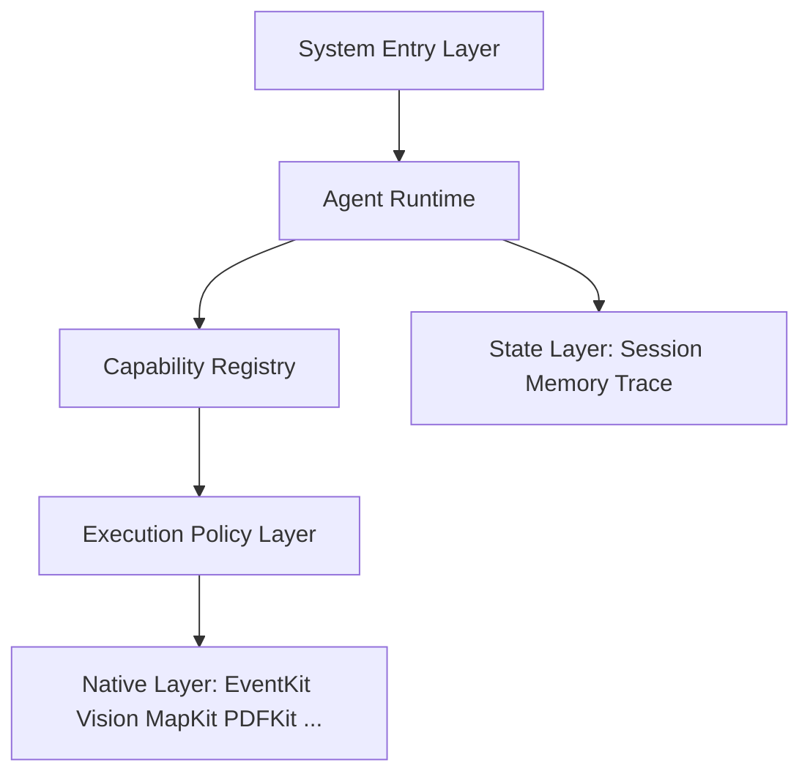

<p align="center">
  
</p>

<h1 align="center">Familiar</h1>

<p align="center">
  为 iPhone 打造的原生、安全、可检查的个人 AI 工作台。
</p>

<p align="center">
  <strong>简体中文</strong> · <a href="README.md">English</a>
</p>

<p align="center">
  <a href="https://github.com/IsaacHuo/familiar/actions/workflows/pages.yml"></a>
  
  
  
  
</p>

<p align="center">
  <a href="https://isaachuo.github.io/familiar/">Website</a> ·
  <a href="https://isaachuo.github.io/familiar/privacy/">Privacy</a> ·
  <a href="https://isaachuo.github.io/familiar/support/">Support</a>
</p>

---

## 项目概览

> **Familiar 是一个原生、安全、可检查的个人 AI 工作台。** Project 是长期工作单元，聊天是主要入口，原生工具与只读 Web 是当前执行面，单 Agent Runtime 是执行内核。

Familiar 把 iPhone 的原生能力转成一个可组合的 Runtime，不引入 Linux 执行环境、Apple Intelligence 依赖或复杂多 Agent。Project、版本化文档资源和 Markdown/纯文本 Artifact 已进入当前实现；Artifact 之外的可写 Workspace 和运行时可恢复执行仍是下一阶段能力。

App 采用 BYOK 模式：用户使用自己的模型 API Key，模型请求从设备直接发送到所选 Provider；会话、附件和工具记录保存在本机。使用网页工具时，搜索词会直接发送给 DuckDuckGo，网页请求会直接发送给所选公开 HTTPS 站点。

> Familiar 目前处于持续开发阶段。AI 输出可能不准确，不应作为医疗、法律、财务或其他高风险决定的唯一依据。

## 核心特性

- **iPhone 原生 Agent Runtime** — 单一主 Agent 通过 Tool 规划，并由 iOS 原生 Framework 执行；无 Linux 环境，无 Apple Intelligence 依赖。
- **Tool 是最核心的抽象** — Calendar、Vision、PDF、Maps 都只是注册在 Capability Registry 中的 Tool；每个 Tool 小而正交、可组合。
- **Native First** — 复用 EventKit、Vision、MapKit、PDFKit、Photos 与 Foundation，而不是重新实现日历、OCR、地图或文档渲染。
- **Project Workspace v1** — 项目指令和版本化本地文档资源可跨项目对话共享；资源使用独立受保护目录，并在 Run 中保存不可变上下文引用。Markdown/纯文本 Artifact 在结构化确认下按项目保存。Artifact 之外的可写 Workspace 仍属后续架构。
- **代码强制授权** — 低风险读取自动执行；当前 EventKit 写入逐次结构化确认，成功后提供当前进程内的一次性 Undo。
- **Runtime Event 驱动的 UI** — 时间线渲染 Agent 事件（模型思考、工具进度、审批、成功与失败），而不是每个工具自造一套 UI。
- **本地优先与 BYOK** — API Key 按 Provider 分别保存在 iOS Keychain；请求不经过 Familiar 服务器。
- **完整 Provider Catalog** — OpenAI、Anthropic、Gemini、DeepSeek、Groq、xAI、OpenRouter、Qwen、Kimi、GLM、MiniMax、SiliconFlow，以及自定义 OpenAI-compatible endpoint。
- **本地文档转换** — AnyDoc 在设备上将 Office、OpenDocument、RTF、EPUB、CSV 与 PDF 转换为 Markdown；扫描 PDF 使用 Vision OCR。
- **系统入口** — 从其他 App 将文本、网页链接或文档保存到 App Group 收件箱；类型化 Deep Link 恢复本地上下文；Siri、快捷指令与 Spotlight 提供 `Ask Familiar`、`Process with Familiar`、`Open Familiar`。
- **富文本回答渲染** — 本地 Markdown、代码高亮、表格、引用、Mermaid、KaTeX、代码复制和安全外链。
- **语音转写** — 使用 Apple Speech 与 `AVAudioEngine` 生成可编辑文字草稿，不保存原始录音。
- **双语界面** — 完整简体中文与英文资源，支持深浅色、Dynamic Type、VoiceOver、Reduce Motion 和 Reduce Transparency。

## 目标架构

Familiar 正在向六层架构演进。下图包含规划能力，不是当前实现清单：

```text
┌─────────────────────────────────────────┐
│             System Entry Layer          │
│ Chat / Share / Notifications / Widgets  │
│ Spotlight / App Intents / Shortcuts     │
└────────────────────┬────────────────────┘
                     │
                     ▼
┌─────────────────────────────────────────┐
│               Agent Runtime             │
│                                         │
│ Agent Loop / Context Assembly           │
│ Model Router / Tool Router              │
│ Run / Step State                        │
└────────────────────┬────────────────────┘
                     │
                     ▼
┌─────────────────────────────────────────┐
│            Capability Registry          │
│                                         │
│ System Tools          Workspace Tools   │
│ Calendar              File              │
│ Reminder              PDF               │
│ Contacts              Text              │
│ Photos                Image             │
│ Maps                  Audio             │
│ Weather               Web               │
│ Location              Structured Data   │
└────────────────────┬────────────────────┘
                     │
                     ▼
┌─────────────────────────────────────────┐
│           Execution Policy Layer        │
│ Availability / Permission / Approval    │
│ Validation / Timeout / Cancellation     │
└────────────────────┬────────────────────┘
                     │
                     ▼
┌─────────────────────────────────────────┐
│              Native Layer               │
│ EventKit / Vision / MapKit / WebKit     │
│ Photos / PDFKit / Core ML / Foundation  │
└─────────────────────────────────────────┘
            + State Layer
  Session / Workspace / Memory
  Artifacts / Trace / History
```

当前实现同时支持普通 Conversation 与 Project 对话，包含有限串行 Tool Loop、9 个静态注册工具（含项目 Artifact 写入）、EventKit 结构化确认、只读 Web Search/Fetch、Project 指令/资源、不可变输入上下文记录、Artifact 存储和摘要性 Run/Step 持久化。长期 Memory、Skills、MCP 与运行时可恢复 Run 尚未实现。



Agent Runtime 是最关键的一层：它只认识 `ToolDefinition`、`ToolCall` 与 `ToolResult`，从不直接触碰 EventKit、Vision、HealthKit 或 MapKit；这些都位于 Capability Registry 与 Execution Policy 之后。

### 系统入口

系统入口按优先级划分：

| 优先级 | 入口 |
| --- | --- |
| **第一优先级** | ① Familiar App 本身 · ② Share Extension · ③ 系统通知 / Deep Link |
| **第二优先级** | ④ Widgets / Controls · ⑤ Spotlight 等轻量系统入口 |
| **兼容能力** | ⑥ App Intents · ⑦ Shortcuts |

当前 System Entry Layer 已包含 Familiar App、Share Extension、类型化 Deep Link、Run 终态本地通知、受保护的 Spotlight 会话索引、启动 Widget、控制中心 Control、三项 App Intent 和双语 App Shortcut。Widget 打开新的可编辑草稿，Control 打开 Familiar 且不替换当前上下文。共享内容只在本机暂存，Deep Link 只恢复或预填上下文；`Ask Familiar` 与 `Process with Familiar` 会明确启动现有 App 内发送链路，`Open Familiar` 不改变草稿或会话。所有入口都不能授权工具操作。

App Intents 位于 Agent Core 之外。其文本输入有长度上限，不读取 Keychain，也不直接调用 Provider；存在未发送草稿时拒绝覆盖。完整 Capability Registry 不会复制到 App Intents。

## Agent Runtime

Familiar 采用单 Agent First 设计，核心是可组合的 Tool Loop：

```text
User
  → AgentRun
  → 会话上下文组装（当前）/ ProjectContextAssembler（目标）
  → Model
  → Tool Call?
       ├── No ──→ Final Answer
       └── Yes
           → Tool Registry
           → Policy Engine
           → Execute Tool
           → ToolResult
           → Context
           → Model
           → continue
until: final answer / cancelled / failed / max steps
```

Agent Loop 是有限循环：有最大迭代轮数、工具结果长度上限和由模型能力决定的上下文上限。同一 run 内的重复工具调用会被拒绝；单次 Agent Run 中相同写操作只能成功提交一次。

## Tool 设计

Tool 使用强类型 Swift，Registry 存储 `AnyFamiliarTool`。当前协议使用类型化 `Input` 并返回 `FamiliarToolOutcome`：

```swift
protocol FamiliarTool {
    associatedtype Input: Decodable & Sendable

    var manifest: FamiliarToolManifest { get }
    func execute(_ input: Input, context: FamiliarToolContext) async throws -> FamiliarToolOutcome
}
```

当前 `FamiliarToolManifest` 包含：

```text
FamiliarToolManifest
  name
  title
  description
  parameters
  effect        read / write / destructiveWrite
  risk          low / high
  requirements  EventKit, Calendar permission, ...
```

Familiar 内部借鉴 MCP 的思想但不把它当作内核，用原生 Swift 实现三种资源分离：

- **当前 Resources** — 会话历史和消息附件抽取文本（application-controlled）
- **当前 Tools** — 2 个本机信息、2 个只读 Web、1 个项目 Artifact 和 4 个 EventKit 工具（model-controlled）
- **目标 Resources** — Project 文件、URL、Artifact 和 scoped Memory
- **目标 Instructions** — Base Policy、ProjectInstruction 和 Skills（user-controlled）

> **MCP 是 Adapter，不是 Kernel。** 未来远程 HTTPS Client 把 MCP Tools 转成 Familiar Manifest，并继续经过 Familiar Policy；MCP 当前尚未实现。

## Capability Registry

目标 Registry 是 Familiar 的核心资产，组织成两大能力体系：

| Native System | Native Workspace |
| --- | --- |
| Calendar | File |
| Reminders | PDF |
| Contacts | Text |
| Photos | Image |
| Maps | Audio |
| Location | Video |
| Weather | CSV / JSON |
| Health | Archive |
| Notifications | Document |
| Clipboard | Web |

当前 Registry 是启动时提供的 9 工具字典，并按 EventKit availability 过滤。表中的 Native Workspace 是由 Project + Resource + Artifact 构成的目标；运行时发现、安装、版本治理和项目绑定尚未实现。

## 权限模型

当前生产授权行为：

| 操作 | 默认行为 |
| --- | --- |
| Read + 低风险 | 自动执行 |
| 可逆写入 | 结构化确认，成功后提供当前进程内一次性 Undo |
| 推断出的写入 | 结构化确认 |
| 敏感读取 | Permission / policy |
| 破坏性操作 | 确认 |
| 财务 / 外部重大影响 | 强确认 |

权限由代码控制，不靠 Prompt：模型无法用一句话绕过 HealthKit 权限、删除确认或敏感数据策略。

目标授权模型只有在用户动作生成可审计、单次使用且精确匹配 capability、规范化参数、作用域和有效期的 grant 后，才可能免除重复确认。Share Extension、App Intent 与 Deep Link 的来源信息永远不授予写权限。

## Provider 支持

| 协议 | Provider |
| --- | --- |
| OpenAI Chat | OpenAI, DeepSeek, Groq, xAI, OpenRouter, Qwen, Kimi, GLM, MiniMax, SiliconFlow, custom OpenAI-compatible |
| Anthropic Messages | Anthropic |
| Gemini generateContent | Gemini |

每个 Provider 拥有独立 Keychain 项、端点配置、Header 和模型目录策略。模型能力按 `providerID + modelID` 标记；未知自定义模型默认仅文本。

模型层使用简单的 `FamiliarModelProvider` 抽象，当前包含 OpenAI Chat、Anthropic Messages 与 Gemini adapter。下一阶段先建立确定性的 Agent benchmark，再进行模型拆分或本地模型工作。

## 文档处理链路

系统将所选文档复制到 App 私有目录，再进行本地转换。

| 输入格式 | 本地处理方式 |
| --- | --- |
| DOC, DOCX, DOCM | AnyDoc → GitHub-Flavored Markdown |
| PPT, PPS, POT, PPTX, PPTM, PPSX, PPSM | AnyDoc → GitHub-Flavored Markdown |
| XLS, XLSX, XLSM, XLSB | AnyDoc → GitHub-Flavored Markdown |
| ODT, ODS, ODP | AnyDoc → GitHub-Flavored Markdown |
| RTF, EPUB, CSV | AnyDoc → GitHub-Flavored Markdown |
| 文本型 PDF | AnyDoc / pdf-inspector → Markdown |
| 扫描或混合型 PDF | 先由 AnyDoc 处理；无文本层页面使用 PDFKit + Vision OCR |
| TXT、MD、Markdown | 编码验证与无损文字直通 |

只有转换后的 Markdown 和文件名会进入模型请求。原始文档字节、本地路径和 security-scoped URL 不会发送给 Firecrawl 或所选模型 Provider。

图片预处理是 Tool，不是强制 pipeline：根据 Agent 判断的任务需要，图片才走 Vision OCR、二维码检测或多模态模型，而不是默认先 OCR。

## 富文本渲染

助手回答由内置的非持久化 `WKWebView` 渲染，并且只使用本地资源。支持的输出包括 CommonMark 风格 Markdown、语法高亮代码块与代码复制、表格、引用、列表、Mermaid 图表、KaTeX 数学表达式和安全外链。

## 隐私与安全模型

- 无 Familiar 账号或登录流程。
- 无 Familiar 自建聊天后端或云数据库。
- 无订阅、权益或托管额度系统。
- API Key 按 Provider 保存在 iOS Keychain。
- 会话历史、附件和工具记录保存在本机。
- 流式 token 和等待中的确认不会被广泛持久化。
- 文档在本机转换；只有转换后的文字会随用户主动发起的请求发送。
- 只有调用相应工具时才请求日历或提醒事项访问权限。
- 写操作要求逐次确认，或提供明确的可逆撤销路径。
- 网站代码不包含广告、分析或跟踪脚本。

## 技术栈

| 领域 | 技术 |
| --- | --- |
| UI | SwiftUI |
| 本地持久化 | SwiftData |
| 网络 | URLSession、SSE streaming |
| 密钥 | iOS Keychain |
| 富文本 | WebKit 与内置 Markdown、Mermaid、KaTeX 资源 |
| 原生工具 | EventKit |
| 文档 | AnyDoc Rust core、PDFKit、Vision |
| 语音输入 | Speech、AVFoundation |
| 照片 | PhotosPicker |
| 网站 | Vue 3、Vite、GitHub Pages |

## 仓库结构

```text
Familiar/
├── Agent/          Agent Runtime、工具循环与确认事件
├── AnyDoc/         内置 AnyDoc 引擎的 Swift 接口
├── App/            App 入口与模型容器
├── Artifacts/      项目 Artifact 存储与 Artifact 工具
├── Attachments/    私有存储、转换与 OCR 链路
├── Data/           Provider 适配器、Keychain 与模型目录服务
├── Domain/         Provider、消息与能力模型
├── EventKit/       日历与提醒事项服务/工具
├── Persistence/    SwiftData Schema 与迁移链
├── Presentation/   SwiftUI 页面、输入器与消息渲染
├── Resources/      本地化、资产与内置渲染资源
├── Speech/         原生语音转写
├── Support/        主题与平台兼容辅助代码
├── SystemEntry/    Deep Link、App Intents、通知与 Spotlight
└── Web/            只读 Web 搜索/抓取与受限 HTTP 客户端

FamiliarWidgets/    主屏幕/锁屏启动 Widget 与控制中心 Control

Shared/             App Group 收件箱与控制 Intent（App 与扩展共享）
Vendor/
├── AnyDocBridge.xcframework/
└── AnyDocBridgeRust/

docs/               设计与规划（我们打算构建什么）
state/              当前实现真实状态（以代码验证）
logs/               可复用的调试与调查经验
website/            Vue/Vite 网站、隐私政策和支持页面
Scripts/            可复现的 AnyDoc XCFramework 构建脚本
```

文档按职责拆分为三个目录（模型见 [`docs/README.md`](docs/README.md)）：`docs/` 承载设计与规划，`state/` 承载以代码验证的当前实现（先读 `state/CURRENT.md`，再读 `state/ARCHITECTURE.md`），`logs/` 承载可复用的调查经验。

## 环境要求

- Apple Silicon Mac
- Xcode 26 或更高版本
- iOS 18 或更高版本
- iPhone target
- 至少一个受支持模型 Provider 的有效 API Key

正常构建 App 不需要安装 Rust，因为仓库已包含 arm64 AnyDoc XCFramework。

## 构建 iOS App

```bash
git clone https://github.com/IsaacHuo/familiar.git
cd familiar
open familiar.xcodeproj
```

选择 `Familiar` scheme 和一个 iPhone destination。API Key 在 App 运行时配置，绝不能提交到仓库。

命令行构建示例：

```bash
xcodebuild \
  -project familiar.xcodeproj \
  -scheme Familiar \
  -configuration Debug \
  -destination 'generic/platform=iOS Simulator' \
  ARCHS=arm64 \
  ONLY_ACTIVE_ARCH=YES \
  CODE_SIGNING_ALLOWED=NO \
  build
```

### 重新构建 AnyDoc

```bash
./Scripts/build-anydoc-xcframework.sh
```

脚本只构建 `aarch64-apple-ios` 和 `aarch64-apple-ios-sim`。

## 构建网站

```bash
npm --prefix website ci
npm --prefix website run build
```

## 明确的产品边界

Familiar 当前不包含：

- iPad 支持
- 账号或工作区系统
- Familiar 托管的模型代理
- 订阅或权益流程
- Linux / iSH 执行环境
- Shell 或任意代码执行
- 多 Agent、Subagent 或 Agent Graph
- 复杂 RAG 或向量数据库
- iPhone 上的 MCP Server（后期可能增加 MCP Client）
- Core ML LLM 或 Apple Intelligence 依赖
- 实时语音对话
- 修改或删除日历/提醒事项
- 自主浏览器操作、JavaScript 执行或递归爬取

## 第三方软件

Familiar 依据 MIT License 内置 AnyDoc，所需许可声明位于：

- `Vendor/AnyDocBridgeRust/LICENSE.anydoc`
- `Familiar/Resources/ThirdPartyNotices.txt`

其他内置渲染资源遵循各自上游项目的许可要求。

## 支持

- 产品支持：<https://isaachuo.github.io/familiar/support/>
- 隐私问题：<https://isaachuo.github.io/familiar/privacy/>
- Bug 反馈：<https://github.com/IsaacHuo/familiar/issues>

反馈问题时，请勿包含 API Key、私人会话、日历数据、提醒事项、文档或其他敏感信息。
