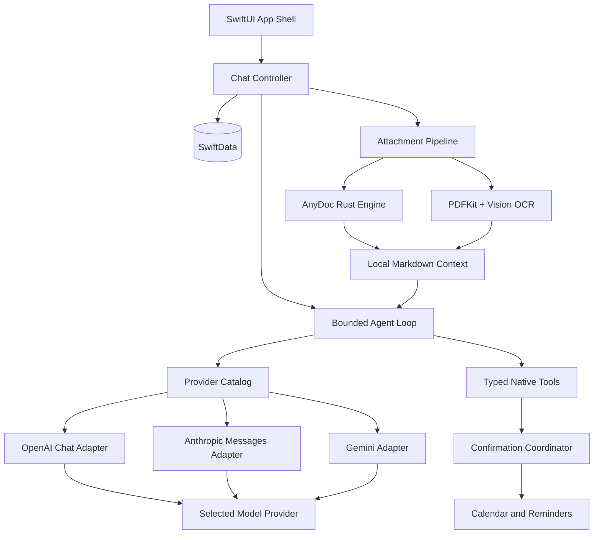

<p align="center">
  
</p>

<h1 align="center">Familiar</h1>

<p align="center">
  为 iPhone 打造的原生、本地优先 BYOK AI Agent。
</p>

<p align="center">
  <strong>简体中文</strong> · <a href="README.md">English</a>
</p>

<p align="center">
  <a href="https://github.com/IsaacHuo/familiar/actions/workflows/pages.yml"></a>
  
  
  
  
</p>

<p align="center">
  <a href="https://isaachuo.github.io/familiar/">Website</a> ·
  <a href="https://isaachuo.github.io/familiar/privacy/">Privacy</a> ·
  <a href="https://isaachuo.github.io/familiar/support/">Support</a>
</p>

---

## 项目概览

Familiar 是一个面向 iPhone 的原生 AI 助理。它不要求注册 Familiar 账号，不依赖 Familiar 自建聊天后端，也不提供订阅或托管额度。用户使用自己的模型 API Key，App 从设备直接连接所选 Provider；会话、附件和工具记录保存在本机。

项目专注于一条可信、可审计的 Agent 闭环：自然语言聊天、本地文档理解、日历与提醒事项查询，以及在用户逐次确认后执行创建操作。

> Familiar 目前处于持续开发阶段。AI 输出可能不准确，不应作为医疗、法律、财务或其他高风险决定的唯一依据。

## 核心特性

- **原生 iPhone 体验** — SwiftUI、SwiftData、URLSession、WebKit、Keychain、EventKit、Speech、Vision 与 PDFKit。
- **本地优先与 BYOK** — API Key 按 Provider 分别保存在 iOS Keychain；请求不经过 Familiar 服务器。
- **完整 Provider Catalog** — OpenAI、Anthropic、Gemini、DeepSeek、Groq、xAI、OpenRouter、Qwen、Kimi、GLM、MiniMax、SiliconFlow，以及自定义 OpenAI-compatible endpoint。
- **协议感知流式传输** — 分别实现 OpenAI Chat、Anthropic Messages 与 Gemini `generateContent` 协议，不假设所有兼容服务完全等价。
- **确认后执行原生操作** — 日历与提醒事项写入前展示结构化预览；未经逐次确认绝不执行。
- **本地文档转换** — AnyDoc 在设备上将 Office、OpenDocument、RTF、EPUB、CSV 与 PDF 转换为 Markdown；扫描 PDF 使用 Vision OCR 补充无文本页面。
- **富文本回答渲染** — 本地 Markdown、代码高亮、表格、引用、Mermaid、KaTeX、代码复制和安全外链。
- **语音转写** — 使用 Apple Speech 与 `AVAudioEngine` 生成可编辑文字草稿，不保存原始录音。
- **明确的图片能力边界** — 相机和相册图片可以作为本地草稿预览，但当前版本在发送前统一阻止，不创建消息，也不上传图片。
- **双语界面** — 完整简体中文与英文资源，支持深浅色、Dynamic Type、VoiceOver、Reduce Motion 和 Reduce Transparency。

## 架构



### 请求链路

```text
用户输入
  → 本地会话快照
  → Provider/模型能力检查
  → 协议专用请求适配器
  → 用户选择的第三方 Provider
  → 流式回答
  → 本地富文本渲染器
  → 明确的持久化检查点
```

Familiar 不代理模型流量。第三方 Provider 如何记录、保留或训练请求内容，取决于对应服务的条款和用户配置。

## Provider 支持

| 协议 | Provider |
| --- | --- |
| OpenAI Chat | OpenAI, DeepSeek, Groq, xAI, OpenRouter, Qwen, Kimi, GLM, MiniMax, SiliconFlow, custom OpenAI-compatible |
| Anthropic Messages | Anthropic |
| Gemini generateContent | Gemini |

每个 Provider 拥有独立 Keychain 项、端点配置、Header 和模型目录策略。模型能力按 `providerID + modelID` 标记；未知自定义模型默认仅文本，不会收到工具定义或图片内容。

会话保存当前 Provider 与模型，每条助手回答记录实际使用的 `providerID` 和 `modelID`，切换模型时会在时间线显示轻量标记。

## Agent 工具

Familiar 当前提供四个产品级强类型工具：

| 工具 | 行为 |
| --- | --- |
| 查询日历事件 | 读取用户问题所需时间范围内的事件 |
| 新建日历事件 | 展示完整预览，确认后写入 EventKit |
| 查询提醒事项 | 按时间或文字条件查询提醒事项 |
| 新建提醒事项 | 展示列表、截止时间、优先级和备注，确认后写入 |

写操作由 confirmation coordinator 暂停执行并等待 UI 决策。任务取消、停止生成、切换会话或 App 终止时，等待中的写操作不会执行。单次 Agent Run 内相同写操作只能成功提交一次。

## 文档处理链路

系统将所选文档复制到 App 私有目录，再进行本地转换。Familiar 不长期依赖外部 security-scoped URL。

| 输入格式 | 本地处理方式 |
| --- | --- |
| DOC, DOCX, DOCM | AnyDoc → GitHub-Flavored Markdown |
| PPT, PPS, POT, PPTX, PPTM, PPSX, PPSM | AnyDoc → GitHub-Flavored Markdown |
| XLS, XLSX, XLSM, XLSB | AnyDoc → GitHub-Flavored Markdown |
| ODT, ODS, ODP | AnyDoc → GitHub-Flavored Markdown |
| RTF, EPUB, CSV | AnyDoc → GitHub-Flavored Markdown |
| 文本型 PDF | AnyDoc / pdf-inspector → Markdown |
| 扫描或混合型 PDF | 先由 AnyDoc 处理；无文本层页面使用 PDFKit + Vision OCR |
| TXT、MD、Markdown | 编码验证与无损文字直通 |

内置桥接层固定使用 [`anydoc 0.1.8`](https://github.com/firecrawl/anydoc)，并向 Swift 暴露窄范围、面向字节的 C ABI。它被编译为静态 XCFramework，仅包含 arm64 iPhone 真机和 Apple Silicon iPhone Simulator 切片；有意排除了 Intel Simulator。

只有转换后的 Markdown 和文件名会进入模型请求。原始文档字节、本地路径和 security-scoped URL 不会发送给 Firecrawl 或所选模型 Provider。

附件会保留本地原文件，以供 QuickLook 历史预览。删除会话或截断消息路径时会同步清理本地文件；编辑和重试会保留附件副本及转换元数据。

## 富文本渲染

助手回答由内置的非持久化 `WKWebView` 渲染，并且只使用本地资源。流式内容与最终内容共用同一个渲染视图，避免从原始文本突然切换到 WebView。

支持的输出包括：

- CommonMark 风格 Markdown
- 语法高亮代码块与代码复制
- 表格、引用和列表
- Mermaid 图表
- KaTeX 数学表达式
- 安全外链

流式更新经过节流；只有用户仍接近会话底部时才继续自动滚动。

## 隐私与安全模型

- 无 Familiar 账号或登录流程。
- 无 Familiar 自建聊天后端或云数据库。
- 无订阅、权益或托管额度系统。
- API Key 按 Provider 保存在 iOS Keychain。
- 会话历史、附件和工具记录保存在本机。
- 流式 token 和等待中的确认不会被广泛持久化。
- 文档由 AnyDoc 在本机转换；只有转换后的文字会随用户主动发起的请求发送。
- 当前版本会阻止图片进入网络请求。
- 只有调用相应工具时才请求日历或提醒事项访问权限。
- 日历与提醒事项写入要求逐次明确确认。
- 网站代码不包含广告、分析或跟踪脚本。

完整说明请参阅[隐私政策](https://isaachuo.github.io/familiar/privacy/)，其中明确区分本地存储与直接发送给所选第三方 Provider 的内容。

## 技术栈

| 领域 | 技术 |
| --- | --- |
| UI | SwiftUI |
| 本地持久化 | SwiftData |
| 网络 | URLSession、SSE streaming |
| 密钥 | iOS Keychain |
| 富文本 | WebKit 与内置 Markdown、Mermaid、KaTeX 资源 |
| 原生工具 | EventKit |
| 文档 | AnyDoc Rust core、PDFKit、Vision |
| 语音输入 | Speech、AVFoundation |
| 照片 | PhotosPicker |
| 网站 | Vue 3、Vite、GitHub Pages |

## 仓库结构

```text
Familiar/
├── Agent/          有限工具循环与确认事件
├── AnyDoc/         内置 AnyDoc 引擎的 Swift 接口
├── App/            App 入口与模型容器
├── Attachments/    私有存储、转换与 OCR 链路
├── Data/           Provider 适配器、Keychain 与模型目录服务
├── Domain/         Provider、消息与能力模型
├── EventKit/       日历与提醒事项服务/工具
├── Persistence/    SwiftData Schema
├── Presentation/   SwiftUI 页面、输入器与消息渲染
├── Resources/      本地化、资产与内置渲染资源
├── Speech/         原生语音转写
└── Support/        主题与平台兼容辅助代码

Vendor/
├── AnyDocBridge.xcframework/
└── AnyDocBridgeRust/

Docs/               产品、架构、UI、隐私和验证记录
website/            Vue/Vite 网站、隐私政策和支持页面
Scripts/            可复现的 AnyDoc XCFramework 构建脚本
```

详尽的产品与工程记录位于 [`Docs/`](Docs/README.md)。

## 环境要求

- Apple Silicon Mac
- Xcode 26 或更高版本
- iOS 17 或更高版本
- iPhone target
- 至少一个受支持模型 Provider 的有效 API Key

正常构建 App 不需要安装 Rust，因为仓库已包含 arm64 AnyDoc XCFramework。仅在重新构建桥接层时需要 Rust 1.88 或更高版本，并安装 iOS arm64 targets。

## 构建 iOS App

```bash
git clone https://github.com/IsaacHuo/familiar.git
cd familiar
open familiar.xcodeproj
```

选择 `Familiar` scheme 和一个 iPhone destination。API Key 在 App 运行时配置，绝不能提交到仓库。

命令行构建示例：

```bash
xcodebuild \
  -project familiar.xcodeproj \
  -scheme Familiar \
  -configuration Debug \
  -destination 'generic/platform=iOS Simulator' \
  CODE_SIGNING_ALLOWED=NO \
  build
```

### 重新构建 AnyDoc

```bash
./Scripts/build-anydoc-xcframework.sh
```

脚本只构建：

- `aarch64-apple-ios`
- `aarch64-apple-ios-sim`

## 构建网站

```bash
npm --prefix website ci
npm --prefix website run build
```

生产构建输出到 `website/dist/`。当 `main` 上的 `website/**` 或 Pages workflow 发生变化时，GitHub Actions 会自动把该目录部署到 GitHub Pages。

## 验证状态

当前实现已经完成以下验证：

- iOS 17.5 arm64 Simulator 构建
- iOS 26.5 arm64 Simulator 构建
- Generic iOS arm64 真机目标构建
- Simulator 干净安装与启动
- Markdown、CSV、DOCX、PDF、未知数据拒绝和 C ABI 所有权的 Rust bridge 测试
- Vue/Vite 生产构建
- Property list 与本地化校验

真实 Provider 凭证、EventKit 写入、相机、麦克风和 Speech 权限仍需在发布前使用实体 iPhone 验证。

## 明确的产品边界

Familiar 当前不包含：

- iPad 支持
- 账号或工作区系统
- Familiar 托管的模型代理
- 订阅或权益流程
- 实时语音对话
- 图片上传或图片理解
- 修改或删除日历/提醒事项
- MCP、Skills、Sandbox 或多 Agent 编排
- Web Research 或自主浏览器操作

## 第三方软件

Familiar 依据 MIT License 内置 AnyDoc，所需许可声明位于：

- `Vendor/AnyDocBridgeRust/LICENSE.anydoc`
- `Familiar/Resources/ThirdPartyNotices.txt`

其他内置渲染资源遵循各自上游项目的许可要求。

## 支持

- 产品支持：<https://isaachuo.github.io/familiar/support/>
- 隐私问题：<https://isaachuo.github.io/familiar/privacy/>
- Bug 反馈：<https://github.com/IsaacHuo/familiar/issues>

反馈问题时，请勿包含 API Key、私人会话、日历数据、提醒事项、文档或其他敏感信息。
