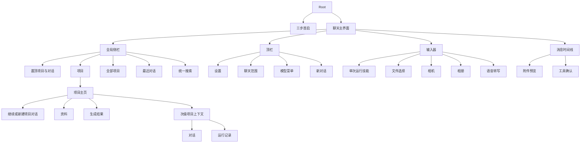

# Familiar UI 与交互设计

## 1. 设计目标

Familiar 使用 ChatGPT 移动端的信息结构和交互密度作为参考，保留独立品牌和真实能力边界。

界面目标：

- 单手操作优先。
- 主任务集中在项目、聊天、资料、模型选择和输入器。
- 蓝色用于主要动作和选中状态。
- 淡紫用于首启、空态和低强度品牌背景。
- 玻璃材质限于导航、输入器和浮层。
- 消息内容层保持稳定背景和清晰排版。
- 信息性运行状态使用轻量单行文本；只有改变数据的写操作使用结构化动作卡片。

## 2. 信息架构



## 2.5 系统入口

系统入口按优先级划分：

| 优先级 | 入口 |
| --- | --- |
| **第一优先级** | ① Familiar App 本身 · ② Share Extension · ③ 系统通知 / Deep Link |
| **第二优先级** | ④ Widgets / Controls · ⑤ Spotlight 等轻量系统入口 |
| **兼容能力** | ⑥ App Intents · ⑦ Shortcuts |

界面设计约束：

- Share Extension 承接外部选中的文本、网页 URL 或文件；第一版保存到共享收件箱，由主 App 导入新草稿，不直接发起 Agent Run。
- 系统通知 / Deep Link 把用户带回对应任务上下文（会话 + Run/Step 轨迹）。
- Widgets / Controls 只暴露轻量动作（如快速提问、任务状态），不复制完整聊天界面。
- App Intents 只暴露 `Ask Familiar`、`Process with Familiar`、`Open Familiar`。Ask / Process 从 Siri、Shortcuts 或 Spotlight 打开主 App 并启动新 Run；Open 只打开 App，不改变当前状态。
- 所有入口最终汇入同一个 Agent Runtime，不各自造一套执行逻辑。

当前 Deep Link 交互约束：

- 新草稿入口打开聊天主界面、关闭设置与抽屉、预填文本并聚焦输入器，绝不自动发送。
- 会话入口选中对应本地会话；Run 入口选中包含该 Run 的会话并展示已有执行时间线。
- App 正在执行请求时保留入口，等当前请求结束后再导航，避免切换会话破坏运行状态。
- App Intents 的 Ask / Process 只有在当前没有未发送草稿时才创建并提交新草稿；若已有草稿则保留原内容、取消本次入口并显示可恢复提示。Open Familiar 永不清空草稿。
- 无效或不存在的本地目标不创建替代数据，界面显示错误并保持可继续操作。

当前 Share Extension 交互约束：

- 使用系统 Share Extension 编辑器，允许用户在共享内容之外添加可选备注。
- 一次最多接收 3 个文件，每个文件沿用 25 MiB 上限；图片和视频不进入此入口。
- 点击系统“发布/发送”动作只表示保存到 Familiar 共享收件箱，不代表向模型发送。
- 主 App 仅在当前草稿为空且没有运行中请求时导入最早一项；否则保持排队，不覆盖用户内容。
- 导入后关闭设置与会话抽屉，打开新草稿并聚焦输入器；用户检查、编辑后主动发送。

当前本地通知交互约束：

- 设置中提供“Run 结束时通知我”开关，只有用户主动开启时才请求系统通知权限。
- 权限被拒绝时开关保持关闭，并提供前往 iOS 通知设置的恢复入口。
- 仅当 App 不活跃且 Run 完成或失败时安排通知；App 正在前台时不重复展示系统横幅。
- 锁屏与通知中心只显示通用的完成或失败状态，不预览问题、回答、附件名或工具结果。
- 点击通知回到对应 Run 的本地时间线；没有 Run ID 时回到对应会话。目标已删除时沿用 Deep Link 的可恢复错误。
- 通知不承诺任务会在 App 被系统挂起后继续运行；后台续跑仍是独立能力。

当前 Spotlight 交互约束：

- 只有已经产生消息或 Run 的会话进入系统搜索，空白会话不制造结果。
- 结果显示 Familiar、会话标题和通用的本地会话说明，不显示消息摘录、附件名或工具结果。
- 点击结果打开对应本地会话；会话不存在时沿用 Deep Link 的可恢复错误，不创建替代内容。
- 会话重命名、更新时间变化或删除后，索引使用当前完整集合刷新；Spotlight 不是另一份会话数据库。
- 索引失败不阻塞聊天、保存或删除；主 App 的 SwiftData 数据始终是唯一事实来源。

## 2.6 Runtime Event 驱动的 Agent 执行界面

工具不自己造 UI。当前界面渲染 `FamiliarRuntimeEventPayload`：

```text
runPhaseChanged / assistantTurnStarted / responseTextDelta
reasoningSummaryDelta / reasoningSummaryCompleted
activityStarted / activityProgress / activityCompleted
toolInvocationRequested / toolResultProduced
approvalRequested / approvalResolved
runtimeNotice / responseCompleted / runFinished(outcome)
```

时间线将 Runtime Event 分为两种表现：

- **信息性状态**：模型思考、查阅资料、Web/Resource 读取、本地图片识别和整理回答只显示一行状态文字，不使用卡片背景。运行结束后折叠为“查看运行过程”。
- **动作 Surface**：只有会改变系统或项目数据的写操作使用动作卡。同一张卡片原位经历提案、等待授权、执行中、成功、失败和已撤销状态。

读取工具不会因为使用了 Tool Call 就升级成卡片。同一 Assistant 回合的多张写动作卡已按 `assistantTurnID` 组成横向 pager；授权已支持仅这次、本次会话和长期范围，长期授权可在设置中撤销；可撤销写操作在可用期显示 Undo，完成后显示“已撤销”终态，其中 EventKit 创建操作的 Undo 入口可跨重启恢复。当前 Runtime 仍不支持字节级中断续跑或可靠后台承接，详见 `state/CURRENT.md`。

## 3. 首启流程

路径：`Familiar/Presentation/FamiliarOnboardingView.swift`

### 3.1 页面结构

1. Familiar 与 BYOK 说明。
2. Provider、API Key、模型和必要配置。
3. 连接验证、Keychain、本地历史和权限触发方式说明。

### 3.2 完成条件

完整配置路径：

- API Key 非空。
- 模型 ID 非空。
- Provider 配置可解析。
- 连接验证成功。
- Key 保存到 Keychain。
- 设置保存到 UserDefaults。

先浏览路径：

- 用户主动选择“暂不配置，先浏览 Familiar”。
- 不保存新 Key，不发起 Provider 请求，也不覆盖已有设置。
- 可进入聊天壳层、本地历史和设置；发送模型请求前仍需完成 BYOK 配置。

### 3.3 权限策略

首启页面说明权限用途。相机、麦克风、Speech、日历和提醒事项权限在用户触发对应功能时请求。

### 3.4 可恢复路径

- 首启每个配置阶段均可先进入浏览状态。
- 设置提供“重新查看首启”入口。
- 重新查看首启只重置展示状态，不删除会话、设置或 Keychain API Key。

## 4. 聊天容器

路径：`Familiar/Presentation/FamiliarChatView.swift`

### 4.1 全局侧栏

- 支持左边缘拖动打开。
- 支持遮罩点击、拖动和选择会话后关闭。
- 主界面在抽屉打开时横移、裁切圆角和添加阴影，不做纵向缩放。
- Reduce Motion 开启时取消动效。

Project v1 上线后的侧栏内容：

- 置顶区同时容纳置顶项目和置顶对话。
- 项目按行展示；点击项目行或尾部箭头展开、收起其对话历史，使用轻量位移与淡入淡出。Reduce Motion 开启时直接切换，不播放展开动画。
- “全部项目”入口打开项目列表与管理界面。
- “最近”只展示不属于项目的普通对话；项目对话收纳在各自项目下。
- 顶部搜索入口统一搜索项目和对话，并支持全部、普通对话或指定项目范围。
- 点击会话后恢复该会话并关闭侧栏。
- 会话标题使用正文级字号和宽松行高，不使用偏小的辅助字号。
- 会话长按菜单提供置顶或取消置顶、重命名和删除；项目长按菜单提供置顶或取消置顶以及打开项目详情。

范围约束：

- 不展示账户、订阅和团队入口。
- UI 使用用户可理解的“项目”，不暴露 Workspace、ContextSnapshot 等实现术语。
- 搜索统一匹配项目和对话，并允许按项目筛选。
- 运行与计划只有在能力真实可用后出现；MCP 和 Memory 预览移入 Labs 或隐藏。

### 4.1.1 Project v1

- “全部项目”列表中的项目行打开对应项目主页；导航栏右上角加号创建项目，项目主页菜单负责新建项目对话、编辑、归档或恢复归档，以及删除。
- 项目名保存前去除首尾空白，最长 80 个字符，并在全部项目中进行不区分大小写的唯一性校验；创建和重命名使用同一规则。
- 项目主页展示说明与指令；有历史时在内容区提供 Continue Chat，新建项目对话始终可从项目主页导航栏菜单进入。独立 Ask 输入框不再与 Chat Composer 重复。
- Resources 与 Artifacts 展示最近内容并提供完整列表；Conversations 与 Runs 合并为紧凑的 Project Context 导航。
- 支持项目内添加文件和新聊天；普通聊天可以不属于项目。Project Conversation 与普通 Chat 共用同一个 Chat Surface、Composer、Runtime、授权和执行 Surface。
- Project Conversation 的归属由顶栏工作区文件夹菜单表达；菜单可切换普通聊天或项目，并可打开当前项目详情，不叠加常驻 Banner 或第二个 Context Pill。
- 项目编辑、归档和删除位于导航栏菜单，不与继续工作争夺主内容区。
- Project UI 只能在持久化模型、文件生命周期和 ContextSnapshot 路径可用后开放。

### 4.2 顶栏

固定结构：

- 左起：设置按钮、工作区文件夹菜单、Provider / 模型菜单。
- 中间：弹性留白。
- 右：新对话按钮。

侧栏从屏幕左边缘打开，不占用顶栏按钮。设置从顶栏进入；工作区文件夹菜单在普通聊天与各个有效项目之间切换，并提供当前项目详情和“全部项目”入口。

选择工作区时恢复该范围内最近更新的会话；该范围没有历史时只建立一个临时的新对话状态，不写入 SwiftData，直到首次发送成功保存用户消息时才创建会话。新对话按钮继承当前项目范围，并同样保持临时状态直到首次发送。

发送期间禁用工作区切换、模型切换和新对话，避免当前请求上下文发生变化。

模型菜单只展示已保存 API Key 的 Provider。设置页保留完整 Provider 列表，并展示当前已配置数量。

### 4.3 平台材质

- iOS 26：`safeAreaBar`、`GlassEffectContainer`、`glassEffect`。
- iOS 18–25：`safeAreaInset`、`ultraThinMaterial`、底部分隔线。

## 5. 时间线

路径：`Familiar/Presentation/FamiliarChatMessageViews.swift`

### 5.1 时间线项目

`FamiliarMessageTimeline` 合并以下项目：

- 用户消息。
- 助手消息。
- 模型切换记录。
- 已完成工具记录。
- 待确认请求。
- Agent 运行状态。
- 流式助手消息。

排序依据：

1. `sequence`
2. `createdAt`

### 5.2 用户消息

- 右对齐。
- 紧凑圆角气泡。
- 使用用户填充色。
- 支持文本选择。
- 支持附件入口。
- 上下文菜单包含复制和编辑。

编辑前显示确认对话。确认后删除目标消息之后的单一路径内容，并将原文本和附件恢复到输入器。

### 5.3 助手消息

- 左对齐。
- 无气泡正文排版。
- 流式阶段使用原生 `FamiliarMarkdownFallbackText`，终态 Markdown 使用 `FamiliarMarkdownWebView`。
- 终态显示实际 Provider 和模型来源。
- 回答下方按复制、系统分享、重试的顺序提供操作；三者与助手正文左边缘对齐，并使用一致的可点击区域。

重试前显示确认对话。确认后删除目标消息之后的消息、模型切换和工具记录。

### 5.4 模型切换

时间线使用轻量分隔行记录 Provider 或模型变化。记录包含旧值、新值、序号和时间。

### 5.5 信息性运行状态

运行期间显示当前最有信息量的一行状态，例如“模型正在思考”“正在查阅资料”“正在识别图片”。状态文案不使用卡片垫底，不暴露内部协议或模型推理内容。回答完成后，状态与只读工具轨迹默认折叠；展开后可查看工具、终态、时间和可用详情。

### 5.6 写动作卡

卡片展示：

- 工具请求标题。
- 目标日历或提醒列表。
- 按字段排序的完整参数。
- 当前阶段与终态。
- 首次授权时的“仅这次 / 本次会话 / 始终允许”，默认“本次会话”。
- 取消、确认、失败重试或撤销等当前阶段允许的动作。

动作卡位于时间线内，保持与模型回答相同的上下文位置。有效授权范围内不重复询问，但仍展示执行中的卡片。失败保留原因与重试入口；撤销后保留“已撤销”终态，不从时间线删除。

同一 Assistant 回合只有一张动作卡时正常全宽展示。两张以上时组成一行横向 pager：

- 每张卡片近乎占满容器，只露出下一张约 16–24 pt。
- 使用逐卡吸附，页码真正变化时触发一次轻触觉，形成明确的减速停顿感。
- 只让视口边缘被裁切的卡片部分渐隐；滚动到头时对应方向不再渐隐。
- 当前卡片正文、按钮和焦点保持完全清晰；卡片尺寸稳定，不随状态变化导致布局跳动。
- Reduce Motion 开启时取消弹簧感，保留稳定吸附；系统禁用触觉时不触发反馈。
- 每张卡片独立成功、失败、重试和撤销；多动作部分失败时不伪装成原子事务。

## 6. 滚动行为

时间线使用 `ScrollViewReader`、`ScrollView` 和 `LazyVStack`。

自动跟随规则：

- 用户位于底部阈值内：流式文本、消息和工具活动变化时跟随底部。
- 用户向上阅读：停止自动跟随。
- 用户点击“滚动到最新”：恢复跟随。

键盘使用交互式收起。滚动位置当前不跨会话持久化。

## 7. 富文本

路径：`Familiar/Presentation/FamiliarMarkdownWebView.swift`

支持：

- Markdown 段落和列表。
- 代码高亮和代码复制。
- 表格。
- 引用。
- KaTeX。
- Mermaid。
- 安全外链。

WebView 关闭内部滚动，由内容高度回传 SwiftUI。文档预览模式可以启用 WebView 垂直滚动。渲染失败时使用 `AttributedString` 或纯文本回退。

## 8. 输入器

路径：`Familiar/Presentation/FamiliarComposerView.swift`

输入器严格参考 Leafy 日迹页的结构和操作密度，适配 Familiar 的聊天任务。

### 8.1 布局

输入器包含：

- 添加按钮。
- 聚焦后可用的 Skill 选择入口与 `/` 筛选面板。
- 文本编辑区。
- 语音按钮。
- 发送或停止按钮。
- 文档和图片草稿预览区。

Skill 必须由用户在 Composer 中显式选择。已选 Skill 以可移除的草稿项展示，只快照到下一次 Run，发送后立即清除，不自动延续到后续 Run，也不因进入项目而自动启用。

### 8.2 模式

- `compact`：短文本和未聚焦状态。
- `expanded`：聚焦或多行文本状态。
- `fullscreen`：长文本编辑状态。

文本接近四行时自动扩展。用户可以显式展开或收起，全屏输入器最多占可用聊天区域的 80%。空态、时间线和文本编辑区均支持交互式下滑收起键盘。Reduce Motion 开启时取消模式切换动画。

### 8.3 发送状态

| 状态 | 主按钮行为 |
|---|---|
| 空草稿 | 禁用发送 |
| 有文本 | 发送 |
| 有文档 | 发送，受模型能力和上下文上限约束 |
| 有图片 | 按当前模型能力选择原生多模态或本地视觉 fallback；所有路径不可用时保留草稿并说明限制 |
| 文件导入中 | 禁用发送 |
| 模型生成中 | 显示停止 |
| 等待确认 | 停止操作可取消 Agent Run 和待确认请求 |

## 9. 附件菜单

添加按钮提供：

- 文件。
- 拍照。
- 相册。

### 9.1 文件

- 使用系统 `fileImporter`。
- 支持多选。
- 单个草稿最多 3 个文档。
- 导入期间显示进度状态。
- 支持移除草稿文档。
- 历史消息通过 Quick Look 预览原文件。

### 9.2 拍照

- 使用原生相机预览。
- 支持前后镜头切换。
- 支持闪光灯。
- 支持权限拒绝后的系统设置入口。
- 拍摄结果加入图片草稿。

### 9.3 相册

- 使用 `PhotosPicker`。
- 支持有序多选。
- 图片总数上限为 4。
- 支持内嵌选择和系统完整照片选择器。
- 支持移除单张图片。

### 9.4 图片能力路由

- 当前模型原生支持图片时，图片进入该 Provider 请求；适配器负责协议编码。
- 当前选择 `deepseek-v4-flash-vision-exp` 时直接进入 DeepSeek 图片请求；该实验模型失败时显示真实错误，不自动 fallback。
- 当前文本模型不支持图片时，Apple Vision 在本机提供 OCR、条码和基础分类，状态行显示“正在识别图片”。结果不足时明确说明能力边界。
- FastVLM 当前不显示设置入口，也不参与自动路由。
- 视觉结果进入折叠运行过程，不使用动作卡。详细结果展示处理方法、模型/系统版本和原图来源。
- 所有路径失败时，不创建虚假回答，不清空文字或图片草稿。

## 10. 语音转写

- 麦克风按钮在空闲状态显示 `mic`。
- 监听状态显示 `waveform` 和系统符号动效。
- 转写文本追加到启动语音前的基础草稿。
- 转写结束后输入器保持可编辑和聚焦。
- App 进入非 active 状态时停止转写。

## 11. 设置

路径：`Familiar/Presentation/FamiliarSettingsView.swift`

设置分区：

- 品牌说明。
- Provider。
- 模型。
- API Key。
- 回答偏好。
- 隐私与数据。
- Agent 授权策略与长期授权管理。
- Skills。
- 本地视觉模型下载、基准、许可证、状态和删除。

Skills 设置使用导航栏右上角加号创建 instruction-only Skill。创建页预填 Goal、Rules、Output 指令模板，并填写必填名称、可选标识和可选描述；当前界面不提供 JSON 导入行。创建 Skill 不授予工具权限，实际使用仍需在 Composer 为单次 Run 显式选择。

Provider 特定字段：

- OpenAI Organization ID。
- OpenAI Project ID。
- Qwen 区域。
- 自定义显示名。
- 自定义 Base URL。
- 自定义模型列表路径。
- 手动模型 ID。

操作：

- 保存配置。
- 验证连接。
- 刷新模型列表。
- 清除 API Key。
- 重新查看首启，不清除会话、配置和 Keychain。

## 12. 视觉系统

路径：`Familiar/Support/FamiliarTheme.swift`

### 12.1 色彩职责

| 色彩 | 用途 |
|---|---|
| Familiar accent blue | 主要动作、选中状态、发送 |
| Brand purple | 渐变辅助、首启和低强度氛围 |
| User fill | 用户消息气泡 |
| Assistant fill | 助手相关背景 |
| Elevated fill | 工具卡、回退材质和浮层 |
| Separator | 分隔线和边框 |

### 12.2 玻璃范围

使用玻璃：

- 顶栏控制。
- Provider/模型胶囊。
- 输入器。
- 相机浮层控制。
- 滚动到最新按钮。

使用内容背景：

- 用户消息。
- 助手正文。
- 工具终态。
- 确认卡。
- 附件内容。

### 12.3 Reduce Transparency

系统开启 Reduce Transparency 时，玻璃组件使用实色 elevated fill 和边框。

### 12.4 语义令牌

核心高频 Surface 使用 `FamiliarTheme.swift` 的有限语义令牌：

| 类别 | 规则 |
| --- | --- |
| Spacing | `xSmall / small / medium / large / xLarge / section` 六档；特殊几何布局可保留明确的局部值 |
| Typography | `largeTitle / screenTitle / sectionTitle / body / secondary / caption / button / metadata`，全部基于 Apple Dynamic Type Text Styles |
| Radius | `compact / control / card / overlay` 四档 |
| Icon | `compact / standard / prominent` 三档视觉尺寸 |
| Control | `minimumHitTarget` 固定 44 pt；视觉内容使用 compact / standard / prominent 尺寸，不把所有按钮画成 44 pt 实心块 |

Primary、Secondary、Icon、Circular、Toolbar、Pill、Destructive 与 Inline Action 使用同一强调规则。优先使用原生 `Button`、`Menu`、`NavigationLink` 和系统角色；Glass 只形成导航与交互层，不进入消息正文、Project 内容或普通 List row。

## 13. 本地化

资源：

- `Familiar/Resources/zh-Hans.lproj/`
- `Familiar/Resources/en.lproj/`

覆盖范围：

- 首启。
- 会话和抽屉。
- 消息操作。
- Provider 和模型。
- 附件和 AnyDoc 错误。
- EventKit 权限和确认。
- 相机、麦克风和 Speech 用途说明。
- 设置与隐私。

## 14. 无障碍要求

设计目标（当前验收状态见 `../state/CURRENT.md`）：

- 主要图标按钮具备 Accessibility Label。
- Reduce Motion 影响首启、抽屉、输入器和滚动。
- Reduce Transparency 影响玻璃组件。
- 模型切换行合并子元素。
- 文本和确认字段支持选择。
- 首启页码提供当前页与总页数描述。
- 抽屉当前会话带有选中 trait。
- 相机主快门、主要图标按钮和发送状态均有本地化名称或禁用原因。
- 确认卡将标题、目标和字段组合为摘要，操作按钮保持独立。
- 运行中及已完成工具记录会读出执行状态和结果详情。
- 新的结构化确认出现时，VoiceOver 焦点转移到确认卡。
- 待真机验收：完整 VoiceOver 路径（焦点返回、连续工具状态播报）、极端 Dynamic Type 布局、Increase Contrast 与 Bold Text。

## 15. UI 验收矩阵

| 维度 | 目标 |
|---|---|
| 系统 | iOS 18、iOS 26 |
| 外观 | Light、Dark |
| 语言 | 简体中文、英文 |
| 字体 | 默认、最大 Dynamic Type |
| 输入 | 空、短文本、长文本、键盘交互 |
| 时间线 | 短回答、长回答、连续流式、工具卡 |
| 滚动 | 底部跟随、向上阅读、恢复跟随 |
| 动效 | 默认、Reduce Motion |
| 材质 | 默认、Reduce Transparency |
| 辅助技术 | VoiceOver |
| 附件 | 文件导入、图片草稿、相机、相册、预览 |
| 系统入口 | App 冷启动、Share Extension 承接、Deep Link 定位、Widgets/Controls、Spotlight |
| Runtime 事件 | 模型思考、工具进度、审批、成功/失败终态、摘要轨迹查看；严格回放为目标能力 |
